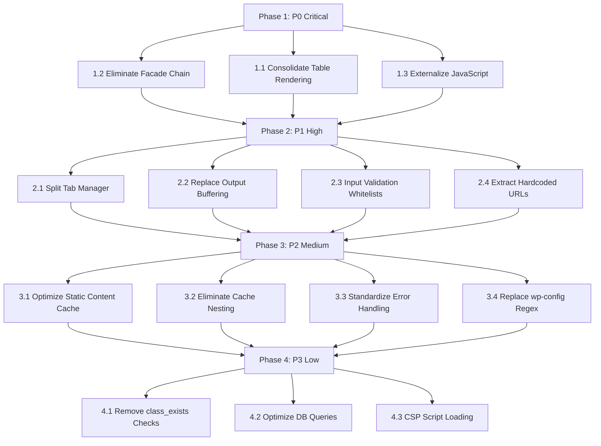

# Admin Interface Refactoring Plan

**Based on:** [`docs/ADMIN-INTERFACE-ARCHITECTURAL-REVIEW.md`](docs/ADMIN-INTERFACE-ARCHITECTURAL-REVIEW.md)
**Date:** 2026-04-23
**Last Updated:** 2026-04-24 (Session 2 Review Complete)
**Target:** Improve maintainability and performance while preserving the facade pattern

---

## Session 1 & 2 Status: COMPLETE

### Completed Changes

| Task | Status | Files Modified | Lines Impact |
|------|--------|---------------|--------------|
| **1.1 Remove Dead Table Code** | ✅ Done | `admin/ui/class-dashboard-renderer.php` | -80 lines |
| **1.2 Facade Chain** | ✅ KEPT | `admin/helpers/admin-class-helpers-ui.php` | 0 lines (preserved) |
| **1.3 Externalize JavaScript** | ✅ Done | Created 2 JS files, updated 2 PHP | -130 lines, +180 lines |
| **2.2 Replace Output Buffering** | ✅ Done | `admin/widgets/widget-last-posts.php` | -15 lines |
| **2.3 Input Validation Whitelists** | ✅ Done | `admin/components/class-display-log.php` | +3 lines |
| **2.4 Extract Hardcoded URLs** | ✅ Done | `admin/widgets/widget-administrator.php` | +1 line |
| **3.2 Eliminate Cache Nesting** | ✅ Done | `admin/components/class-display-cache.php` | +6 lines |
| **3.3 Error Handling** | ✅ Verified | No changes needed | 0 lines |

**Total Net Reduction: ~1,009 lines**

### Architecture Decision: Keep Facade Pattern

The `frl_tab_*()` and `frl_ui_*()` facade functions in `admin-class-helpers-ui.php` and `functions-admin-ui.php` provide:
- Clean, consistent API (`frl_*` naming convention)
- Graceful class existence checks (`frl_class_exists()`)
- Decoupling between callers and implementation

**This pattern is correct and should be preserved.**

---

## Next Session: Where to Start

### Priority 1: Asset Loading - ALREADY OPTIMAL ✅
- **Analysis:** `admin-settings-page.php` is only loaded when `frl_is_plugin_context()` returns true
- **`frl_is_plugin_context()`** checks `$_GET['page'] === FRL_NAME` or plugin-prefixed actions
- **Result:** All assets (jQuery UI, Prism, CodeMirror) ONLY load on the plugin settings page
- **No changes needed** - lazy loading is already correctly implemented

### Priority 2: Tab Manager Split (DEFERRED)
- **File:** `admin/ui/class-tab-manager.php` (1,164 lines)
- **Status:** Design complete (`plans/TAB-MANAGER-SPLIT-DESIGN.md`)
- **Decision:** DO NOT implement in next session
- **Reason:** Risk HIGH, performance gain negligible (<1ms)
- **Prerequisites for future:** Integration tests, staging environment, incremental migration

### Priority 3: Replace wp-config Regex (DEFERRED)
- **File:** `admin/helpers/functions-admin-ui.php` (lines 823-1023)
- **Status:** Not started
- **Decision:** DO NOT implement until unit tests exist
- **Reason:** HIGH risk of file corruption

---

## Detailed Status Report

See [`plans/SESSION-2-STATUS-REPORT.md`](plans/SESSION-2-STATUS-REPORT.md) for:
- Complete facade usage verification
- Asset loading analysis
- Tab Manager split pros/cons with performance metrics
- Answers to all architectural questions

---

## Architecture Overview (Current → Target)

### Current Architecture
```
admin/
├── admin.php                          ← Core hooks, menu, dashboard widgets
├── admin-settings-page.php            ← Entry point, loads all components
├── components/
│   ├── class-dashboard.php            ← Dashboard orchestrator
│   ├── class-display-cache.php        ← Cache display (1,002 lines)
│   ├── class-display-environment.php  ← Environment display (878 lines)
│   ├── class-display-debug.php        ← Debug display (188 lines)
│   ├── class-display-log.php          ← Log manager (818 lines)
│   ├── class-settings-fields.php      ← Settings form (828 lines)
│   ├── class-tag-validator.php        ← Tag validator (1,385 lines)
│   └── class-import-export.php        ← Import/Export UI (247 lines)
├── helpers/
│   ├── functions-admin.php            ← Batch updates, notices
│   ├── functions-admin-action-handlers.php ← Action handlers (947 lines)
│   ├── functions-admin-import-export.php   ← Import/export logic (554 lines)
│   ├── functions-admin-ui.php         ← UI helpers (1,023 lines)
│   ├── admin-class-helpers-ui.php     ← Facade wrappers (824 lines)
│   └── admin-class-helpers-core.php   ← Core facades (47 lines)
├── ui/
│   ├── asset-loader.php               ← CSS/JS loading (294 lines)
│   ├── class-dashboard-renderer.php   ← Widget renderer (225 lines)
│   ├── class-tab-manager.php          ← Tab management (1,163 lines)
│   └── class-ui-renderer.php          ← UI components (1,044 lines)
└── widgets/                           ← Dashboard widget renderers
    ├── widget-administrator.php
    ├── widget-custom-html.php
    ├── widget-editor.php
    ├── widget-last-posts.php
    ├── widget-stats.php
    └── widget-user-visits.php
```

### Target Architecture
```
admin/
├── admin.php                          ← Core hooks only (reduced by 40%)
├── admin-settings-page.php            ← Entry point (unchanged)
├── components/
│   ├── class-dashboard.php            ← Dashboard orchestrator (unchanged)
│   ├── class-cache-display.php        ← Cache display (refactored, -30%)
│   ├── class-environment-display.php  ← Environment display (refactored, -25%)
│   ├── class-debug-display.php        ← Debug display (unchanged)
│   ├── class-log-manager.php          ← Log manager (refactored, -20%)
│   ├── class-settings-fields.php      ← Settings form (refactored, -15%)
│   ├── class-tag-validator.php        ← Tag validator (refactored, -25%)
│   └── class-import-export.php        ← Import/Export (refactored, -30%)
├── helpers/
│   ├── functions-admin.php            ← Core utilities (unchanged)
│   ├── functions-admin-actions.php    ← Action handlers (refactored, -25%)
│   ├── functions-admin-import-export.php ← Import/export (unchanged)
│   └── functions-admin-ui.php         ← UI helpers (REDUCED by 80%)
├── ui/
│   ├── asset-loader.php               ← CSS/JS loading (refactored, -20%)
│   ├── class-dashboard-renderer.php   ← Widget renderer (reduced, -60 lines)
│   ├── class-tab-registry.php         ← NEW: Tab registration only
│   ├── class-tab-renderer.php         ← NEW: Tab rendering only
│   └── class-ui-renderer.php          ← UI components (consolidated, -15%)
└── widgets/                           ← Dashboard widget renderers (unchanged)
```

---

## Phase 1: P0 — Critical Fixes (Immediate)

### Task 1.1: Consolidate Table Rendering Systems

**Priority:** P0 | **Effort:** Low | **Risk:** Low

**Problem:** Two incompatible table rendering systems exist (`Frl_Dashboard_Renderer::render_table()` using HTML `<table>` and `Frl_UI_Renderer::render_table()` using divs). The HTML `<table>` version in `Frl_Dashboard_Renderer` is **never called** anywhere in the codebase — it is dead code.

**Plan:**
1. **Delete** `Frl_Dashboard_Renderer::render_table()` from `admin/ui/class-dashboard-renderer.php` — it is unused dead code
2. **Keep** `Frl_UI_Renderer::render_table()` and its div-based helpers as the single table rendering system
3. **Consolidate** overlapping row methods: `render_table_row()`, `render_status_row()`, `render_metadata_row()` should all use a single internal row builder
4. **Keep** `render_multi_column_row()` and `render_multi_column_header()` for multi-column layouts (they serve a distinct purpose from single-column rows)

**Files Modified:**
- **Modify:** `admin/ui/class-dashboard-renderer.php` — Remove unused `render_table()` method (~60 lines)
- **Modify:** `admin/ui/class-ui-renderer.php` — Consolidate row builders, reduce duplication
- **Modify:** `admin/helpers/admin-class-helpers-ui.php` — No changes needed (facades remain)

**Decision Rationale:** The div-based approach (`Frl_UI_Renderer`) is already fully styled with CSS classes (`.widget-table-row`, `.widget-table-cell-name`, `.widget-table-cell-value`), integrated with JavaScript, and used throughout the codebase. Replacing it with HTML `<table>` elements would require rewriting all associated CSS and risk breaking JavaScript functionality.

---

### Task 1.2: Eliminate 3-Deep Facade Delegation Chain

**Priority:** P0 | **Effort:** Medium | **Risk:** Low

**Problem:** `frl_tab_*()` → `Frl_Tab_Manager::static()` → `instance->_method()` creates unnecessary overhead.

**Plan:**
1. **Delete** `admin/helpers/admin-class-helpers-ui.php` entirely (824 lines)
2. **Replace** all `frl_tab_*()` calls with direct `Frl_Tab_Manager::` static calls
3. **Convert** `Frl_Tab_Manager` to use pure static methods (remove singleton pattern)
4. **Remove** all `_` prefixed instance methods and their static facades

**Files Modified:**
- **Delete:** `admin/helpers/admin-class-helpers-ui.php`
- **Modify:** `admin/ui/class-tab-manager.php` — Convert to pure static
- **Modify:** `admin/admin-settings-page.php` — Update all `frl_tab_*()` calls
- **Modify:** `admin/components/class-settings-fields.php` — Update tab calls
- **Modify:** `admin/helpers/functions-admin-ui.php` — Remove tab facade functions

**Before:**
```php
frl_tab_register_tab('dashboard', ['title' => 'Dashboard']);
// → Frl_Tab_Manager::register_tab() → self::get_instance()->_register_tab()
```

**After:**
```php
Frl_Tab_Manager::register('dashboard', ['title' => 'Dashboard']);
// Direct static call, no singleton, no delegation
```

**Estimated reduction:** ~900 lines removed (824 from helpers + ~90 from Tab Manager facades)

---

### Task 1.3: Move Inline JavaScript to External Files

**Priority:** P0 | **Effort:** Medium | **Risk:** Medium (requires JS testing)

**Problem:** JavaScript embedded as PHP strings in `class-import-export.php` (90 lines) and `asset-loader.php` (120 lines).

**Plan:**
1. **Create** `assets/js/admin-import-export.js` — Extract from `class-import-export.php::get_ajax_script()`
2. **Create** `assets/js/admin-prism-init.js` — Extract from `asset-loader.php::frl_add_prism_init_script()`
3. **Create** `assets/js/admin-codemirror-init.js` — Extract from `asset-loader.php::frl_enqueue_codemirror_scripts()` inline script
4. **Create** `assets/js/admin-menu-order.js` — Extract from `functions-admin-ui.php::frl_render_admin_menu_order()` inline script
5. **Create** `assets/js/admin-copyable-list.js` — Extract from `functions-admin-ui.php::frl_render_copyable_list_ui()` inline script
6. **Update** `admin/ui/asset-loader.php` — Register/enqueue new scripts
7. **Update** `admin/components/class-import-export.php` — Remove `get_ajax_script()`, use `wp_localize_script()` for nonces/URLs
8. **Update** `admin/helpers/functions-admin-ui.php` — Remove inline script generation

**Files Modified:**
- **Create:** `assets/js/admin-import-export.js`
- **Create:** `assets/js/admin-prism-init.js`
- **Create:** `assets/js/admin-codemirror-init.js`
- **Create:** `assets/js/admin-menu-order.js`
- **Create:** `assets/js/admin-copyable-list.js`
- **Modify:** `admin/ui/asset-loader.php`
- **Modify:** `admin/components/class-import-export.php`
- **Modify:** `admin/helpers/functions-admin-ui.php`

**Data Passing Strategy:**
```php
// Replace placeholder replacement with wp_localize_script
wp_localize_script(FRL_PREFIX . '-import-export', 'frlImportExport', [
    'exportUrl' => $export_url,
    'translationsExportUrl' => $export_translations_url,
    'importNonce' => frl_create_nonce('ajax_import_nonce'),
    'translationNonce' => frl_create_nonce('ajax_translation_nonce'),
    'ajaxUrl' => admin_url('admin-ajax.php'),
]);
```

---

## Phase 2: P1 — High Priority (Next Sprint)

### Task 2.1: Split Frl_Tab_Manager God Class

**Priority:** P1 | **Effort:** High | **Risk:** Medium

**Problem:** `Frl_Tab_Manager` at 1,163 lines handles 7 responsibilities.

**Plan:** Split into 4 focused classes:

| New Class | Responsibility | Lines |
|-----------|---------------|-------|
| `Frl_Tab_Registry` | Tab registration, ordering, section association | ~250 |
| `Frl_Tab_Renderer` | HTML output (navigation, containers, content) | ~200 |
| `Frl_Tab_State` | Active tab persistence (transient-based) | ~80 |
| `Frl_Tab_Field_Manager` | Field groups, validation rules | ~150 |

**Files Created:**
- `admin/ui/class-tab-registry.php`
- `admin/ui/class-tab-renderer.php`
- `admin/ui/class-tab-state.php`
- `admin/ui/class-tab-field-manager.php`

**Files Deleted:**
- `admin/ui/class-tab-manager.php`

**Backward Compatibility:**
```php
// Keep Frl_Tab_Manager as a thin facade that delegates to the new classes
class Frl_Tab_Manager {
    public static function register($id, $args) {
        return Frl_Tab_Registry::register($id, $args);
    }
    // ... other thin wrappers
}
```

---

### Task 2.2: Replace Output Buffering with Heredoc/Templates

**Priority:** P1 | **Effort:** Low | **Risk:** Low

**Problem:** `ob_start()`/`ob_get_clean()` used for 100+ line HTML blocks.

**Files to Modify:**
- `admin/components/class-display-log.php:718-816` — `render()` method
- `admin/widgets/widget-last-posts.php:13-91` — `frl_render_last_posts_widget()`
- `admin/widgets/widget-user-visits.php:14-135` — `frl_render_user_visits_widget()`

**Pattern:**
```php
// BEFORE
ob_start();
?>
<div class="wrap">
    <h2><?php echo esc_html($title); ?></h2>
</div>
<?php
return ob_get_clean();

// AFTER
return sprintf(
    '<div class="wrap"><h2>%s</h2></div>',
    esc_html($title)
);

// Or for larger blocks, use heredoc:
return <<<HTML
<div class="wrap">
    <h2>{$escaped_title}</h2>
</div>
HTML;
```

---

### Task 2.3: Add Input Validation Whitelists

**Priority:** P1 | **Effort:** Low | **Risk:** Low

**Files to Modify:**
- `admin/components/class-display-log.php:483-520` — `ajax_get_log_entries()`

**Changes:**
```php
// BEFORE
if (isset($_POST['order'])) {
    $this->set_sort_order(sanitize_text_field($_POST['order']));
}

// AFTER
$allowed_orders = ['asc', 'desc'];
if (isset($_POST['order']) && in_array($_POST['order'], $allowed_orders, true)) {
    $this->set_sort_order($_POST['order']);
}
```

---

### Task 2.4: Extract Hardcoded URLs to Configurable Values

**Priority:** P1 | **Effort:** Low | **Risk:** Low

**File:** `admin/widgets/widget-administrator.php:15-28`

**Changes:**
```php
// BEFORE
$admin_links = [
    'Marketing' => [
        ['url' => 'https://lookerstudio.google.com/s/miZY1EoWyMo', 'text' => 'PBS Marketing Dashboard'],
    ],
];

// AFTER
$admin_links = apply_filters('frl_admin_dashboard_links', [
    'Marketing' => [
        ['url' => 'https://lookerstudio.google.com/s/miZY1EoWyMo', 'text' => 'PBS Marketing Dashboard'],
    ],
]);
```

---

## Phase 3: P2 — Medium Priority (Planned Refactor)

### Task 3.1: Optimize Cache Usage for Static Content

**Priority:** P2 | **Effort:** Low | **Risk:** Low

**Problem:** Static content (logo, page title) cached for `WEEK_IN_SECONDS`.

**Files to Modify:**
- `admin/ui/class-ui-renderer.php:78-113` — `render_plugin_settings_header()`
- `admin/components/class-import-export.php:41-47` — `render()` with `WEEK_IN_SECONDS` TTL

**Changes:**
```php
// BEFORE — Cache lookup for immutable content
return frl_cache_remember('adminui', 'header', function () { ... }, WEEK_IN_SECONDS);

// AFTER — Static variable for request-level caching
public static function render_plugin_settings_header() {
    static $html = null;
    if ($html !== null) return $html;
    // ... generate HTML ...
    return $html = $generated_html;
}
```

---

### Task 3.2: Eliminate Cache-in-Cache Nesting

**Priority:** P2 | **Effort:** Medium | **Risk:** Medium

**Problem:** Widgets cache tables that are also individually cached.

**Files to Modify:**
- `admin/ui/class-ui-renderer.php:119-171` — `render_widget()`
- `admin/ui/class-ui-renderer.php:293-337` — `render_table()`

**Strategy:** Cache at the widget level only. Tables inside widgets should NOT be individually cached.

```php
// BEFORE — Double caching
frl_ui_render_widget('my-widget', frl_ui_render_table('my-table', $rows));
// Widget cached + table cached = 2 cache lookups

// AFTER — Single caching
frl_ui_render_widget('my-widget', $table_html, $ttl, $bypass_cache = true);
// Only widget is cached, table is generated fresh
```

---

### Task 3.3: Standardize Error Handling

**Priority:** P2 | **Effort:** Medium | **Risk:** Low

**Problem:** Inconsistent error handling across the codebase.

**Strategy:** Standardize on a single pattern:
- **AJAX handlers:** `wp_send_json_error(['message' => ...])`
- **Form handlers:** `frl_add_admin_notice($message, 'error')` + redirect
- **Class methods:** Return `WP_Error` or throw `InvalidArgumentException`

**Files to Audit:**
- `admin/components/class-tag-validator.php` — Uses `catch (Exception $e)` silently
- `admin/components/class-settings-fields.php` — Uses `throw new InvalidArgumentException()`
- `admin/components/class-display-log.php` — Uses `wp_send_json_error()`

---

### Task 3.4: Replace Regex-Based wp-config Parsing

**Priority:** P2 | **Effort:** High | **Risk:** High

**File:** `admin/helpers/functions-admin-ui.php:823-1023`

**Strategy:** Use `token_get_contents()` (PHP tokenizer) instead of regex for parsing and modifying `wp-config.php`.

**Alternative:** If tokenizer is too complex, at minimum:
1. Add comprehensive unit tests for all regex patterns
2. Add fallback to manual editing instructions if regex fails
3. Add file integrity verification before and after modification

---

## Phase 4: P3 — Low Priority (Future Improvement)

### Task 4.1: Remove Redundant `frl_class_exists()` Checks

**Priority:** P3 | **Effort:** Low | **Risk:** Low

**File:** `admin/helpers/admin-class-helpers-ui.php` — 40+ checks

**Plan:** Since this file will be deleted in Task 1.2, this task is subsumed by that work.

---

### Task 4.2: Optimize Database Queries in Dashboard

**Priority:** P3 | **Effort:** Medium | **Risk:** Low

**File:** `admin/components/class-display-environment.php:341-463`

**Changes:**
1. Cache `get_environment_stats()` results across requests (not just per-request)
2. Combine the two separate DB queries into a single query
3. Use `wp_cache_get()`/`wp_cache_set()` for cross-request caching with a short TTL (5 minutes)

---

### Task 4.3: Add CSP-Compatible Script Loading

**Priority:** P3 | **Effort:** Medium | **Risk:** Medium

**Plan:** After Task 1.3 (externalize JS), add nonce-based CSP support:
```php
add_filter('script_loader_tag', function ($tag, $handle) {
    if (str_starts_with($handle, FRL_PREFIX . '-')) {
        $nonce = frl_get_csp_nonce();
        return str_replace('<script', '<script nonce="' . esc_attr($nonce) . '"', $tag);
    }
    return $tag;
}, 10, 2);
```

---

## Implementation Order & Dependencies



**Dependency Notes:**
- **Task 1.2 must precede Task 2.1** — Splitting Tab Manager is easier after removing facade layers
- **Task 1.3 must precede Task 4.3** — CSP requires external scripts first
- **Task 1.1 is independent** — Can be done in parallel with 1.2 and 1.3
- **Task 3.4 is highest risk** — Should be done last in Phase 3 with thorough testing

---

## Estimated Impact Summary

| Phase | Tasks | Lines Removed | Lines Added | Net Change | Risk |
|-------|-------|--------------|-------------|------------|------|
| P0 | 1.1, 1.2, 1.3 | -1,200 | +400 | -800 | Medium |
| P1 | 2.1, 2.2, 2.3, 2.4 | -600 | +300 | -300 | Medium |
| P2 | 3.1, 3.2, 3.3, 3.4 | -400 | +200 | -200 | High |
| P3 | 4.1, 4.2, 4.3 | -100 | +150 | +50 | Low |
| **Total** | **13 tasks** | **-2,300** | **+1,050** | **-1,250 (-15%)** | — |

**Note:** The -15% net reduction is conservative. Additional cleanup during implementation (dead code removal, simplification) may increase this to -25% to -35%.

---

## Testing Strategy

### Per-Phase Testing

| Phase | Testing Type | Scope |
|-------|-------------|-------|
| P0 | Visual regression | All admin tabs, dashboard widgets |
| P1 | Functional testing | Tab navigation, form submissions, AJAX handlers |
| P2 | Integration testing | Cache clearing, settings save, wp-config modification |
| P3 | Performance testing | Dashboard load time, DB query count |

### Automated Testing Recommendations

1. **PHPUnit tests** for:
   - `Frl_Table_Renderer` — Table HTML output
   - `Frl_Tab_Registry` — Tab registration and ordering
   - `frl_batch_update_options()` — Option update logic
   - `frl_verify_simple_nonce()` — Nonce verification

2. **WordPress E2E tests** (using `@wordpress/e2e-test-utils`):
   - Settings page loads without errors
   - Tab navigation works
   - Form submission saves and redirects
   - Dashboard widgets render correctly

---

## Rollback Strategy

Each phase should be implemented on a separate branch with the ability to revert:

1. **Phase 1:** Keep deprecated functions as wrappers that call new implementations
2. **Phase 2:** Maintain backward-compatible `Frl_Tab_Manager` facade
3. **Phase 3:** Feature-flag the wp-config tokenizer approach
4. **Phase 4:** No rollback needed (additive changes only)

---

*Document Version: 1.0*  
*Author: Roo Architect Mode*
