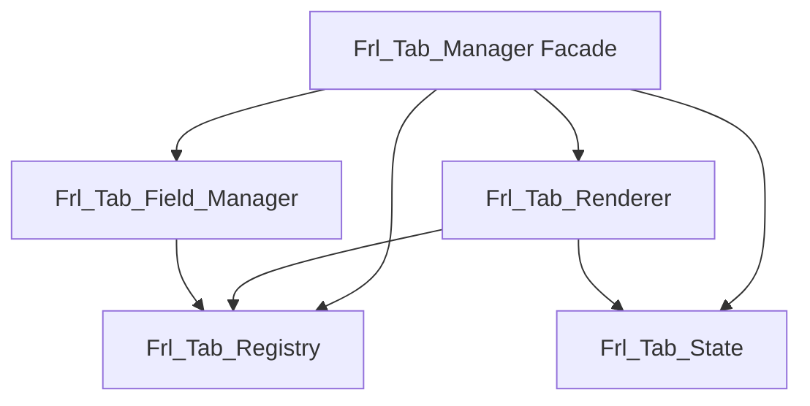

# Tab Manager Split - Architectural Design

**Date:** 2026-04-24  
**Source:** `admin/ui/class-tab-manager.php` (1,164 lines)  
**Goal:** Split into 4 focused classes with backward compatibility

---

## Current Responsibilities Analysis

| Responsibility | Methods | Lines | Dependencies |
|---------------|---------|-------|-------------|
| **Tab Registration** | `_register_tab()`, `_register_custom_tab()`, `register_tab()`, `register_custom_tab()` | ~120 | WordPress `add_action()`, `apply_filters()` |
| **Tab Rendering** | `_generate_tabs_navigation()`, `_render_all_custom_tabs()`, `_render_custom_tab()`, `_render_tab_container_start()`, `_render_tab_container_end()`, `_render_tabs_from_sections()` | ~200 | WordPress `do_action()`, `apply_filters()`, output buffering |
| **Tab State** | `_get_active_tab()`, `_save_active_tab()`, `is_tab_active()` | ~50 | `frl_get_transient()`, `frl_set_transient()`, `$_GET` |
| **Field Management** | `_add_field_group()`, `_get_tab_field_groups()`, `_render_tab_field_groups()`, `_set_tab_validation_rules()`, `_get_validation_rules()` | ~150 | `frl_is_array_not_empty()` |
| **Section Association** | `_associate_sections_with_tab()`, `_get_tab_sections()` | ~40 | None |
| **Tab Sorting** | `_get_sorted_tabs()` | ~40 | None |
| **Hook Helpers** | `_get_tab_action_hook()`, `_add_tab_content()` | ~20 | WordPress `add_action()` |

---

## Target Architecture

### 1. `Frl_Tab_Registry` (~200 lines)
**Responsibility:** Tab registration, ordering, section/field association

```php
class Frl_Tab_Registry {
    private static $instance = null;
    private $tab_registry = ['form' => [], 'custom' => []];
    private $sorted_tabs = null;
    
    // Constants
    const POSITION_FIRST = 0;
    const POSITION_DEFAULT = 500;
    const POSITION_FORM = 1000;
    const POSITION_LAST = PHP_INT_MAX;
    
    // Registration
    public static function register($tab_id, $args = [], $type = 'custom'): void
    public static function register_custom($tab_id, $args = []): void
    
    // Section/Field association
    public static function associate_sections($tab_id, array $sections): bool
    public static function get_sections($tab_id): ?array
    public static function add_field_group($tab_id, array $field_group): bool
    public static function get_field_groups($tab_id): ?array
    
    // Validation rules
    public static function set_validation_rules($tab_id, array $rules): bool
    public static function get_validation_rules($tab_id): ?array
    
    // Query
    public static function get_tabs($type = null): array
    public static function get_sorted_tabs(): array
    
    // Internal
    private function _register_tab()
    private function _register_custom_tab()
    private function _get_sorted_tabs()
}
```

### 2. `Frl_Tab_Renderer` (~180 lines)
**Responsibility:** HTML output for tab navigation and containers

```php
class Frl_Tab_Renderer {
    // Container rendering
    public static function render_container_start($vertical = true, $class = '', $active_tab = null): void
    public static function render_container_end(): void
    
    // Navigation
    public static function render_navigation(): string
    
    // Tab content
    public static function render_all_custom_tabs(): void
    public static function render_custom_tab($tab_id, $action_hook = ''): void
    
    // Section-based tabs
    public static function render_tabs_from_sections($sections, $position_start = 1000): void
    
    // Internal
    private function _generate_navigation_html(): string
    private function _render_tab_content($tab_id, $action_hook): void
}
```

### 3. `Frl_Tab_State` (~60 lines)
**Responsibility:** Active tab persistence

```php
class Frl_Tab_State {
    public static function get_active_tab(): int
    public static function save_active_tab($active_tab): void
    public static function is_tab_active($tab_id, $active_tab): bool
}
```

### 4. `Frl_Tab_Field_Manager` (~120 lines)
**Responsibility:** Field group rendering

```php
class Frl_Tab_Field_Manager {
    public static function render_field_groups($tab_id, $field_callback, $args = []): void
    
    private function _render_field_group_content()
}
```

### 5. `Frl_Tab_Manager` (Facade - ~50 lines)
**Responsibility:** Backward compatibility facade

```php
class Frl_Tab_Manager {
    // All methods delegate to the appropriate new class
    public static function register_tab($tab_id, $args = [], $type = 'custom'): void
    { Frl_Tab_Registry::register($tab_id, $args, $type); }
    
    // ... other thin wrappers
}
```

---

## Migration Strategy

### Phase 1: Create New Classes (No Breaking Changes)
1. Create `Frl_Tab_Registry` with all registration logic
2. Create `Frl_Tab_Renderer` with all rendering logic
3. Create `Frl_Tab_State` with state management
4. Create `Frl_Tab_Field_Manager` with field rendering
5. Convert `Frl_Tab_Manager` to thin facade

### Phase 2: Update Callers (Optional)
1. Update direct callers to use new class names
2. Keep facade for backward compatibility

### Phase 3: Deprecate Facade (Future)
1. Add `_deprecated_function()` notices to facade methods
2. Remove facade in next major version

---

## Dependency Graph



---

## File Structure After Split

```
admin/ui/
├── class-tab-manager.php       ← Facade (50 lines)
├── class-tab-registry.php      ← Registration (200 lines)
├── class-tab-renderer.php      ← HTML output (180 lines)
├── class-tab-state.php         ← Active tab persistence (60 lines)
└── class-tab-field-manager.php ← Field rendering (120 lines)
```

**Total:** 610 lines vs 1,164 lines (-48%)

---

## Risk Mitigation

1. **Backward Compatibility:** Facade ensures all existing calls continue to work
2. **Incremental Testing:** Each new class can be tested independently
3. **Rollback:** Keep original file as backup until all tests pass
4. **No Behavior Changes:** Only code organization changes, no functional changes

---

*Document Version: 1.0*
