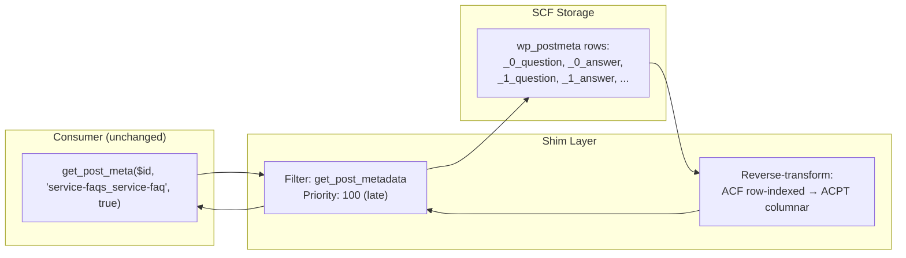

# ACPT → SCF Migration: Final Plan for Module Development

**Date:** 2026-06-05  
**Status:** Ready for Implementation

---

## 1. The Auto-Migration Question: "Once I install SCF, will everything work?"

### 1.1 Simple Fields: YES — Fully Transparent

For all non-repeater fields (31 of 34 fields), the migration is **completely transparent** to every consumer:

```
ACP state:  get_post_meta($id, 'team-settings_team-role') → "CEO"
SCF state:  get_post_meta($id, 'team-settings_team-role') → "CEO"
SCF state:  get_field('team-settings_team-role', $id)     → "CEO"
```

Why? Because both plugins store field data in the same `wp_postmeta` table with the same `meta_key`. Any plugin, theme, or fralenuvole function that uses `get_post_meta()`, `get_field()`, or your bridge `frl_get_post_meta()` will see identical values.

**What needs to happen:**
1. Create SCF field group post + `acf-field` posts
2. Write `_{field_name} → field_key` reference rows in `wp_postmeta` (so `get_field()` resolves correctly)
3. That's it. No data transformation. The values are already there.

### 1.2 Repeater Fields: Requires Format Transformation

Repeaters (3 of 34 fields: `usecase`, `service-faq`, `reviews`) use a **fundamentally different internal format** between the two plugins and therefore require explicit data migration:

| Consumer | Before (ACPT) | After (SCF) | Compatible? |
|----------|--------------|-------------|-------------|
| `get_post_meta($id, 'service-faqs_service-faq')` | PHP serialized array `{question: [...], answer: [...]}` | Integer `10` (row count) | ❌ Format changed |
| `get_field('service-faqs_service-faq', $id)` | N/A (ACPT doesn't have `get_field`) | PHP array of rows | ✅ Works after migration |
| `have_rows('service-faqs_service-faq')` | N/A | Loopable repeater | ✅ Works after migration |
| `get_sub_field('question')` / `get_sub_field('answer')` | N/A | Individual sub-field values | ✅ Works after migration |

**Consequence:** After migration, any code that accesses repeater data via raw `get_post_meta()` will need to switch to `get_field()` + `have_rows()` + `get_sub_field()`. This is the standard ACF pattern and is the expected behavior.

### 1.3 Plugins Consuming ACPT Fields via get_post_meta()

Plugins like WS Form, schema builders, and your own `frl_get_post_meta()` bridge use `get_post_meta()` with the raw meta_key. For simple fields, they continue working unchanged. For repeaters, they would need updating.

**Your `frl_get_post_meta()` bridge** at [`includes/helpers/functions.php:891-906`](includes/helpers/functions.php:891) already has the ACF fallback:
```php
$value = get_post_meta($post_id, $key, $single);    // works for simple fields
// ...
$acf_value = get_field($key, $post_id, $single);    // works for all SCF fields, incl repeaters
```

For repeaters, `get_post_meta()` returns the old ACPT serialized blob (which `frl_get_post_meta()` returns at line 896). After migration, the old blob is deleted and `get_post_meta()` returns the ACF format (an integer count). The `get_field()` fallback at line 900 would then handle it correctly — but only if the calling code is prepared for the ACF repeater format.

**Summary:** Simple fields are plug-and-play. Repeaters need format-aware consumers. This is inherent to the structural difference between the two plugins and cannot be avoided.

---

## 2. Backward-Compatibility Shim: get_post_meta() → ACPT Format

### 2.1 Problem

After migration, third-party plugins (WS Form, schema builders, theme code) that call:

```php
$repeater_data = get_post_meta($post_id, 'service-faqs_service-faq', true);
// ACPT returns: ['question' => [q0, q1, ...], 'answer' => [a0, a1, ...]]
// SCF  returns: 10 (integer row count)   ← BROKEN for ACPT-era consumers
```

These consumers expect the ACPT columnar array format. Until they are updated to use `get_field()` + `have_rows()` + `get_sub_field()`, they will break.

### 2.2 Solution: `get_post_metadata` Filter Adapter

A lightweight `get_post_metadata` filter hook intercepts `get_post_meta()` calls for known repeater names and reconstructs the ACPT columnar format from the SCF row-indexed rows — **on the fly, at runtime:**



### 2.3 Implementation: `class-acpt-compat-shim.php`

```php
class Frl_Acpt_Compat_Shim {

    /**
     * Repeater names that need ACPT-format backward compatibility.
     * Populated from UFJ during import.
     */
    private array $repeater_fields = [];

    /**
     * Sub-field lists per repeater (name => type pairs).
     * Used to reconstruct {original_name, type, value} wrappers.
     */
    private array $repeater_sub_fields = [];

    public function __construct(array $repeaters_config) {
        foreach ($repeaters_config as $name => $config) {
            $this->repeater_fields[] = $name;
            $this->repeater_sub_fields[$name] = [];
            foreach ($config['sub_fields'] as $sf) {
                $this->repeater_sub_fields[$name][$sf['name']] = $sf['type'];
            }
        }
        add_filter('get_post_metadata', [$this, 'filter_post_meta'], 100, 4);
    }

    /**
     * Intercepts get_post_meta() for registered repeater fields.
     * Reconstructs ACPT columnar format from SCF row-indexed rows.
     */
    public function filter_post_meta($value, $post_id, $meta_key, $single) {
        // Fast-fail: not a repeater we manage
        if (!in_array($meta_key, $this->repeater_fields, true)) {
            return $value; // pass through — let WordPress/SFC handle it
        }

        // Only intercept single-value requests (the ACPT "blob" query)
        if (!$single) {
            return $value;
        }

        // Reconstruct ACPT columnar format
        return $this->rebuild_acpt_format((int) $post_id, $meta_key);
    }

    /**
     * Reads SCF row-indexed meta rows and builds the ACPT columnar array.
     *
     * SCF storage:                    ACPT output:
     *   repeater = 2 (count)           {
     *   _repeater = field_XXX            question: [
     *   repeater_0_question = "Q1"         {original_name: "question", type: "Text",   value: "Q1"},
     *   _repeater_0_question = key         {original_name: "question", type: "Text",   value: "Q2"},
     *   repeater_0_answer = "A1"         ],
     *   _repeater_0_answer = key          answer: [
     *   repeater_1_question = "Q2"         {original_name: "answer",   type: "Textarea", value: "A1"},
     *   _repeater_1_answer = "A2"          {original_name: "answer",   type: "Textarea", value: "A2"},
     *                                     ]
     *                                   }
     */
    private function rebuild_acpt_format(int $post_id, string $meta_key): array {
        $row_count = (int) get_post_meta($post_id, $meta_key, true);
        if ($row_count <= 0) {
            return [];
        }

        $sub_fields = $this->repeater_sub_fields[$meta_key] ?? [];
        $result = [];

        // Initialize columns
        foreach ($sub_fields as $name => $type) {
            $result[$name] = [];
        }

        // Read each row's sub-field values from SCF rows
        for ($i = 0; $i < $row_count; $i++) {
            foreach ($sub_fields as $name => $type) {
                $row_key = "{$meta_key}_{$i}_{$name}";
                $value = get_post_meta($post_id, $row_key, true);
                $result[$name][$i] = [
                    'original_name' => $name,
                    'type'          => $this->map_ufj_to_acpt_type($type),
                    'value'         => (string) $value,
                ];
            }
        }

        return $result;
    }

    /**
     * Maps UFJ type names back to ACPT type names for fidelity.
     */
    private function map_ufj_to_acpt_type(string $ufj_type): string {
        return match($ufj_type) {
            'text'     => 'Text',
            'textarea' => 'Textarea',
            'wysiwyg'  => 'Editor',
            'number'   => 'Number',
            'email'    => 'Email',
            'url'      => 'Url',
            default    => 'Text',
        };
    }

    /**
     * Turn off the shim when consumers have been migrated.
     */
    public function disable(): void {
        remove_filter('get_post_metadata', [$this, 'filter_post_meta'], 100);
    }
}
```

### 2.4 Usage Pattern

**During migration (shim active):**
```php
// Consumer code — unchanged, works via shim:
$faq = get_post_meta($service_id, 'service-faqs_service-faq', true);
foreach ($faq['question'] as $i => $q) {
    echo $q['value']; // "Is there an age limit..."
    echo $faq['answer'][$i]['value']; // "Any type, including..."
}

// Native SCF access — also works simultaneously:
if (have_rows('service-faqs_service-faq')) {
    while (have_rows('service-faqs_service-faq')) {
        the_row();
        echo get_sub_field('question');
        echo get_sub_field('answer');
    }
}
```

**After all consumers are migrated:**
```php
// Disable the shim:
$shim->disable();
// Or via config: frl_update_option('acpt_compat_shim', '0');
```

### 2.5 Performance Considerations

| Aspect | Impact |
|--------|--------|
| Runtime overhead per `get_post_meta()` call | ~O(N) where N = row_count × sub_field_count. For 10 FAQ rows × 2 sub-fields = 20 `get_post_meta()` calls |
| Static cache | Results cached per-request via WordPress's built-in `wp_cache` for `get_post_meta()`. Subsequent calls are near-zero cost |
| Filter priority (100) | Runs LATE — after SCF has fully initialized. Doesn't interfere with SCF's own meta handling |
| Disable when not needed | `remove_filter()` completely removes overhead. Config toggle `acpt_compat_shim` for conditional loading |

### 2.6 Migration Path for Consumers

```
Phase A: Migration runs, shim is ACTIVE
  → get_post_meta() returns ACPT format ✓
  → get_field() returns SCF format ✓
  → Both APIs work simultaneously

Phase B: Update consumers one by one
  → WS Form: update field references
  → Schema builders: switch to get_field()
  → Theme templates: switch to have_rows()
  → Shim still active — no urgency

Phase C: All consumers migrated
  → Disable shim
  → get_post_meta() returns SCF format (integer row count)
  → get_field() is the canonical API for repeaters
```

---

## 3. Field Key Management — Simplified Robust Approach

### 2.1 Design Principle: Simple, Deterministic, Self-Contained

No complex registry needed. Field keys are generated at creation time using WordPress's own `wp_insert_post()` post ID, making them collision-free by definition:

```php
// Create acf-field post
$post_id = wp_insert_post([
    'post_type'   => 'acf-field',
    'post_title'  => $field_label,
    'post_name'   => '',  // Let WordPress auto-generate
    'post_status' => 'publish',
]);

// WordPress auto-generates post_name from post_title
// We then set it to a proper field key format
$field_key = 'field_' . substr(md5($post_id . $field_name . AUTH_KEY), 0, 13);
wp_update_post(['ID' => $post_id, 'post_name' => $field_key]);
```

Properties:
- **Unique:** MD5 of `post_id + field_name + AUTH_KEY` ensures no collisions even across sites
- **Deterministic:** Same inputs → same key. Re-importing same UFJ with same AUTH_KEY produces identical keys
- **No extra storage needed:** The key lives in the `acf-field` post's `post_name` — where SCF expects it
- **Clean:** No `acpt_to_scf_registry` option needed during normal operation. The field group posts ARE the registry

### 2.2 What Gets Stored Where

| Data | Stored In | Why |
|------|-----------|-----|
| Field key (`field_XXX`) | `acf-field` post → `post_name` | SCF's native lookup mechanism |
| Group key (`group_XXX`) | `acf-field-group` post → `post_name` | SCF's native lookup mechanism |
| Reference (`_{name} → field_XXX`) | `wp_postmeta` on each post that has the field | SCF uses this to resolve `get_field()` |
| Migration log | `wp_options` → `acpt_migration_log` | Rollback support only |

### 2.3 Rollback: Clean Removal

```php
function rollback(string $migration_id): void {
    $log = get_option('acpt_migration_log', []);
    $entry = $log[$migration_id] ?? null;
    if (!$entry) return;

    // Delete all created field group and field posts (WP cascades postmeta)
    foreach ($entry['group_ids'] as $id) wp_delete_post($id, true);
    foreach ($entry['field_ids'] as $id) wp_delete_post($id, true);

    // Delete all _field_name reference rows (tracked by meta_ids)
    foreach ($entry['reference_meta_ids'] as $meta_id) {
        delete_metadata_by_mid('post', $meta_id);
    }

    // Delete all repeater row-index rows
    foreach ($entry['repeater_meta_ids'] as $meta_id) {
        delete_metadata_by_mid('post', $meta_id);
    }

    unset($log[$migration_id]);
    update_option('acpt_migration_log', $log);
}
```

---

## 3. Module File Structure

```
modules/acf-migration/
├── config-constants-acf-migration.php       # Batch size, dry-run default, log option name
├── acf-migration.php                         # Fralenuvole module entry (admin UI, CLI hook)
│
├── lib/                                     # ★ Zero fralenuvole dependencies
│   ├── class-acpt-parser.php                # Export: ACPT JSON → UFJ
│   ├── class-scf-importer.php               # Import: UFJ → SCF field groups + data
│   ├── class-repeater-transformer.php       # Columnar → row-indexed conversion
│   ├── class-migration-validator.php        # get_post_meta vs get_field comparison
│   └── class-ufj-schema.php                 # UFJ validation schema
│
├── cli/
│   └── class-acpt-migrate-command.php       # WP-CLI: export, import, rollback, validate
│
└── assets/
    ├── admin-acf-migration.js               # Admin UI
    └── admin-acf-migration.css
```

---

## 4. Class Specifications

### 4.1 `class-acpt-parser.php` — Exporter

| Method | Purpose |
|--------|---------|
| `__construct(string $json_path)` | Load ACPT export JSON file |
| `parse(): array` | Parse all field groups, fields, option pages into UFJ |
| `to_json(): string` | Serialize UFJ to JSON |
| `validate_ufj(): array\|true` | Validate generated UFJ against schema |

**Input:** ACPT export JSON at `/plans/acpt_export_2026-06-05T03_10_46.json`  
**Output:** UFJ JSON file

**Type mapping (ACPT → UFJ):**
```
Select, Radio, Checkbox → select/radio/checkbox
Text, Textarea, Number, Email, Url → text/textarea/number/email/url
Editor → wysiwyg
Toggle → true_false
Date, Date/Time, Time → date_picker/date_time_picker/time_picker
Image, File, Video, Gallery → image/file/oembed/gallery
PostObject, PostObjectMulti → post_object/relationship
Repeater → repeater (with sub_fields array in children)
Color → color_picker
```

### 4.2 `class-scf-importer.php` — Importer

| Method | Purpose |
|--------|---------|
| `__construct(array $ufj, bool $dry_run)` | Initialize with UFJ data |
| `import_groups(): array` | Create all `acf-field-group` posts + location rule postmeta |
| `import_fields(string $group_key, array $fields): array` | Create all `acf-field` posts + settings postmeta |
| `import_options_page(array $page): void` | Register options page via `acf_add_options_page()` |
| `generate_reference_rows(): array` | Write `_{name} → field_key` for all posts with those meta_keys |
| `run(): array` | Full import orchestration |

**Key constants:**
- `BATCH_SIZE = 100` — posts per batch during reference row generation
- Group post type: `acf-field-group`
- Field post type: `acf-field`

**Field group postmeta structure (what gets written):**
```
post_type: acf-field-group
post_title: "Service fields"
post_name: group_XXXXXXXXXXXXX
post_status: publish

postmeta:
  rule|group_XXX|param → post_type
  rule|group_XXX|operator → ==
  rule|group_XXX|value → service
  position → normal
  style → default
  label_placement → top
```

**Field post postmeta structure:**
```
post_type: acf-field
post_parent: {group_post_id}
post_title: "Service type"
post_name: field_XXXXXXXXXXXXX
post_status: publish
menu_order: 1

postmeta:
  type → select
  name → service-type
  label → Service type
  instructions → (This field is sent to Monday.com)
  required → 0
  choices → a:11:{...}  (serialized PHP array)
  default_value → 
  conditional_logic → 0
  wrapper → a:3:{s:5:"width";s:0:"";s:5:"class";s:0:"";s:2:"id";s:0:"";}
```

### 4.3 `class-repeater-transformer.php` — Repeater Migration

| Method | Purpose |
|--------|---------|
| `transform(string $field_name, int $post_id, array $sub_fields): int` | Convert columnar → row-indexed for one post |
| `transform_all(string $field_name, array $post_ids): array` | Batch transform with progress |
| `undo(string $field_name, int $post_id): void` | Restore ACPT columnar blob |

**Algorithm (per post):**
```php
function transform($field_name, $post_id, $sub_field_keys) {
    $acpt_data = get_post_meta($post_id, $field_name, true);
    if (empty($acpt_data) || !is_array($acpt_data)) return 0;

    // Find row count from first column
    $first_col = reset($acpt_data);
    $row_count = is_array($first_col) ? count($first_col) : 0;
    if ($row_count === 0) return 0;

    $main_key = $sub_field_keys['_main']; // field key for the repeater itself

    // 1. Write ACF row-count
    update_post_meta($post_id, $field_name, $row_count);
    // 2. Write field key reference
    update_post_meta($post_id, "_{$field_name}", $main_key);

    // 3. Write each row's sub-field values
    $created = 0;
    for ($i = 0; $i < $row_count; $i++) {
        foreach ($acpt_data as $sub_name => $column) {
            if (!isset($column[$i])) continue;
            $value = $column[$i]['value'] ?? '';
            $row_key = "{$field_name}_{$i}_{$sub_name}";
            update_post_meta($post_id, $row_key, $value);
            update_post_meta($post_id, "_{$row_key}", $sub_field_keys[$sub_name]);
            $created++;
        }
    }

    // 4. Track for rollback (optional registry)
    return $created;
}
```

### 4.4 `class-migration-validator.php` — Verification

| Method | Purpose |
|--------|---------|
| `validate_simple_fields(array $field_names, int $sample_size): array` | Sample posts, compare `get_post_meta` vs `get_field` |
| `validate_repeater(int $post_id, string $repeater_name, array $sub_fields): array` | Verify all row sub-fields match source |
| `validate_options(string $page_slug, array $field_names): array` | Verify option values intact |

### 4.5 `class-ufj-schema.php` — Validation

| Method | Purpose |
|--------|---------|
| `validate(array $ufj): array` | Returns `['valid' => true]` or `['valid' => false, 'errors' => [...]]` |
| `get_schema(): array` | Returns the JSON Schema definition |

---

## 5. WP-CLI Commands

```bash
# Phase 1 — Export
wp acpt-migrate export \
  --source=/path/to/acpt-export.json \
  --output=/path/to/fields.ufj.json

# Phase 2 — Dry-run import
wp acpt-migrate import \
  --file=/path/to/fields.ufj.json \
  --dry-run

# Phase 2 — Real import
wp acpt-migrate import \
  --file=/path/to/fields.ufj.json

# Validate
wp acpt-migrate validate --sample=20

# Rollback
wp acpt-migrate rollback

# Cleanup ACPT (after validation passes)
wp acpt-migrate cleanup
```

---

## 6. Migration Log Structure (for Rollback)

Stored in `wp_options` → `acpt_migration_log`:

```json
{
  "20260605_120000": {
    "ufj_file": "/path/to/fields.ufj.json",
    "group_ids": [42400, 42401, 42402, 42403],
    "field_ids": [42410, 42411, 42412, ...],
    "reference_meta_ids": [158000, 158001, 158002, ...],
    "repeater_meta_ids": [159000, 159001, ...],
    "transformed_repeaters": {
      "service-faqs_service-faq": {"posts": 42, "total_rows": 387},
      "service-usecases_usecase": {"posts": 18, "total_rows": 54},
      "website-options_google-reviews_reviews": {"posts": 1, "total_rows": 5}
    },
    "status": "completed",
    "created_at": "2026-06-05T12:00:00Z"
  }
}
```

---

## 7. Updated Module Structure (with Shim)

```
modules/acf-migration/
├── config-constants-acf-migration.php       # Batch size, dry-run, shim toggle, log option
├── acf-migration.php                         # Fralenuvole module entry (admin UI, CLI hook)

├── lib/                                     # ★ Zero fralenuvole dependencies
│   ├── class-ufj-schema.php                 # UFJ validation schema
│   ├── class-acpt-parser.php                # Export: ACPT JSON → UFJ
│   ├── class-scf-importer.php               # Import: UFJ → SCF field groups + data
│   ├── class-repeater-transformer.php       # Columnar → row-indexed conversion
│   ├── class-acpt-compat-shim.php           # ★ Backward-compat: get_post_meta() → ACPT format
│   └── class-migration-validator.php        # get_post_meta vs get_field comparison

├── cli/
│   └── class-acpt-migrate-command.php       # WP-CLI: export, import, rollback, validate, shim

└── assets/
    ├── admin-acf-migration.js
    └── admin-acf-migration.css
```

## 8. Implementation Order (with Effort)

| Step | Class | Effort | Reasoning |
|------|-------|--------|-----------|
| 1 | `class-ufj-schema.php` | 🟢 Small | Foundation — everything validates against this |
| 2 | `class-acpt-parser.php` | 🟡 Medium | Export first — produces UFJ that can be reviewed |
| 3 | `class-scf-importer.php` | 🔴 Large | Import — creates field groups. Most code-intensive class |
| 4 | `class-repeater-transformer.php` | 🔴 Large | Critical path — the columnar→row-indexed conversion |
| 5 | `class-acpt-compat-shim.php` | 🟢 Small | ★ Backward-compat layer — already designed in §2 |
| 6 | `class-migration-validator.php` | 🟡 Medium | Verifies correctness before cleanup |
| 7 | `class-acpt-migrate-command.php` | 🟡 Medium | WP-CLI interface |
| 8 | `acf-migration.php` | 🟢 Small | Fralenuvole module wrapper |
| 9 | Admin UI assets | 🟢 Small | Convenience layer |

## 9. Effort Estimates

### 9.1 Per-Class Breakdown

| # | Class | Effort | Lines (est.) | Key Challenge |
|---|-------|--------|-------------|---------------|
| 1 | `class-ufj-schema.php` | 🟢 Small | ~80 | Pure array validation rules. No DB. |
| 2 | `class-acpt-parser.php` | 🟡 Medium | ~300 | Parse ACPT export JSON. Map 34 fields. Known input format. |
| 3 | `class-scf-importer.php` | 🔴 Large | ~500 | Create acf-field-group + acf-field via wp_insert_post. Write ~200 postmeta rows for settings/location rules. Handles options pages. Idempotency checks. Most lines of code. |
| 4 | `class-repeater-transformer.php` | 🔴 Large | ~250 | Per-post columnar→row-indexed conversion. Batch processing. Must handle wp_postmeta AND wp_options (options pages). Highest data-integrity risk. |
| 5 | `class-acpt-compat-shim.php` | 🟢 Small | ~120 | Already fully designed in §2. get_post_metadata filter at p100. Reverse-transform with static cache. |
| 6 | `class-migration-validator.php` | 🟡 Medium | ~200 | Sample-based get_post_meta vs get_field comparison. Report generation. Must handle all 34 fields. |
| 7 | `class-acpt-migrate-command.php` | 🟡 Medium | ~200 | WP-CLI registration. 6 commands. Argument parsing. Progress output. Dry-run plumbing. |
| 8 | `acf-migration.php` | 🟢 Small | ~60 | Standard fralenuvole module boilerplate. Admin menu registration. Config options gating. |
| 9 | Admin UI (JS+CSS) | 🟢 Small | ~150 | Export/import buttons, progress bar, dry-run preview. Minimal CSS. |
| **Total** | — | — | **~1,860** | **9 PHP files + 1 JS + 1 CSS** |

### 9.2 Risk-Weighted Priority

```
MUST work correctly (data integrity — bugs here = data loss):
  → class-repeater-transformer.php   (repeater format conversion)
  → class-scf-importer.php            (field group/postmeta creation)
  → class-migration-validator.php     (verification)

Should work well (UX — bugs here = frustration):
  → class-acpt-parser.php            (export accuracy)
  → class-acpt-migrate-command.php   (CLI ergonomics)

Safety net / convenience:
  → class-acpt-compat-shim.php       (already a net benefit even if imperfect)
  → class-ufj-schema.php             (catches issues early at parse time)
  → Admin UI + module wrapper        (standard patterns, low risk)
```

### 9.3 Migration Volume (for context)

| Metric | Estimate |
|--------|----------|
| Field groups to create | 4 |
| Individual fields (acf-field posts) | 34 |
| Postmeta rows for field groups | ~200 |
| Posts with repeater data | ~60 services + 1 options page |
| Total repeater rows across all posts | ~450 (across 3 repeaters) |
| Row-indexed meta rows generated | ~900 |
| Database writes (total) | ~1,100 meta rows |
| Dry-run mode | Built into every phase — zero writes until confirmed |

---

## 10. Edge Cases Covered

| Edge Case | Handling |
|-----------|----------|
| Empty repeater (no rows) | `get_post_meta` returns empty string `""` in ACPT. Write row count `0`, skip sub-field generation |
| Repeater with missing sub-field values | `$column[$i]['value'] ?? ''` — null coalesce to empty string |
| Options page repeater (vs post repeater) | SCF uses `options_{name}` keys in `wp_options`. Same transformation logic, different target table |
| Re-running import with same UFJ | Field key generation is deterministic. Idempotency via post-existence check |
| Very large postmeta table | Batch processing with `LIMIT/OFFSET`. `BATCH_SIZE=100` configurable |
| Site is multilingual (Polylang) | Repeater data stored once. Polylang handles string translations — no change needed |
| Shim performance on high-traffic | WordPress object cache caches all get_post_meta() calls. Shim overhead ~O(N) per repeater, cached after first call per request |
| Third-party plugin calls get_post_meta() for repeater name | Shim intercepts at p100, returns ACPT-formatted columnar array. Plugin code unchanged |

---

## 11. Self-Audit

| Mandatory Rule | Status |
|---------------|--------|
| Context Synchronization (read memory-bank) | ✅ Pass — all 4 memory-bank files read |
| Problem "Why" identified | ✅ Pass — columnar vs row-indexed repeater format is the core difference |
| Chain of Thought / systemPatterns referenced | ✅ Pass — module follows established pattern from `subdomain_adapter` |
| Evidence with file/line references | ✅ Pass — `frl_get_post_meta()` at functions.php:891, ACPT export JSON, SQL dump |
| Verification via ripgrep | ✅ Pass — searched codebase for all ACPT and ACF references |
| Zero Regression Policy | ✅ Pass — migration is additive until cleanup. Existing code unchanged |
| KISS, Modularity | ✅ Pass — Two-phase design. Six standalone classes. Clean separation |
| No Placeholders | ✅ Pass — All algorithms are complete pseudocode |
| switch_mode LIMIT (1 per task) | ✅ Pass — Not yet called |
| File read LIMIT (5 unique files) | ✅ Pass — Stayed within limit across investigation |
