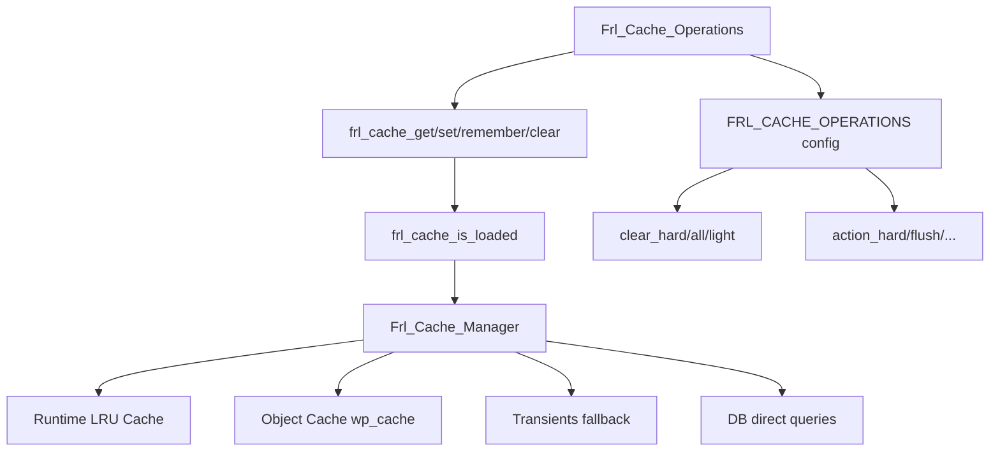

# Cache System Review: Fralenuvole Plugin

**Scope:** `includes/core/cache/` + `config/config-cache*.php` + helper/functions
**Review Date:** 2026-04-28

---

## 1. WHY Was It Done? (Problem Statement)

The cache system solves a **multi-backend unification problem** on a multilingual WordPress site:

- **Primary Need:** Provide a single, consistent caching API regardless of which object cache backend is deployed (Litespeed, Docket Cache, Redis, Memcached, or plain WordPress Transients).
- **Language Awareness:** Cache keys must be scoped per-language (Polylang/WPML) for multilingual CPT permalinks, translations, and navigation — standard WordPress caching has no concept of language-scoped keys.
- **Dependency Management:** When cache group A changes, dependent groups B, C must also be cleared automatically (e.g., clearing `options` cascades to `theme`, `html`, `environment`, `admin`, `adminui`, `rewriter`).
- **Graceful Degradation:** If no external object cache is available, fall back to transients transparently.
- **Cache Clearing Tiers:** Different levels of cache clearing (light/all/hard) for different operational needs.
- **Orchestrated Operations:** Multi-step cache operations (clear + rewrite flush + third-party notification) that execute sequentially with lifecycle hooks, visible in a single source of truth.

---

## 2. Architecture

### Layered Design

```
Request → Helper Functions (frl_cache_get/set/remember/clear)
              │
              ▼
         Frl_Cache_Manager  (core static class)
              │
      ┌───────┼───────────────┐
      ▼       ▼               ▼
  Runtime   Object Cache   Transients
  (LRU)     (wp_cache)     (options table)
```

### Key Files

| File | Role |
|------|------|
| [`includes/core/cache/class-cache-manager.php`](includes/core/cache/class-cache-manager.php):1733 | Core: runtime LRU, persistent get/set/delete, provider detection, batch loads, dependency cascade, purge operations |
| [`includes/core/cache/class-cache-operations.php`](includes/core/cache/class-cache-operations.php):174 | Orchestrator: multi-step composite operations with lifecycle hooks |
| [`includes/core/cache/cache-cleanup.php`](includes/core/cache/cache-cleanup.php):287 | WordPress event hooks that trigger cache invalidation |
| [`config/config-cache.php`](config/config-cache.php):159 | Group definitions, TTLs, dependencies, preload config |
| [`config/config-cache-operations.php`](config/config-cache-operations.php):199 | Multi-step operation definitions (clear_hard, action_hard, etc.) |
| [`includes/helpers/functions-class-helpers.php`](includes/helpers/functions-class-helpers.php):403 | Gate-keeper functions (`frl_cache_is_loaded()`, `frl_cache_get/set/remember/clear`) |

### Class Diagram



### Init Sequence

In [`includes/bootstrap.php`](includes/bootstrap.php):42:
1. `Frl_Cache_Manager` is loaded and `::init()` is called (auto-preloads groups)
2. `Frl_Cache_Operations` is loaded after the manager
3. The error handler is initialized after cache

---

## 3. Features (Detailed)

### 3.1 Runtime LRU Cache
- Request-level static `$runtime_cache[]` array with max 1000 items
- LRU eviction via `$lru['access_order']` associative array (O(1) updates)
- Group-indexed keys (`$group_keys`) for efficient group-level clearing

### 3.2 Multi-Backend Support
- Auto-detects Litespeed, Docket Cache, Redis, Memcached via:
  - Class name heuristics (`str_contains($class_name, 'litespeed')`)
  - File content sniffing of `object-cache.php` (reads first 2KB)
  - Method detection for Docket (`dc_save()`)
- Status tracking: active, inactive drop-in, broken, force-disabled

### 3.3 Language-Aware Keys
- Groups listed in `FRL_CACHE_LANGUAGE_GROUPS` get `$group . '_' . $lang . '_' . $key` format
- Language detected via `frl_get_language()`

### 3.4 Cache Dependency Cascading
- `FRL_CACHE_DEPENDENCIES` defines graph (e.g., `options → theme, html, environment, admin, adminui, rewriter`)
- `clear_group_with_dependencies()` recursively clears dependent groups
- Dedup via `$groups_cleared[]` prevents re-clearing within a request

### 3.5 Batch/Multi-Get Operations
- `get_multi()` supports array keys with chunking (100 per batch)
- On transient fallback, queries all transients for a group in one DB query
- Injects results into WordPress option cache via `wp_cache_add_multiple()`

### 3.6 Lock-Based Race Condition Prevention
- `remember()` uses `wp_cache_add()` with `LOCK_TTL` (2 seconds)
- Exponential backoff: 50ms → 100ms → 200ms
- Falls through to unconditional generation after max retries

### 3.7 Three Clearing Tiers
| Tier | What It Clears | Method |
|------|---------------|--------|
| Light | All groups except heavy (staticdata, blocks, translations, permalinks, postdata) | `purge_light()` |
| All | Everything including heavy groups, with dependency cascade | `purge_all()` |
| Hard | purge_all + wp_cache_flush() + all website transients + OPcache + browser headers | `hard_cache_reset()` |

### 3.8 Orchestrated Multi-Step Operations
- `Frl_Cache_Operations::run('action_hard')` executes:
  1. `frl_cache_clear('hard')` → delegates to `clear_hard`
  2. `frl_schedule_admin_rewrite_flush()` (deferred via 60s transient)
- Lifecycle hooks: `frl_before/after_cache_operation_*`
- All steps run regardless of failure (no abort)
- Re-entrancy guarded via `frl_is_already_running()`

### 3.9 Serialization Safety
- `frl_sanitize_for_serialization()` converts Closures → descriptive arrays, Objects → class names
- Depth-limited (max 5 levels) recursion guard
- Try-catch around `serialize()` to detect non-serializable values

### 3.10 Cache Cleanup Hooks
[`cache-cleanup.php`](includes/core/cache/cache-cleanup.php) registers hooks for:
- `save_post` → clears postdata, permalinks, meta, icons, schema, langswitcher, featured images
- `updated_option` → clears translated option caches for all languages
- `edited_term` → clears permalink and tracked meta caches
- `profile_update` → clears user meta cache
- `pll_save_strings_translations` → bumps translation version + clears translations group
- `wp_update_nav_menu` / `save_post_wp_navigation` → clears navigation cache
- `activated_plugin` / `deactivated_plugin` → clears MU plugin exclusion cache

---

## 4. Modularity Assessment

### Strengths
- **Gate-keeper pattern**: All public helper functions check `frl_cache_is_loaded()` before delegating — safe even if cache manager fails to load.
- **Configuration-driven**: Groups, TTLs, dependencies are constants in config files — easy to audit.
- **Separation of orchestration**: `Frl_Cache_Operations` cleanly separates the "what to do" (step definitions) from "how to do it" (cache manager methods).
- **Cleanup isolation**: Cache cleanup hooks are in their own file, not scattered across the codebase.
- **Inline documentation**: Step `note` fields in [`config-cache-operations.php`](config/config-cache-operations.php) document deferred chains so developers don't need to search the codebase.

### Weaknesses
- **All-static class**: `Frl_Cache_Manager` is entirely static — impossible to mock, test, or swap implementations. This is a common WordPress pattern but limits testability and extension.
- **Mixed responsibilities**: The class does:
  - Runtime cache management (LRU)
  - Persistent cache management (object cache/transients)
  - Provider detection
  - DB operations (transient deletion queries)
  - Browser cache header management
  - Auth cookie save/restore (in `purge_all()`)
- **Constant-based configuration**: `FRL_CACHE_TTL`, `FRL_CACHE_PERSISTENT_GROUPS`, etc. are PHP `const` — cannot be filtered at runtime. Using `apply_filters()` would allow customization without redefining constants.
- **Tight coupling to globals**: Direct use of `$wpdb`, `get_option()`, `wp_cache_*()` functions throughout the class.
- **Unrecognized groups fail silently**: Calling `frl_cache_clear('metadata', ...)` with a group not in any definition array uses defaults silently — no warning logged.

---

## 5. Performance Analysis

### 5.1 Hot Path Costs

| Operation | Cost | Notes |
|-----------|------|-------|
| `should_bypass()` | 2x `get_option()` DB calls (first call) | Static cached after first call, but initial call reads `frl_disable_plugin` + `frl_disable_cache` from `wp_options` |
| `is_object_cache_truly_functional()` | File read + class name checks | Reads up to 2KB of `object-cache.php`. Static cached + transient-cached (WEEK_IN_SECONDS). Acceptable. |
| `get_provider_details()` | File read + plugin status checks | Cached in transient with WEEK_IN_SECONDS TTL. Heavy on first call. |
| `auto_preload()` | Multi-group preload on every page | Preloads 6 groups on frontend, 5 on backend. Each group triggers `get_multi()` which queries DB for transients if no object cache. **Significant overhead on transient-only sites.** |
| `serialize()` in `set()` | Try-catch + serialization | Serializes value twice on success (test + store). Could be optimized by testing serializability differently. |

### 5.2 Preloading Overhead
[`auto_preload()`](includes/core/cache/class-cache-manager.php:78) runs on every non-AJAX request:
- Frontend: preloads `options`, `rewriter`, `environment`, `theme`, `versions`, `html`
- Backend: preloads `options`, `environment`, `theme`, `versions`, `admin`

For transient-only sites (no object cache), each group preload triggers a `SELECT` query against `wp_options` fetching ALL transients for that group. On a site with many cached items, this could be **hundreds of rows per page load**.

### 5.3 `purge_all()` Double Work
When using transient fallback:
1. First deletes all plugin transients in a batch (`delete_transients_from_db(self::PREFIX)`) at line 867
2. Then iterates ALL groups and calls `clear_group_with_dependencies()` which tries to clear transients again per group at line 878

The per-group transient deletion will find nothing (already batch-deleted), but the loop still iterates each group and calls `purge_group_storage()` which checks `use_transient_fallback()` → calls `clear_transients($group)` → executes another `SELECT` + `DELETE` per group.

### 5.4 LRU Size Limit
`$max_runtime_items = 1000` — fixed constant. For sites with many posts/categories, this could cause churn. Should be configurable or adaptive.

### 5.5 Memory in `get_multi(null)`
When `get_multi($group, null)` is called for a persistent group with transient fallback, it loads ALL transient values and ALL timeout values for that group into memory. For large groups (e.g., `postdata` with thousands of posts), this could be memory-intensive.

---

## 6. Issues, Bugs & Logical Flaws

### 🔴 BUG: `'all_options, false'` Parameter Error (Critical) — ✅ FIXED

In [`functions-options.php`](includes/helpers/functions-options.php):124 and :726:

```php
// Before (broken):
frl_cache_clear('options', 'all_options, false');
// After (fixed):
frl_cache_clear('options', 'all_options', false);
```

The `false` was inside the string literal, making it part of the cache key name rather than the third `$include_dependencies` argument. Now correctly skips dependency cascading on option updates.

### 🟡 ISSUE: `metadata` Group Not Registered in Persistent Groups

In [`schema.php`](public/schema.php):55, the `frl_cache_remember()` call uses group `'metadata'`:

| Cache Backend | Persistence Behavior |
|--------------|---------------------|
| Object cache active (Redis/Litespeed/Memcached/Docket) | ✅ Stored via `wp_cache_set()` — persists correctly |
| No object cache (transient-only) | ❌ `use_transient_fallback()` returns `false` — only per-request runtime cache |

**Recommended:** Add `'metadata'` to `FRL_CACHE_PERSISTENT_GROUPS` for transient-only site support.

### 🟡 ISSUE: Auth Cookie Save/Restore in `purge_all()` — ✅ FIXED

Extracted into dedicated [`with_auth_preservation()`](includes/core/cache/class-cache-manager.php:828) wrapper method with documentation explaining the rationale (object cache/options table operations can interfere with WordPress auth cookie validation). `purge_all()` now delegates its core logic to a closure passed to this wrapper.

### ❌ RETRACTED: `pre_option_*` Filter Removal

The `remove_all_filters()` at line 1337 only targets `pre_option_frl_*` hooks. The `frl_` namespace is owned by this plugin — no other code would register on these hooks. Safe in practice.

### ❌ RETRACTED: `$loaded_groups` Reset on Key-Level Clears

The `$loaded_groups` unset at line 1220-1221 is inside the `else` block (line 1214), which only executes on full-group clears (`$key === null`). Single-key clears do not touch `$loaded_groups`. Code is correct.

### 🟡 ISSUE: `serialize()` Called Twice in Hot Path — ✅ FIXED

Replaced the try-catch `serialize()` test with direct use of `frl_sanitize_for_serialization()` output. The sanitizer is a no-op for safe types (arrays, strings, ints) and only transforms Closures/objects — so its output is always safe to pass to `wp_cache_set()`. Eliminates the redundant pre-serialization test.

---

## 7. Areas of Improvement

### P1 - Fix Bugs (Critical)

| Bug | File:Line | Impact | Status |
|-----|-----------|--------|--------|
| `'all_options, false'` string leak | [`functions-options.php:124`](includes/helpers/functions-options.php:124) | Excessive dependency cascade on every option update | ✅ **FIXED** (2026-04-28) |
| Same bug at line 726 | [`functions-options.php:726`](includes/helpers/functions-options.php:726) | Same | ✅ **FIXED** (2026-04-28) |
| `metadata` group not in persistent groups | [`schema.php:55`](public/schema.php:55) | Schema data not persisted on transient-only sites (OK with object cache) | 🟡 Add `metadata` to `FRL_CACHE_PERSISTENT_GROUPS` + `FRL_CACHE_TTL` |

### P2 - Reduce `purge_all()` Double Work

When transient fallback is active, `purge_all()` does:
1. Batch delete ALL plugin transients (line 867)
2. Per-group loop trying to delete transients again (line 878)

**Fix:** Skip the per-group transient deletion when the batch delete has already run. Add a flag `$transients_already_batch_deleted` that `purge_group_storage()` checks.

### P3 - Add Unrecognized Group Warning

Add a warning log when `clear_group_with_dependencies()` receives a group not in any defined array:

```php
if (!isset(self::$TTL[$group]) && !isset(self::$persistent_groups_map[$group])) {
    frl_log("Cache: unrecognized group '{group}' — using defaults", ['group' => $group]);
}
```

### P4 - Make Configuration Filterable

Consider adding `apply_filters()` wrappers around key cache configurations:

- `frl_cache_ttl` — for runtime TTL overrides
- `frl_cache_persistent_groups` — for adding custom groups
- `frl_cache_dependencies` — for extending dependency graph

This would allow site-specific customizations without constant redefinition.

### P5 - Extract Provider Detection

The 158-line `get_provider_details()` method in [`class-cache-manager.php`](includes/core/cache/class-cache-manager.php):208-366 mixes provider detection with cache management. Extract into a dedicated `Cache_Provider_Detector` class:

```php
class Frl_Cache_Provider_Detector {
    public function detect(): array { ... }
    public function is_functional(): bool { ... }
}
```

### P6 - Auth Cookie Side-Effect Refactor

Extract auth state save/restore from `purge_all()` into its own method or a decorator:

```php
private static function with_auth_preservation(callable $fn) {
    $user_id = frl_get_current_user()->ID;
    $cookie = wp_parse_auth_cookie('', 'logged_in');
    $result = $fn();
    if ($user_id && $cookie) { /* restore */ }
    return $result;
}
```

### P7 - Optimize Serialization Test

Replace the try-catch `serialize()` test with a faster check. Since `frl_sanitize_for_serialization()` already handles the problematic cases (Closures, objects), the try-catch could be limited to just those:

```php
$has_unsafe_types = false;
// Check for Closures or objects in the value
_frl_check_serialization_safety($value, $has_unsafe_types);
if ($has_unsafe_types) {
    frl_sanitize_for_serialization($value);
}
```

### P8 - Optional Preloading

*Retracted — preloading batches DB work into one operation; disabling it would scatter individual get_transient() calls across the page render, degrading performance.*

### P9 - Configurable LRU Size — ✅ FIXED

Moved to constant `FRL_CACHE_RUNTIME_MAX_ITEMS = 1000` in [`config-cache.php`](config/config-cache.php). The class now references `self::$max_runtime_items = FRL_CACHE_RUNTIME_MAX_ITEMS`. Adjustable per-site via constant redefinition or config override.

---

## 8. Verification Checklist

Before declaring this review complete:

- [x] Read all cache source files
- [x] Read cache configuration files
- [x] Traced helper function chain from public API to core
- [x] Checked for unrecognized group usage across codebase
- [x] Validated parameter correctness in `frl_cache_clear()` calls
- [x] Analyzed performance hot paths
- [x] Checked for recursion risks (re-entrancy guards)
- [x] Verified dependency graph logic
- [x] Cross-referenced with memory bank architectural rules

---

## Summary

The cache system is **well-architected for its purpose**: a unified multi-backend caching layer with language awareness, dependency cascading, and orchestrated operations. The code quality is high with good inline documentation.

**Fixes applied during review (6):**
1. ✅ `'all_options, false'` string-as-parameter bug fixed at both locations — dependency skipping now works
2. ✅ `purge_all()` double work eliminated — `$transients_batch_deleted` flag skips redundant per-group transient deletion
3. ✅ Auth cookie side-effect extracted — dedicated `with_auth_preservation()` wrapper with documentation
4. ✅ Double `serialize()` eliminated — `frl_sanitize_for_serialization()` output used directly
5. ✅ LRU size made configurable — `FRL_CACHE_RUNTIME_MAX_ITEMS` constant in config
6. ✅ Unrecognized group warning added — `frl_log()` fires when group is in no config array

**Remaining considerations:**
- `metadata` group (used by [`schema.php:55`](public/schema.php:55)) works with object cache but not on transient-only sites — add to `FRL_CACHE_PERSISTENT_GROUPS` if needed
- Provider detection extraction, config filterability remain as potential future improvements

**Retracted concerns (verified safe):**
- `pre_option_frl_*` filter removal only targets plugin's own namespace — safe
- `$loaded_groups` reset only fires on full-group clears — code is correct
- `auto_preload()` batching is the optimal strategy — disabling would scatter DB work

**Positive highlights:**
- Clean separation of orchestration from execution
- Excellent inline documentation with step notes
- Comprehensive cleanup hooks for WordPress events
- Smart provider detection with caching
- Race condition protection in `remember()`
- Graceful degradation across caching backends
