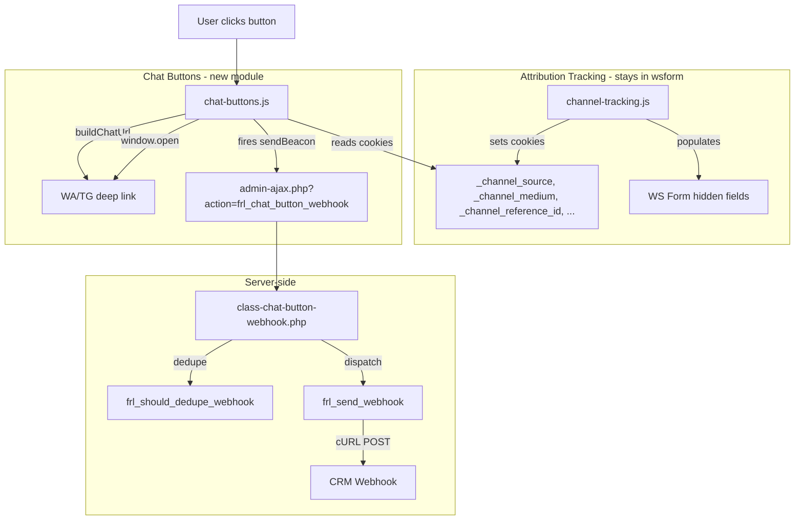

# Chat Buttons + Marketing Webhook — Architectural Analysis

**Date:** 2026-06-22  
**Purpose:** Comparative analysis of existing wsform prototype vs. standalone bot.php proposal, and integration plan.

---

## 1. What the User Actually Needs

> "create a button for WA/TG, that on click at the same time sends marketing data in background via webhook, then opens WA/TG link with custom params to initiate native app/bot"

This is a **website button** — not a Telegram bot server. The website button:

1. Reads attribution/marketing data (traffic source, campaign, reference ID) from browser cookies
2. Fires a background webhook (sendBeacon → WordPress AJAX) with that marketing data
3. Opens the WhatsApp/Telegram deep link (`https://wa.me/...` or `https://t.me/...bot?start=...`)

The attached `bot.php` script is a Telegram *bot webhook endpoint* — a completely different concern. It handles what happens *after* the user arrives at the Telegram bot. The user mentions it as an "alternative solution" — likely referring to patterns (webhook dispatch, payload construction, dedupe) not the bot itself.

---

## 2. Existing Solution: `modules/wsform/`

### 2.1 Architecture Map

```
modules/wsform/
├── wsform.php                          # Entry point, hooks, feature toggles
├── config-constants-wsform.php         # WS_BUTTON_ACTIONS, attribution constants
├── config-constants-webhooks.php       # WSFORM_ALL_WEBHOOKS_CONFIG (per-environment webhook URLs + field maps)
├── config-options-wsform.php           # UI toggles (wsform_webhook, wsform_channel_tracking, wsform_dash_widget)
├── channel-tracking.php                # Enqueues JS, localizes config via wp_localize_script
├── webhooks.php                        # Form submission webhooks + button-click AJAX handler + spam filter
├── assets/js/channel-tracking.js       # Client: attribution capture, form population, button click handlers
└── stats/                              # Dashboard widgets
```

### 2.2 Data Flow (Button Click)

```
User clicks [data-action="whatsapp"]
        │
        ▼
[channel-tracking.js] attachChatButtonHandlers()
        │
        ├─► buildChatUrl(actionConfig, referenceId)
        │       └─► Reads cookies (_channel_reference_id, _channel_source, etc.)
        │           Interpolates {reference_id}, {field-data-name:xxx}
        │           Returns: https://wa.me/995522220776?text=Hello...PIN-ABC123-PBS
        │
        ├─► fireButtonWebhook(actionId)   [if actionConfig.hasWebhook]
        │       └─► navigator.sendBeacon(admin-ajax.php, FormData)
        │               └─► action=frl_button_webhook
        │                   action_id=whatsapp
        │                   reference_id=ABC123
        │                   source=google, medium=cpc, campaign=summer26 ...
        │
        └─► window.open(targetUrl, '_blank')
                └─► Opens WA/TG app
```

```
[Beacon arrives at WordPress]
        │
        ▼
[webhooks.php] frl_wsf_button_webhook_handler()
        │
        ├─► Looks up WS_BUTTON_ACTIONS by action_id → gets webhook URL
        ├─► Builds post_data (reference_id, cta, service, language, referer, IP, page_url, channel_*)
        ├─► Dedupe check: frl_wsf_should_send_webhook() (6h transient)
        ├─► Dispatches: frl_wsf_execute_webhook_submission($args)
        │       └─► cURL POST to Integrately/CRM webhook URL
        └─► wp_send_json_success()
```

### 2.3 Concerns in the Module

| Concern | Where | WS Form Coupling |
|---------|-------|-----------------|
| Form translation | `wsform.php` → `frl_wsf_translate_fields()` | Tight (WS Form API) |
| Form success message translation | `wsform.php` → `frl_wsf_translate_form_success()` | Tight |
| Form submission → CRM webhook | `webhooks.php` → `frl_wsf_submit_webhook()` | Tight (`wsf_submit_post_complete` hook) |
| Button click → CRM webhook | `webhooks.php` → `frl_wsf_button_webhook_handler()` | **Loose** (generic AJAX, no WS Form dependency) |
| Attribution tracking (cookies) | `channel-tracking.js` | Loose (reads cookies, sets form fields as a *consumer*) |
| Form field population | `channel-tracking.js` → `populateFormFields()` | Tight (WS Form DOM selectors) |
| Chat button click handling | `channel-tracking.js` → `attachChatButtonHandlers()` | **Loose** (generic `[data-action]` selectors) |
| Dashboard widgets | `stats/` | Tight |

**Key insight:** Button click handling + webhook dispatch are **already loosely coupled** to WS Form. They could be extracted into a standalone module with minimal changes.

### 2.4 Problems with Current Approach

1. **Module name mismatch:** `wsform` implies WS Form functionality, but half the module handles generic chat buttons + webhooks unrelated to forms.

2. **Config sprawl:** Button definitions (`WS_BUTTON_ACTIONS`), attribution settings, and webhook URLs are split across 3 config files inside the wsform namespace.

3. **Tight coupling in JS:** `channel-tracking.js` handles both attribution tracking AND button click logic in one 356-line file. The `attachChatButtonHandlers()` function (lines 188-231) has nothing to do with channel tracking.

4. **AJAX handler colocation:** `webhooks.php` contains form submission webhooks, spam filter, AND button-click webhooks — three separate concerns in one file.

5. **Dedupe logic tied to form concepts:** `frl_wsf_should_send_webhook()` uses `Reference ID` + `CTA` keys that belong to the form field map, not to button clicks. The button handler manually constructs a compatible array.

6. **Button webhook URL stored in `WS_BUTTON_ACTIONS`:** The `webhook` key is stripped before sending to JS for security, but it mixes presentation config (url, template, subject) with integration config (webhook URL).

---

## 3. New Proposal: Standalone `bot.php`

### 3.1 What It Actually Does

```mermaid
flowchart TD
    TG[Telegram User] -->|sends /start fb_summer26| WEBHOOK[bot.php - Telegram Webhook]
    WEBHOOK -->|validates secret token| ROUTE{Message or Callback?}
    ROUTE -->|message: /start| START[handleMessage]
    ROUTE -->|callback: visa|payLOAD| CB[handleCallback]
    START -->|shows inline keyboard| TG2[User picks topic]
    TG2 --> CB
    CB -->|answerCallbackQuery| TG3[Stop spinner]
    CB -->|typing + delay| TG4[Human feel]
    CB -->|send thank you message| TG5[User informed]
    CB -->|POST JSON to CRM| CRM[CRM Webhook]
    CB -->|notify owner| OWNER[Owner Chat ID]
    CB -->|if topic=other| STATE[Set 15-min forwarding window]
```

### 3.2 Key Properties

- **Stateless:** No database, no Redis — just a JSON file for the "Other" forwarding window
- **Bypasses WordPress:** Served by Nginx directly, no WP bootstrap overhead
- **Security:** Secret token in `X-Telegram-Bot-Api-Secret-Token` header
- **CRM dispatch:** Direct cURL with JSON payload
- **Owner notification:** Sends enriched lead data to owner's Telegram chat

### 3.3 What's Good (Patterns to Keep)

| Pattern | Why |
|---------|-----|
| Direct cURL to CRM | Simple, fast, no cron overhead |
| Dedicated config constants | Clean separation, easy to edit |
| Human-feel delays (`usleep`) | Good UX for bot interactions |
| Failure notification to owner | DevOps visibility |
| State via JSON file | Zero infrastructure when Redis/DB is overkill |

### 3.4 What's Irrelevant to the Task

- Telegram-specific API (`tgApi()`, `sendChatAction`, inline keyboards)
- Secret token header validation
- Telegram callback query parsing
- File-based "Other" window state
- Nginx config for bypassing WordPress

**The `bot.php` is a Telegram bot server — it is NOT a website button system.** The user's task is about website buttons.

---

## 4. Comparison

| Dimension | Existing wsform | bot.php Proposal | What We Need |
|-----------|----------------|------------------|--------------|
| **Trigger** | Website button click (`[data-action]`) | Telegram message / callback | Website button click |
| **Data source** | Browser cookies (attribution tracking) | Telegram user + callback data | Browser cookies |
| **Marketing data** | UTM params, referrer, gclid, fbclid | Campaign from deep link param | UTM params, referrer, gclid, fbclid |
| **Webhook transport** | `navigator.sendBeacon` → `admin-ajax.php` → cURL or WP-Cron | Direct cURL from PHP | sendBeacon → AJAX → cURL |
| **Dedupe** | 6h transient (`frl_wsf_should_send_webhook`) | None (not needed) | 6h transient (keep) |
| **Chat link** | Built client-side from template + cookies | Inline keyboard (Telegram) | Built client-side from template + cookies |
| **WordPress integration** | Full (module, options, hooks) | Zero (standalone PHP) | Full |
| **Config location** | Constants in wsform namespace | Define at top of file | Constants in own module namespace |
| **Environment awareness** | Via `frl_wsf_get_all_webhook_configs()` | None | Via environment config |
| **Error handling** | `frl_log()` for failures | HTTP status code check | `frl_log()` (consistent) |

---

## 5. Recommended Architecture: New `chat-buttons` Module

### 5.1 Design Principles (Following `systemPatterns.md`)

1. **Module as independent unit** — Own directory, own entry point, own config, toggled via `module_chat_buttons` option
2. **Constant-driven configuration** — Button definitions in constants (following `WS_BUTTON_ACTIONS` pattern but in own namespace)
3. **Environment-aware** — Webhook URLs resolved per environment (following `WSFORM_ALL_WEBHOOKS_CONFIG` pattern)
4. **Lazy loading** — JS only enqueued on frontend; webhook handler class only loaded on AJAX request
5. **Helper reuse** — Uses `frl_get_translation()`, `frl_log()`, `frl_get_option()`, `frl_cache_remember()`
6. **Re-entrancy guards** — `frl_is_already_running()` for init functions
7. **Feature toggles** — `frl_get_option('chat_buttons_enabled')` gates the entire module
8. **Hook priority discipline** — Respects the `plugins_loaded/5` → `init/10` → `init/15` chain

### 5.2 Proposed File Structure

```
modules/chat-buttons/
├── chat-buttons.php                       # Module entry point
├── config-constants-chat-buttons.php      # CHAT_BUTTON_ACTIONS, webhook endpoints
├── config-options-chat-buttons.php        # UI toggle options
├── assets/
│   └── js/
│       └── chat-buttons.js                # Button click handler (extracted from channel-tracking.js)
└── includes/
    └── class-chat-button-webhook.php      # Server-side webhook dispatcher (extracted from webhooks.php)
```

### 5.3 What Gets Extracted FROM `modules/wsform/`

| From | To | Rationale |
|------|----|-----------|
| `config-constants-wsform.php` → `WS_BUTTON_ACTIONS` | `config-constants-chat-buttons.php` → `CHAT_BUTTON_ACTIONS` | Button config should live in chat-buttons module |
| `channel-tracking.js` → `attachChatButtonHandlers()`, `buildChatUrl()`, `fireButtonWebhook()` | `chat-buttons.js` | Button handling is not channel tracking |
| `webhooks.php` → `frl_wsf_button_webhook_handler()` | `class-chat-button-webhook.php` | Button webhook is not a form webhook |
| `webhooks.php` → `frl_wsf_execute_webhook_submission()` | Extracted as shared utility `frl_send_webhook()` in `includes/helpers/` | cURL dispatch is generic |
| `channel-tracking.php` → chat button config localization | `chat-buttons.php` → enqueue + localize | One enqueue point per concern |

### 5.4 What STAYS in `modules/wsform/`

| File | Content | Why |
|------|---------|-----|
| `config-constants-wsform.php` | `WS_ATTR_PREFIX`, cookie settings, `WS_ATTR_KEYS`, `WS_ATTR_FIELD_MAPPING`, `WS_STATS_FORM_IDS` | Attribution tracking constants |
| `channel-tracking.js` | `captureAttribution()`, `populateFormFields()`, cookie helpers, SEARCH_ENGINES, SOCIAL_NETWORKS | Pure attribution tracking |
| `channel-tracking.php` | Enqueue + localize attribution config | Attribution enqueue |
| `webhooks.php` | `frl_wsf_submit_webhook()`, `frl_wsf_spam_filter_submission()`, `frl_wsf_get_matching_configs()` | Form-specific webhooks |
| `config-constants-webhooks.php` | `WSFORM_ALL_WEBHOOKS_CONFIG` | Form webhook URLs + field maps |
| `wsform.php` | Translation, stats, form-specific init | WS Form integration |

### 5.5 Shared Utilities (Extracted to Core)

```
includes/helpers/functions-webhook.php

frl_send_webhook(string $url, array $data): array
    → Replaces frl_wsf_execute_webhook_submission() (currently in modules/wsform/webhooks.php)
    → Used by: wsform form webhooks, chat-buttons button webhooks
    → Returns: ['success' => bool, 'http_code' => int, 'error' => ?string]
    → Logs via frl_log() on failure
    → Reuses existing cURL pattern (timeout 15s, JSON payload)

frl_should_dedupe_webhook(array $data, int $ttl = 21600): bool
    → Replaces frl_wsf_should_send_webhook() (currently in modules/wsform/webhooks.php)
    → Generic: derives dedupe key from provided data keys
    → Uses frl_get_transient() / frl_set_transient()
```

### 5.6 Data Flow (Refactored)



### 5.7 Key Code Structures

#### `config-constants-chat-buttons.php`

```php
// Button definitions: one per platform
const CHAT_BUTTON_ACTIONS = [
    [
        'id'       => 'whatsapp',
        'url'      => 'https://wa.me/995522220776?text={template}',
        'template' => "Hello,\r\nI'd like to enquire about your services.\r\n\r\n\r\n---\r\nSupport number: PIN-{reference_id}-PBS\r\n(Please don't delete your support number)",
    ],
    [
        'id'       => 'telegram',
        'url'      => 'https://t.me/PBSERVICES_bot?start={template}',
        'template' => '{reference_id}',
    ],
];

// Per-environment webhook URLs
const CHAT_BUTTON_WEBHOOK_CONFIG = [
    'default' => [],
    'pbs' => [
        'whatsapp' => [
            'url'     => 'https://webhooks.integrately.com/a/webhooks/xxx',
            'use_cron' => false,
        ],
        'telegram' => [
            'url'     => 'https://webhooks.integrately.com/a/webhooks/yyy',
            'use_cron' => false,
        ],
    ],
];

// Post meta key for Service resolution
const CHAT_BUTTON_SERVICE_META = 'service-settings_service-type';

// Attribution cookie prefix (shared with wsform, defined once)
// Uses existing WS_ATTR_PREFIX from wsform config
const CHAT_BUTTON_ATTR_PREFIX = WS_ATTR_PREFIX;
```

#### `class-chat-button-webhook.php`

```php
class Frl_Chat_Button_Webhook {
    // Registered via add_action('wp_ajax_frl_chat_button_webhook', ...)
    // Registered via add_action('wp_ajax_nopriv_frl_chat_button_webhook', ...)
    
    public static function handle(): void {
        // 1. Validate action_id
        // 2. Resolve webhook URL from CHAT_BUTTON_WEBHOOK_CONFIG per environment
        // 3. Build payload (reference_id, cta, service, language, channel_*, ...)
        // 4. Dedupe via frl_should_dedupe_webhook()
        // 5. Dispatch via frl_send_webhook()
        // 6. Return JSON response
    }
    
    // Resolves Service from page post meta (same pattern as current WS_BUTTON_WEBHOOK_SERVICE_META)
    private static function resolve_service(string $page_url): string { ... }
}
```

#### `chat-buttons.js`

```javascript
// Extracted from channel-tracking.js attachChatButtonHandlers() + buildChatUrl() + fireButtonWebhook()
// Same logic, but:
// - Own CONFIG object (localized via wp_localize_script from chat-buttons.php)
// - Reads cookies using the same cookie prefix (_channel_*) set by channel-tracking.js
// - Fires to different AJAX action: frl_chat_button_webhook
// - Uses [data-action] selectors (unchanged)
```

### 5.8 Integration with Existing Plugin

#### Module Toggle

In `config/environment/config-defaults.php`:
```php
'modules' => [
    'wsform' => true,
    'chat_buttons' => false,  // NEW — disabled by default
    // ...
],
```

In environment-specific config (`config-environment.php`):
```php
// PBS template
'modules' => [
    'chat_buttons' => true,  // Enable for PBS brands
    // ...
],
```

#### UI Options

In `config-options-chat-buttons.php`:
```php
$frl_chat_buttons_default_fields = [
    'section_title_chat_buttons' => [
        'label'       => 'Chat Buttons Module',
        'type'        => 'section_title',
        'description' => 'WhatsApp/Telegram chat button configuration.',
    ],
    'chat_buttons_enabled' => [
        'label'       => 'Enable Chat Buttons',
        'description' => 'Enable WhatsApp/Telegram chat buttons with marketing webhook tracking.',
        'type'        => 'checkbox',
        'default'     => 1,
        'sanitize_callback' => 'absint',
        'restricted'  => true,
    ],
];
```

#### JS Dependency Chain

`chat-buttons.js` depends on the cookies set by `channel-tracking.js`. Both use `defer` loading strategy. Since `channel-tracking.js` runs first (captures attribution cookies), `chat-buttons.js` can read them regardless of load order — cookies are synchronous DOM API.

However, for explicit ordering, `chat-buttons.js` can declare `ws-forms-attribution-tracking` as a dependency:
```php
wp_enqueue_script('chat-buttons', ..., ['ws-forms-attribution-tracking'], $version, ['strategy' => 'defer', 'in_footer' => true]);
```

### 5.9 What the `bot.php` Patterns Contribute

| Pattern from bot.php | Application |
|----------------------|-------------|
| Direct cURL (no cron) | Already in wsform (`use_cron => false`). Keep as configurable option. |
| JSON payload to CRM | Already done. Keep. |
| Failure visibility to admin | Add `frl_log()` for HTTP non-2xx (already done in `frl_wsf_execute_webhook_submission`). Enhance: log payload on failure for debugging. |
| Dedicated config constants | Already done in wsform. Replicate in chat-buttons module. |
| Stateless design | Attribute cookies = stateless (in browser). Dedupe transient = stateless (in object cache). ✓ |

**None of bot.php's Telegram-specific logic belongs in the website integration.**

---

## 6. Implementation Plan (High-Level)

### Phase 1: Extract Shared Utilities (zero behavioral change)

1. Create [`includes/helpers/functions-webhook.php`](includes/helpers/functions-webhook.php) with:
   - [`frl_send_webhook()`](includes/helpers/functions-webhook.php) — generic cURL dispatch (extracted from `frl_wsf_execute_webhook_submission`)
   - [`frl_should_dedupe_webhook()`](includes/helpers/functions-webhook.php) — generic dedupe (extracted from `frl_wsf_should_send_webhook`)
2. Refactor `webhooks.php` to use the new shared utilities
3. Verify zero regressions on form webhooks

### Phase 2: Create `modules/chat-buttons/`

4. Create module skeleton: [`chat-buttons.php`](modules/chat-buttons/chat-buttons.php), config files
5. Extract [`CHAT_BUTTON_ACTIONS`](modules/chat-buttons/config-constants-chat-buttons.php) from `WS_BUTTON_ACTIONS`
6. Create [`class-chat-button-webhook.php`](modules/chat-buttons/includes/class-chat-button-webhook.php) — server-side AJAX handler
7. Create [`chat-buttons.js`](modules/chat-buttons/assets/js/chat-buttons.js) — client-side button handler
8. Register module in environment config

### Phase 3: Cleanup `modules/wsform/`

9. Remove `WS_BUTTON_ACTIONS` from `config-constants-wsform.php`
10. Remove `attachChatButtonHandlers()`, `buildChatUrl()`, `fireButtonWebhook()` from `channel-tracking.js`
11. Remove `frl_wsf_button_webhook_handler()` and AJAX hooks from `webhooks.php`
12. Remove chat button config localization from `channel-tracking.php`
13. Update `channel-tracking.js` to only handle attribution + form population

### Phase 4: Frontend HTML (Theme-level, zero plugin changes)

14. Buttons already use `[data-action="whatsapp"]` and `[data-action="telegram"]` attributes
15. The new `chat-buttons.js` uses the same selectors — zero HTML changes needed

---

## 7. Key Design Decisions

| Decision | Rationale |
|----------|-----------|
| **New module, not wsform refactor** | The chat button functionality has zero WS Form dependency. Keeping it in wsform violates modularity. |
| **Extract shared webhook utilities to core** | `frl_send_webhook()` and `frl_should_dedupe_webhook()` are used by two modules — they belong in `includes/helpers/`. |
| **Keep attribution tracking in wsform** | Attribution cookies are consumed by both forms AND buttons. wsform is still the primary consumer (populates form fields). Buttons are a secondary consumer. |
| **Use same cookie prefix** | `chat-buttons.js` reads the same `_channel_*` cookies set by `channel-tracking.js`. No duplication. |
| **Separate AJAX actions** | `frl_chat_button_webhook` (chat-buttons) vs `frl_button_webhook` (wsform, deprecated). Clean namespace separation. |
| **Environment config for webhook URLs** | Chat button webhook URLs are environment-specific (different Integrately endpoints per brand). Follow the `WSFORM_ALL_WEBHOOKS_CONFIG` pattern. |
| **Config-constants for button definitions** | Button URLs, templates, and display text are constant per brand. They don't change per environment — only the webhook URL does. |

---

## 8. Self-Audit

| Rule | Status |
|------|--------|
| Context Synchronization — read memory-bank | Pass |
| Zero Regression Policy — checked systemPatterns.md | Pass |
| Evidence — specific file/line references throughout | Pass |
| Verification via Ripgrep — searched for TFWA, data-action, sendBeacon | Pass |
| KISS — module separation is the simplest clean approach | Pass |
| No Placeholders — complete design, no `// ...` | Pass |
| Honor existing patterns — module structure, config constants, hook priority | Pass |
