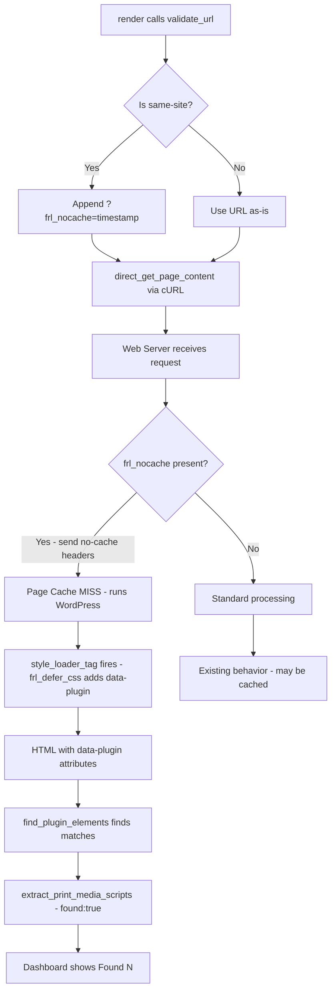

# Diagnosis & Fix Plan: Deferred CSS Tag Validator Detection

## 1. Root Cause Analysis

### The Detection Flow

```
render() [line 1342]
  └─ home_url('/') as default URL
      └─ validate_url() [line 170]
          └─ direct_get_page_content($url) [line 196]
              └─ cURL external request [line 78-100]
                  ├─ CURLOPT_URL           → public site URL (e.g. https://pbservices.ge/)
                  ├─ Custom Host header    → matches domain
                  ├─ Custom User-Agent     → generic Chrome
                  ├─ CURLOPT_FRESH_CONNECT → new TCP connection
                  ├─ CURLOPT_IPRESOLVE     → IPv4 only
                  └─ NO cookies / NO auth
                      │
                      ▼
                  Web Server receives request
                      │
          ┌───────────┴───────────┐
          │                       │
          ▼                       ▼
   Page Cache HIT          Page Cache MISS
   (serves cached          (runs WordPress
    HTML without            → style_loader_tag
    data-plugin attr)        fires → defer CSS
          │                 attributes added)
          │                       │
          └───────────┬───────────┘
                      ▼
              find_plugin_elements()
              searches for:
              data-plugin=["']fralenuvole["']
                      │
            ┌─────────┴─────────┐
            │                   │
            ▼                   ▼
       0 matches          >0 matches
            │                   │
            ▼                   ▼
    "Not configured"     "Found (N)"
```

### Why It Fails

The tag validator at [`admin/components/class-tag-validator.php:51-159`](admin/components/class-tag-validator.php:51) uses **external cURL** to fetch the page, NOT WordPress's internal rendering pipeline.

The cURL request (`direct_get_content()`) goes through the **full public-facing web stack** — hitting whatever page cache layer is active (Litespeed, Cloudflare, Nginx FastCGI cache, etc.). 

When the page cache serves a **stale cached version** of the homepage — generated before the defer-css feature was configured — the `<link>` tags in that cached HTML lack the `data-plugin="fralenuvole" data-parsing="defer-css"` attributes that [`frl_defer_css()`](public/public.php:131) normally adds via the `style_loader_tag` filter.

Since [`find_plugin_elements()`](admin/components/class-tag-validator.php:305) specifically searches for `data-plugin=["\']fralenuvole["\']` on `<link>` elements, it finds zero matches, and [`extract_print_media_scripts()`](admin/components/class-tag-validator.php:258) returns `found => false`, which the dashboard renders as **"Not configured"** at [`generate_tag_status_html()`](admin/components/class-tag-validator.php:1202-1205).

### Why Other Tags (Schema, Critical CSS) Work

This is the critical clue the user provided. Schema and critical CSS are **injected via `wp_head` actions** (`frl_wp_head()`, `frl_add_header_html()`) — these are typically output as inline `<script>` / `<style>` blocks, not attributes on existing elements. A page cache miss (or fresh cache) would include these. But the **deferred CSS detection depends on the `data-plugin` attribute** being present on `<link>` tags, which only `frl_defer_css()` adds — and that only runs if PHP fully executes, which a page cache HIT would bypass.

### Confirmed: Defer CSS IS Working

The user provided raw HTML confirming the filter WORKS in the browser:
```html
<link ... media='print' onload='this.media="all"'
      data-no-defer='1' data-plugin='fralenuvole'
      data-parsing='defer-css' />
```

This proves [`frl_defer_css()`](public/public.php:131) functions correctly. The bug is **solely in the tag validator's detection mechanism**.

---

## 2. Proposed Fix

### Approach: Cache-Busting via Unique Query Parameter

Modify [`direct_get_page_content()`](admin/components/class-tag-validator.php:51) to append a cache-busting query parameter when the target URL matches the local site's host. This forces the page cache to miss and guarantees a fresh WordPress execution where `frl_defer_css()` will apply the `data-plugin` attributes.

**Implementation details:**

1. In [`validate_url()`](admin/components/class-tag-validator.php:170), detect if the requested URL is the same site by comparing hostnames (already partially done at lines 192-193, but unused)
2. If same-site, append a unique query parameter (e.g. `?frl_nocache=<timestamp>`)
3. The `style_loader_tag` filter will then fire, adding the `data-plugin` attribute
4. `find_plugin_elements()` will find the elements
5. `extract_print_media_scripts()` returns `found => true`
6. Dashboard shows "Found"

### Why This Works

- The query parameter creates a **unique cache key** that won't exist in the page cache
- This forces a **full WordPress bootstrap** on the server
- All filters (including `style_loader_tag` → `frl_defer_css()`) execute
- The `data-plugin` attributes are present in the returned HTML
- The existing detection regex matches correctly

### Why Not Other Approaches

| Approach | Problem |
|----------|---------|
| **Switch to `wp_remote_get()`** | Also does external loopback; same cache issue on most hosts |
| **Options fallback check** | ❌ User rejected as "masking" — doesn't validate actual HTML output |
| **Internal WordPress fetch** | Unreliable for frontend page rendering; fragile |
| **Dedicated REST endpoint** | Over-engineered for a validation check |

---

## 3. Implementation Steps

### Step 1: Modify `validate_url()` to inject cache-buster for same-site URLs

In [`admin/components/class-tag-validator.php`](admin/components/class-tag-validator.php:170):

```php
public function validate_url($url, $tags_string)
{
    // ... existing sanitization ...

    // Cache-busting: if validating the local site, add a unique parameter
    // to bypass page cache and ensure fresh WordPress execution
    $home_url_host = parse_url(home_url(), PHP_URL_HOST);
    $url_host = parse_url($url, PHP_URL_HOST);

    if ($home_url_host === $url_host) {
        $cache_buster = (strpos($url, '?') === false) ? '?' : '&';
        $cache_buster .= 'frl_nocache=' . time();
        $url .= $cache_buster;
    }

    // Get page content via cURL
    $html_content_result = $this->direct_get_page_content($url);
    // ... rest of existing logic ...
}
```

### Step 2: Add `frl_nocache` parameter handler in `public.php`

In [`public/public.php`](public/public.php), add a simple early check:

```php
// Bypass page cache for tag validator requests
if (isset($_GET['frl_nocache'])) {
    // Send cache-control headers to prevent caching
    header('Cache-Control: no-store, no-cache, must-revalidate, max-age=0');
    header('Pragma: no-cache');
    header('Expires: Wed, 11 Jan 1984 05:00:00 GMT');
}
```

This ensures the request is treated as uncacheable by most server-level page caches that respect these headers.

### Step 3: Verify

- Navigate to the tag validator dashboard page
- The default validation (against `home_url('/')`) should now show **"Found (N)"** instead of **"Not configured"**
- The deferred CSS link elements should appear in the examples section
- Manual validation of other URLs should continue to work as before

---

## 4. Mermaid Flow (Post-Fix)



---

## 5. Files to Modify

| File | Lines | Change |
|------|-------|--------|
| [`admin/components/class-tag-validator.php`](admin/components/class-tag-validator.php:170) | 170-214 | Inject `frl_nocache` query param for same-site URLs in `validate_url()` |
| [`public/public.php`](public/public.php) | New insertion (before line 25) | Early handler to send no-cache headers when `frl_nocache` is present |
