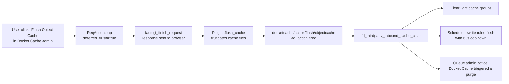

# Docket Cache — Thirdparty Cache Bridge Integration Plan

## Overview

Add Docket Cache (WordPress object cache accelerator by Nawawi Jamili) to the existing bidirectional cache bridge in `modules/thirdparty/`.

## Research Findings

### Docket Cache Native Hooks (verified from source code)

| Direction | Hook / Mechanism | Source | Status |
|-----------|-----------------|--------|--------|
| **Inbound** 🔽 | [`docketcache/action/flush/objectcache`](https://github.com/nawawi/docket-cache/blob/master/includes/src/ReqAction.php) | Fired by `ReqAction.php` after deferred object cache flush completes in admin | ✅ Native hook, confirmed in source |
| **Outbound** 🔼 for `hard` | Already handled by [`hard_cache_reset()`](includes/core/cache/class-cache-manager.php:1737) which calls `wp_cache_flush()` at line 1738 | Docket Cache IS the WP Object Cache backend — `wp_cache_flush()` flushes it natively | ❌ Redundant — see analysis below |
| **Outbound** 🔼 for `rewrite_flush` | [`frl_flush_rewrite_rules()`](includes/plugin-lifecycle.php:179) does NOT call `wp_cache_flush()` | Adding it would flush object cache on every rewrite rule flush — unnecessary side effect | ❌ Not needed |
| **Query trigger** | None — Docket Cache uses POST/AJAX with nonce, not GET params | — | ❌ No entry needed |

### Key insight from user feedback

**Outbound notification is unnecessary** for Docket Cache because:

```
clear_hard operation (config-cache-operations.php:40)
  Step 0: Frl_Cache_Manager::hard_cache_reset()
            ├── purge_all()                    ← fralenuvole groups
            ├── wp_cache_flush()               ← ← ← THIS ALREADY FLUSHES DOCKET CACHE
            └── clear_all_website_transients()
  Step 1: frl_thirdparty_maybe_notify('hard')  ← would call wp_cache_flush() AGAIN if added
```

Since Docket Cache provides the `object-cache.php` drop-in that overrides `WP_Object_Cache`, calling `wp_cache_flush()` in `hard_cache_reset()` already flushes ALL of Docket Cache's cached objects. An outbound entry would be **redundant** for `hard` and **unnecessary** for `rewrite_flush`.

## Changes Required

### Only 1 file, 1 constant entry

**File**: [`modules/thirdparty/config-constants-thirdparty.php`](modules/thirdparty/config-constants-thirdparty.php)

**Add to [`FRL_THIRDPARTY_INBOUND_HOOKS`](modules/thirdparty/config-constants-thirdparty.php:26)** (after line 46, before closing `];`):

```php
// Docket Cache — post-flush hook fired after Docket Cache completes a flush
'docketcache/action/flush/objectcache' => [
    'label' => 'Docket Cache',
    'clear' => 'light',
    'rewrite_flush' => true,
],
```

**No changes** to [`modules/thirdparty/thirdparty.php`](modules/thirdparty/thirdparty.php) — the existing dynamic dispatch at lines 124-126 already iterates `array_keys(frl_thirdparty_get_inbound_hooks())` and calls `add_action()` for each hook automatically.

## Integration Flow



## Why Outbound is Already Covered

| Trigger | Calls `wp_cache_flush()`? | Effect on Docket Cache |
|---------|--------------------------|----------------------|
| `hard` | ✅ Yes — `hard_cache_reset()` line 1738 | Docket Cache flushed natively via WP Object Cache API |
| `all` | ❌ No — `purge_all()` only | Docket Cache NOT flushed (intentional — `all` is fralenuvole-internal) |
| `light` | ❌ No — `purge_light()` only | Docket Cache NOT flushed |
| `rewrite_flush` | ❌ No — `frl_flush_rewrite_rules()` | Docket Cache NOT flushed (not needed) |

## Verification Checklist

1. **Inbound registration** — `has_action('docketcache/action/flush/objectcache')` returns truthy when `thirdparty_cache_inbound` option is enabled
2. **No regressions** — LiteSpeed, Breeze, WP Rocket integrations continue working
3. **Admin notice** — When admin flushes Docket Cache, fralenuvole displays "Docket Cache triggered a purge: light cache cleared"
4. **No double flush** — `hard_cache_reset()` still only calls `wp_cache_flush()` once (no outbound redundancy added)

## Files Modified

| File | Change |
|------|--------|
| [`modules/thirdparty/config-constants-thirdparty.php`](modules/thirdparty/config-constants-thirdparty.php) | Add 1 array entry to `FRL_THIRDPARTY_INBOUND_HOOKS` |
| [`modules/thirdparty/thirdparty.php`](modules/thirdparty/thirdparty.php) | No changes needed |
