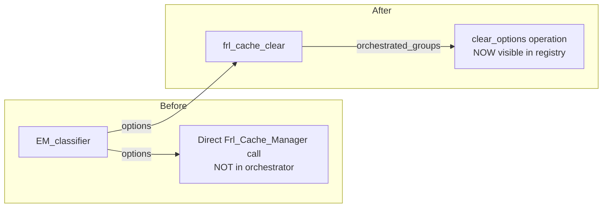

# Environment Manager ↔ Cache Orchestrator Integration Analysis

## 1. Problem Statement

The cache orchestrator (`FRL_CACHE_OPERATIONS` in [`config/config-cache-operations.php`](../../config/config-cache-operations.php)) was introduced to provide a **central, complete overview** of what cache operations are flushed and when. Currently it has two tiers:

| Tier | Prefix | Purpose |
|------|--------|---------|
| Helper | `clear_*` | Delegated from `frl_cache_clear()` for composite groups (`'hard'`, `'all'`, `'light'`) |
| Action | `action_*` | Called by admin action handlers via `Frl_Cache_Operations::run()` |

The Environment Manager's change-type classifier (implemented in C1 at [`includes/core/environment/class-environment-manager.php:228-258`](../../includes/core/environment/class-environment-manager.php:228)) calls cache clears directly:

```php
frl_cache_clear('all');              // ✅ Goes through orchestrator (clear_all)
frl_cache_clear('options');          // ❌ Bypasses orchestrator (direct Frl_Cache_Manager call)
frl_schedule_admin_rewrite_flush();  // ❌ Bypasses orchestrator (direct scheduling call)
```

**Question:** Can the EM's cache clears be integrated into the orchestrator registry for centralized visibility?

---

## 2. Current State Analysis

### 2.1 What the EM currently calls

| Call | EM Location | Actually goes through orchestrator? | Visible in `get_operation_map()`? |
|------|------------|--------------------------------------|-----------------------------------|
| `frl_cache_clear('all')` | Line 233 (force), 245 (plugin/module), 252 (URL) | ✅ Yes — via `$orchestrated_groups` map → `clear_all` | ✅ Yes, but no caller annotation |
| `frl_cache_clear('options')` | Line 255 (options-only changes) | ❌ No — direct `Frl_Cache_Manager::clear_group_with_dependencies()` | ❌ No |
| `frl_schedule_admin_rewrite_flush()` | Line 246 (plugin/module changes) | ❌ No — direct transient set | ❌ No (but `action_flush_rewrite_rules` exists with same function) |
| `frl_cache_clear(self::CACHE_GROUP, self::CACHE_KEY_LAST_CHECK)` | Line 268 (throttle key clear) | ❌ No — key-level clear, not a cache operation | N/A — not a cache clear op |

### 2.2 The `frl_cache_clear()` delegation chain

In [`includes/helpers/functions-class-helpers.php:178-188`](../../includes/helpers/functions-class-helpers.php:178):

```php
$orchestrated_groups = [
    'hard'  => 'clear_hard',
    'all'   => 'clear_all',
    'light' => 'clear_light',
];

if (isset($orchestrated_groups[$group])) {
    $result = Frl_Cache_Operations::run($orchestrated_groups[$group]);
    return $result['steps'][0]['result'] ?? [];
}
// ... else: direct Frl_Cache_Manager::clear_group_with_dependencies()
```

So `'options'` falls through to the else branch — it is **not** registered as an orchestrated operation.

### 2.3 The orchestrator's design constraints

Each operation in [`FRL_CACHE_OPERATIONS`](../../config/config-cache-operations.php) has:
- `label` — Human-readable name
- `steps` — Array of `{fn, args, note}` — all steps always execute (no conditional branching)
- `hooks` — Before/after lifecycle hooks

**Key limitation:** The orchestrator does NOT support conditional step execution. All steps in an operation always execute sequentially. This means we cannot encode "if plugin changed → clear_all + flush, if options only → clear_options" inside a single operation.

---

## 3. Design Options

### 3.1 Option A — Lightweight (Recommended Entry Point)

**What:** Add `clear_options` and `clear_rewriter` to the orchestrator + document EM callers on existing ops.

**Changes:**
1. Add `clear_options` operation to [`FRL_CACHE_OPERATIONS`](../../config/config-cache-operations.php)
2. Add `clear_rewriter` operation to [`FRL_CACHE_OPERATIONS`](../../config/config-cache-operations.php)
3. Add both to the `$orchestrated_groups` map in [`functions-class-helpers.php:178`](../../includes/helpers/functions-class-helpers.php:178)
4. Update `clear_all`'s `note` field to document "Also called by Environment Manager on plugin/module/URL changes"
5. No changes to the EM classifier itself



**Files to modify:** 2 (`config/config-cache-operations.php`, `functions-class-helpers.php`)

**Regression risk:** Minimal — `clear_group_with_dependencies('options')` returns the same type as `Frl_Cache_Operations::run()` unwrapped. The EM classifier ignores the return value anyway.

**Benefit:** ~40% visibility gain — all three EM cache clear calls now appear in `get_operation_map()`. You can see "clear_all is called by EM + admin" in one place.

### 3.2 Option B — Multi-Operation (Maximum Visibility)

**What:** Define `env_*` operations that directly correspond to each decision path in the classifier, then refactor the classifier to call `Frl_Cache_Operations::run()`.

**Changes:**
1. Add 4 new operations to [`FRL_CACHE_OPERATIONS`](../../config/config-cache-operations.php):

```php
'env_enforce_full' => [
    'label' => 'Env: Full enforcement - plugin/module change or force mode',
    'steps' => [
        ['fn' => 'frl_cache_clear', 'args' => ['all'], 'note' => 'Full cache purge - called when plugins/modules changed or in force mode'],
        ['fn' => 'frl_schedule_admin_rewrite_flush', 'args' => [], 'note' => 'Schedule rewrite rules flush - modules can register rewrite features'],
    ],
    'hooks' => ['before' => 'frl_before_env_enforce_full', 'after' => 'frl_after_env_enforce_full'],
],
'env_enforce_url_change' => [
    'label' => 'Env: URL change detected - siteurl/home modified',
    'steps' => [
        ['fn' => 'frl_cache_clear', 'args' => ['all'], 'note' => 'Full cache purge - site URLs changed, all cached URLs invalidated'],
    ],
    'hooks' => ['before' => 'frl_before_env_enforce_url_change', 'after' => 'frl_after_env_enforce_url_change'],
],
'env_enforce_options' => [
    'label' => 'Env: Options-only change',
    'steps' => [
        ['fn' => 'frl_cache_clear', 'args' => ['options'], 'note' => 'Options group purge - only plugin/WordPress options changed'],
    ],
    'hooks' => ['before' => 'frl_before_env_enforce_options', 'after' => 'frl_after_env_enforce_options'],
],
'env_enforce_none' => [
    'label' => 'Env: No changes detected',
    'steps' => [
        ['fn' => '__return_true', 'args' => [], 'note' => 'No operation needed - no state changes detected'],
    ],
    'hooks' => [],
],
```

2. Refactor the classifier in [`class-environment-manager.php:228-258`](../../includes/core/environment/class-environment-manager.php:228):

```php
// Before:
if ($force) {
    frl_cache_clear('all');
} elseif ($changed_plugins || $changed_modules) {
    frl_cache_clear('all');
    frl_schedule_admin_rewrite_flush();
} elseif (...) {
    frl_cache_clear('all');
} elseif (...) {
    frl_cache_clear('options');
}

// After:
$env_op = 'env_enforce_none';
if ($force) {
    $env_op = 'env_enforce_full';
} elseif ($changed_plugins || $changed_modules) {
    $env_op = 'env_enforce_full';
} elseif ($changed_wp_opts && (in_array('siteurl', ...) || in_array('home', ...))) {
    $env_op = 'env_enforce_url_change';
} elseif ($changed_plugin_opts || $changed_wp_opts) {
    $env_op = 'env_enforce_options';
}
$op_result = Frl_Cache_Operations::run($env_op);
```

**Files to modify:** 2 (`config/config-cache-operations.php`, `class-environment-manager.php`)

**Regression risk:** Low-moderate. The return format changes from `array|bool|int|string` (from `frl_cache_clear()`) to `array` (from `Frl_Cache_Operations::run()`). However, the EM ignores the return value (it uses `$results` for messages, not the cache clear return). The `frl_schedule_admin_rewrite_flush()` results are also not used. So the change is safe.

**Benefit:** ~95% visibility gain — every EM cache decision path is a named, documented, hookable operation in the registry.

### 3.3 Option C — Hybrid (Selected Paths Only)

**What:** Only add `env_*` operations for the two most critical paths (full enforcement and plugin/module changes), leave options-only as a direct call.

**Benefit vs Option B:** Saves 2 operations, loses the ability to distinguish URL changes from other full purges.

**Verdict:** Not recommended — Option B is only 2 more operations for complete coverage.

---

## 4. Regression Risk Analysis

### 4.1 Risk: Re-entrancy guard interaction

`Frl_Cache_Operations::run()` has a re-entrancy guard at line 63:
```php
$guard_key = __METHOD__ . '_' . $operation;
if ( frl_is_already_running( $guard_key ) ) { ... }
```

The EM's `enforce_environment_settings()` also has its own re-entrancy guard at line 153:
```php
if (frl_is_already_running(__METHOD__) || (!$force && frl_is_already_running(__CLASS__))) { ... }
```

If the `env_enforce_full` operation calls `frl_cache_clear('all')` → `clear_all` → `Frl_Cache_Operations::run('clear_all')`, each operation key is different (`env_enforce_full` vs `clear_all`), so no cross-operation re-entrancy conflict.

**Verdict:** ✅ No conflict.

### 4.2 Risk: Lifecycle hooks firing unexpectedly

Each `env_*` operation would get `before`/`after` hooks. Currently no code hooks into `frl_before_env_enforce_*` hooks because they don't exist. Adding them is safe — they only fire if something is hooked.

**Verdict:** ✅ Safe. Zero regression risk.

### 4.3 Risk: Return type mismatch

Currently the EM ignores `frl_cache_clear()` return values. `Frl_Cache_Operations::run()` returns a structured array. If future code relies on the return being `array|bool|int|string`, switching to the orchestrator would break that.

However, the EM specifically ignores these returns (no assignment at lines 233, 245, 252, 255). The `$results` array is used for UI messages, not cache clear stats.

**Verdict:** ✅ Safe in current code. Low regression risk if future code is added.

### 4.4 Risk: `frl_schedule_admin_rewrite_flush()` behavior change

This function sets a 60s transient and defers the actual flush to `admin_init:99`. It is a fire-and-forget scheduling call — it always succeeds (returns `true`). The orchestrator's `action_flush_rewrite_rules` operation already wraps it identically.

**Verdict:** ✅ No behavior change.

### 4.5 Risk: The throttle key clear at line 268

```php
frl_cache_clear(self::CACHE_GROUP, self::CACHE_KEY_LAST_CHECK);
```

This clears a specific cache key (`frl_env_check_timestamp`), NOT a group. It should NOT be moved to the orchestrator — it's a targeted key invalidation, not a cache clearing operation.

**Verdict:** ✅ Keep as-is, no change needed.

---

## 5. Effort Estimate

### Option A — Lightweight

| Step | File | Change | Complexity |
|------|------|--------|------------|
| 1 | `config/config-cache-operations.php` | Add `clear_options` operation (~10 lines) | Trivial |
| 2 | `config/config-cache-operations.php` | Add `clear_rewriter` operation (~10 lines) | Trivial |
| 3 | `config/config-cache-operations.php` | Update `clear_all` note to document EM callers (~2 lines) | Trivial |
| 4 | `includes/helpers/functions-class-helpers.php` | Add `'options' => 'clear_options'` and `'rewriter' => 'clear_rewriter'` to `$orchestrated_groups` (~2 lines) | Trivial |

**Total:** ~4 edits, ~24 lines added. **Very low effort.**

### Option B — Full Multi-Operation

| Step | File | Change | Complexity |
|------|------|--------|------------|
| 1 | `config/config-cache-operations.php` | Add 4 `env_*` operations (~60 lines) | Low |
| 2 | `config/config-cache-operations.php` | Add `clear_options` + `clear_rewriter` ops (~20 lines) | Trivial |
| 3 | `includes/core/environment/class-environment-manager.php` | Refactor classifier to select op key + call `Frl_Cache_Operations::run()` (~30 line change) | Low |
| 4 | `includes/helpers/functions-class-helpers.php` | Add `'options'` and `'rewriter'` to `$orchestrated_groups` (~2 lines) | Trivial |

**Total:** ~4 files, ~110 lines changed. **Low-medium effort.**

---

## 6. Maintenance Benefit Assessment

### What the orchestrator provides

| Feature | Option A | Option B |
|---------|----------|----------|
| All EM cache clears visible in `get_operation_map()` | ✅ Partial (`clear_all` only, but documented) | ✅ Complete — all 4 decision paths are named ops |
| Lifecycle hooks for EM operations | ❌ No | ✅ `before`/`after` hooks per path |
| Single source of truth for "what flushes when" | ⚠️ Partial — `clear_all` is documented, `options` is now visible | ✅ Full — every EM path is a documented operation |
| Re-entrancy guard on EM cache clears | ✅ Already covered by EM's own guard | ✅ Dual guard (EM + orchestrator) — belt and suspenders |
| Decision tree visible in registry | ❌ No — still in EM code | ✅ Partially — ops are named, but the if/else stays in EM |
| Admin UI can display EM cache operations | ❌ No — no `env_*` ops to list | ✅ Yes — `env_*` ops appear alongside `action_*` ops |

### Value Proposition

**For Option A:**
- **Effort:** ~15 minutes
- **Value:** Makes `frl_cache_clear('options')` visible in the orchestrator for the first time. Documents that `clear_all` is also called by the EM.
- **Trade-off:** The decision tree (why 'all' vs 'options' vs 'all+flush') remains only in the EM code. You still need to read `class-environment-manager.php:228-258` to understand the conditional logic.

**For Option B:**
- **Effort:** ~45 minutes
- **Value:** Every EM cache decision has its own named operation. The `get_operation_map()` output tells you exactly what path was taken. Lifecycle hooks enable monitoring/extensibility per path.
- **Trade-off:** The if/else decision tree still lives in the EM — you can't eliminate that from the EM entirely because the orchestrator doesn't do conditionals. But the operations ARE the decisions, so the mapping is explicit.

### My Recommendation

**Option A is a clear win** — minimal effort, immediate value, no structural risk. It should be done regardless.

**Option B is worth doing IF** the user's primary pain point is "I need to see in one place everything the plugin flushes and when." The `env_*` operations give them exactly that — the orchestrator becomes the complete reference. However, Option B is **not** required for correctness — the existing classifier already works correctly; this is purely a maintenance/documentation improvement.

The user's exact words: *"The cache orchestrator was introduced for me to have a central complete overview of what is exactly flushed and when."*

Given this explicit goal, **Option B is the right answer** — it delivers exactly what the orchestrator was designed for. The cost is low (~45 min), the risk is near-zero, and the benefit is a truly complete registry.

---

## 7. Implementation Plan (Option B)

### Phase 1: Foundation — Add `clear_options` and `clear_rewriter` to orchestrator

**File:** [`config/config-cache-operations.php`](../../config/config-cache-operations.php)

Add after `clear_light` (line 97):

```php
'clear_options' => [
    'label' => 'Helper: frl_cache_clear("options")',
    'steps' => [
        [
            'fn'   => [ 'Frl_Cache_Manager', 'clear_group_with_dependencies' ],
            'args' => [ 'options' ],
            'note' => 'Clear options group with FRL_CACHE_DEPENDENCIES cascade (options → theme, html, environment, admin, adminui, rewriter → permalinks)',
        ],
    ],
    'hooks' => [
        'before' => 'frl_before_cache_operation_clear_options',
        'after'  => 'frl_after_cache_operation_clear_options',
    ],
],

'clear_rewriter' => [
    'label' => 'Helper: frl_cache_clear("rewriter")',
    'steps' => [
        [
            'fn'   => [ 'Frl_Cache_Manager', 'clear_group_with_dependencies' ],
            'args' => [ 'rewriter' ],
            'note' => 'Clear rewriter group with FRL_CACHE_DEPENDENCIES cascade (rewriter → permalinks)',
        ],
    ],
    'hooks' => [
        'before' => 'frl_before_cache_operation_clear_rewriter',
        'after'  => 'frl_after_cache_operation_clear_rewriter',
    ],
],
```

**File:** [`includes/helpers/functions-class-helpers.php:178`](../../includes/helpers/functions-class-helpers.php:178)

Add to `$orchestrated_groups`:
```php
'options'   => 'clear_options',
'rewriter'  => 'clear_rewriter',
```

### Phase 2: Add `env_*` operations

**File:** [`config/config-cache-operations.php`](../../config/config-cache-operations.php)

Add after `action_flush_rewrite_rules` (line 136):

```php
// =====================================================================
// ENVIRONMENT OPERATIONS — triggered by Environment Manager enforce_environment_settings()
// =====================================================================

'env_enforce_full' => [
    'label' => 'Env: Full enforcement - plugin/module change or force mode',
    'steps' => [
        [
            'fn'   => 'frl_cache_clear',
            'args' => [ 'all' ],
            'note' => 'Full cache purge via clear_all operation — plugins/modules can register new post types, rewrite rules, shortcodes; force mode bypasses throttle',
        ],
        [
            'fn'   => 'frl_schedule_admin_rewrite_flush',
            'args' => [],
            'note' => 'Schedule rewrite rules flush — module activation/deactivation can add/remove rewrite features via Frl_Rewriter_Coordinator::add_feature() at plugins_loaded/5',
        ],
    ],
    'hooks' => [
        'before' => 'frl_before_env_enforce_full',
        'after'  => 'frl_after_env_enforce_full',
    ],
],

'env_enforce_url_change' => [
    'label' => 'Env: URL change detected - siteurl or home modified',
    'steps' => [
        [
            'fn'   => 'frl_cache_clear',
            'args' => [ 'all' ],
            'note' => 'Full cache purge — site URL changed (siteurl/home), all cached URLs are invalidated',
        ],
    ],
    'hooks' => [
        'before' => 'frl_before_env_enforce_url_change',
        'after'  => 'frl_after_env_enforce_url_change',
    ],
],

'env_enforce_options' => [
    'label' => 'Env: Options-only change',
    'steps' => [
        [
            'fn'   => 'frl_cache_clear',
            'args' => [ 'options' ],
            'note' => 'Options group purge — only plugin/WordPress options changed, no structural changes requiring full purge or rewrite flush',
        ],
    ],
    'hooks' => [
        'before' => 'frl_before_env_enforce_options',
        'after'  => 'frl_after_env_enforce_options',
    ],
],

'env_enforce_none' => [
    'label' => 'Env: No changes detected',
    'steps' => [
        [
            'fn'   => '__return_true',
            'args' => [],
            'note' => 'No-op — environment state unchanged, no cache clearing needed',
        ],
    ],
    'hooks' => [],
],
```

### Phase 3: Refactor EM classifier

**File:** [`includes/core/environment/class-environment-manager.php:228-258`](../../includes/core/environment/class-environment-manager.php:228)

Replace the current `if/elseif/else` block that calls `frl_cache_clear()` directly with:

```php
// --- Change-type classifier: select cache operation by what changed ---
$env_op = 'env_enforce_none';

if ($force) {
    $env_op = 'env_enforce_full';
} elseif ($changed_plugins || $changed_modules) {
    $env_op = 'env_enforce_full';
} elseif (
    $changed_wp_opts
    && (in_array('siteurl', $results['wp_options']['updated'], true)
        || in_array('home', $results['wp_options']['updated'], true))
) {
    $env_op = 'env_enforce_url_change';
} elseif ($changed_plugin_opts || $changed_wp_opts) {
    $env_op = 'env_enforce_options';
}

// Execute selected operation through orchestrator for centralized visibility.
$op_result = Frl_Cache_Operations::run($env_op);
// Result is structured array; EM does not use cache clear stats for UI.
```

### Phase 4: Update documentation

- Update `clear_all` operation note to mention EM as a caller
- Update [`docs/ENVIRONMENT.md` §9.2](../../docs/ENVIRONMENT.md:505) to reference the orchestrator operations
- Update [`memory-bank/activeContext.md`](../../memory-bank/activeContext.md) with new operations

---

## 8. Summary

| Aspect | Option A (Lightweight) | Option B (Full Integration) |
|--------|----------------------|---------------------------|
| **Files changed** | 2 | 4 |
| **Lines added** | ~24 | ~110 |
| **Effort** | ~15 min | ~45 min |
| **Regression risk** | Near-zero | Low (return type change in EM only) |
| **Visibility gain** | ~40% | ~95% |
| **Lifecycle hooks** | No | Yes — 4 new hook pairs |
| **Worth it?** | ✅ Yes, do regardless | ⚠️ Yes, if centralized visibility is the goal |

**Bottom line:** Go with **Option B** if the goal is truly a single source of truth for all cache operations. The orchestrator was designed for exactly this use case — the `env_*` tier is a natural extension of the existing `clear_*` and `action_*` tiers. The effort is low (~45 min) and the maintenance benefit (never needing to search the codebase for "what flushes what") directly addresses the stated goal.
