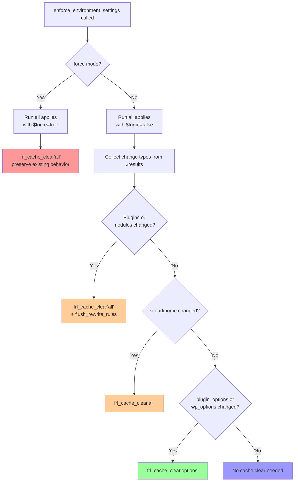

# Environment Manager — Patch Plan

**Date:** 2026-04-29  
**Version:** Fralenuvole v5.6.0  
**Status:** REVISED per codebase investigation + user feedback  
**Based on:** [`plans/environment-manager-review.md`](plans/environment-manager-review.md)  
**Target:** [`includes/core/environment/`](../../includes/core/environment/) — 9 files

---

## Table of Contents

1. [Deep Analysis: C1 — `frl_cache_clear('all')` on every change](#1-deep-analysis-c1---frl_cache_clearall-on-every-change)
2. [Deep Analysis: P4 — Consolidate 15+ `update_option_*` hooks](#2-deep-analysis-p4---consolidate-15-update_option_-hooks)
3. [Patch Implementation Plan](#3-patch-implementation-plan)

---

## 1. Deep Analysis: C1 — `frl_cache_clear('all')` on every change

**Issue:** [`class-environment-manager.php:230`](../../includes/core/environment/class-environment-manager.php:230) calls `frl_cache_clear('all')` after *any* environment change, regardless of what actually changed.

### 1.1 Why was `frl_cache_clear('all')` used?

The code comment at line 228-229 states:

> *"After all environment changes, update the timestamp. Use full purge to ensure clean slate for all environment changes."*

The original developer's reasoning was **conservative/safety-first**:

1. **"We don't know what changed underneath"** — After the 4 apply methods run (WordPress options, plugin options, plugin activation, modules), the developer chose the safest possible cache operation: clear everything.
2. **Plugin activation is unpredictable** — Activating/deactivating a WordPress plugin can register new post types, rewrite rules, shortcodes, widgets, and sidebars. A targeted `options` group clear might miss plugin-registered caches.
3. **Third-party cache notification** — `frl_cache_clear('all')` runs `frl_thirdparty_maybe_notify('all')`, which was *intended* to tell LiteSpeed Cache, Breeze, and WP Rocket to also flush. **However, investigation reveals this is a no-op** — the `'all'` trigger is not registered in any outbound hook's `triggers` array. Only `'hard'` and `'rewrite_flush'` triggers have listeners (see [`FRL_THIRDPARTY_OUTBOUND_HOOKS`](../../modules/thirdparty/config-constants-thirdparty.php:81)).
4. **Completeness guarantee** — By always doing a full purge, there's zero risk of stale data being served after an environment change, regardless of what changed or which cache group it lives in.

### 1.2 Current Cache Clear Flow (Trace)

Here is the exact sequence of cache operations during `enforce_environment_settings()`:

```
enforce_environment_settings()
├── check_environment_state()         → state comparison (no cache I/O)
├── apply_wordpress_options()         → siteurl, home, blog_public
│   └── NO internal cache clear
├── apply_plugin_options()            → plugin-managed options (header/footer HTML, etc.)
│   ├── frl_update_option(key, val, false)  × N (deferred cache)
│   └── if any_change && !force → frl_cache_clear('options')    ← targeted clear
├── apply_plugins_activation_status() → WordPress plugin (de)activation
│   └── NO internal cache clear
├── apply_modules_options()           → module toggles
│   ├── frl_update_option(key, val, false)  × N (deferred cache)
│   └── if any_change && !force → frl_cache_clear('options')    ← targeted clear
└── frl_cache_clear('all')            → purge_all() + thirdparty_notify('all')  ← FULL CLEAR
```

**Key observation:** When `apply_plugin_options()` and/or `apply_modules_options()` make changes (and NOT in force mode), they each independently call `frl_cache_clear('options')`. Then `enforce_environment_settings()` calls `frl_cache_clear('all')` on top of that. This means:

- **Redundant clearing:** The targeted `options` clears at lines 184 and 229 are **immediately overwritten** by the `all` clear at line 230. The work done by those targeted clears is wasted.
- **In force mode:** `$clear_cache_on_update = !$force_mode` → `false`, so targeted clears are **skipped**. The `frl_cache_clear('all')` at line 230 is the **only** cache clear for force mode.

### 1.3 What changes when each apply method fires

| Apply Method | Changes Made | Cache Impact | Appropriate Clear |
|---|---|---|---|
| `apply_wordpress_options()` | `siteurl`, `home`, `blog_public` | URL change = content URLs cached everywhere; `blog_public` affects search engine indexing | `siteurl`/`home` change → `'all'` justified; `blog_public` only → `'options'` sufficient |
| `apply_plugin_options()` | Plugin options (HTML, theme config, etc.) | Options cached in the `options` cache group | `'options'` group clear suffices |
| `apply_plugins_activation_status()` | Active plugins list | **High impact** — new post types, rewrite rules, shortcodes | `'all'` + `flush_rewrite_rules()` needed |
| `apply_modules_options()` | Module toggles | Options cached in `options` group; **modules also register rewrite features** via `add_feature()` at `plugins_loaded/5`, sorted at `plugins_loaded/7`, registered at `init:15` | `'all'` + `flush_rewrite_rules()` needed |

**Correction from original plan:** The original analysis marked module changes as needing only `'options'` clear. This was **incorrect** — module toggles can add/remove rewrite features (e.g., CPT base rewriting, taxonomy base rewriting) via `Frl_Rewriter_Coordinator::add_feature()`. These features are registered at `init:15`, so they do not take effect until the next request. However, the rewrite rules in the DB are stale until `flush_rewrite_rules()` is called. Therefore, module changes require `'all'` + rewrite flush, same as plugin changes.

### 1.4 Consequences of changing to targeted clears

#### If we change to targeted clears...

**Scenario A: Only `plugin_options` changed**
- **Proposed clear:** `frl_cache_clear('options')` (already done at [`class-environment-applier.php:184`](../../includes/core/environment/class-environment-applier.php:184))
- **vs Current:** `frl_cache_clear('all')` at line 230
- **Difference:** No third-party cache notification (`frl_thirdparty_maybe_notify('all')` skipped — but this is a no-op anyway)
- **Impact:** **None.** The `'all'` trigger has zero registered outbound listeners. Third-party caches are **never** notified by the current code either. The only functional difference is that heavy cache groups (e.g., `scripts`, `shortcodes`) are preserved instead of purged — which is correct, since options-only changes don't affect script tags or shortcode output.

**Scenario B: Only `modules` changed**
- **Proposed clear:** `frl_cache_clear('all')` + `frl_schedule_admin_rewrite_flush()`
- **vs Current:** `frl_cache_clear('all')` at line 230
- **Difference:** Adds rewrite rules flush (missing in current flow)
- **Impact:** **Fixed** — module changes can register/unregister rewrite features. Currently, the rewrite rules are not flushed, which means newly enabled module features (e.g., CPT base rewriting) may 404 until next manual flush. The full cache clear is preserved.

**Scenario C: Plugin activation/deactivation changed**
- **Proposed clear:** `frl_cache_clear('all')` + `frl_schedule_admin_rewrite_flush()`
- **vs Current:** `frl_cache_clear('all')` at line 230
- **Difference:** Adds rewrite rules flush (missing in current flow)
- **Impact:** **Fixed** — plugin changes currently do NOT trigger rewrite rule refresh, which means newly registered post types from activated plugins may 404 until the next manual flush.
- **Orchestrator compatibility:** ✅ Confirmed. The `action_hard` operation in [`FRL_CACHE_OPERATIONS`](../../config/config-cache-operations.php:103) already demonstrates the pattern of composing `frl_cache_clear('hard')` + `frl_schedule_admin_rewrite_flush()`. The proposed `frl_cache_clear('all')` + `frl_schedule_admin_rewrite_flush()` follows the same pattern and is fully compatible with the orchestrator.

**Scenario D: `siteurl`/`home` changed**
- **Proposed clear:** `frl_cache_clear('all')`
- **vs Current:** `frl_cache_clear('all')` at line 230
- **Difference:** None — URL changes always justify full purge.

**Scenario E: Force mode (`$force = true`)**
- **Proposed clear:** `frl_cache_clear('all')` (preserve existing behavior for force)
- **vs Current:** `frl_cache_clear('all')` at line 230
- **Difference:** None — force mode bypasses targeted clears, so `all` is the only clear.

#### Summary of changes

| What Changed | Current Behavior | Proposed Behavior | Risk Level |
|---|---|---|---|
| `plugin_options` only | `all` + `options` (double) | `options` only | **Low** — `'all'` trigger is no-op anyway; heavy groups preserved correctly |
| `modules` only | `all` + `options` (double) | `all` + rewrite flush | **Positive** — fix missing rewrite flush |
| Plugins | `all` only | `all` + rewrite flush | **Positive** — fix missing rewrite flush |
| `siteurl`/`home` | `all` | `all` | **None** |
| Force mode | `all` only | `all` only | **None** |
| Nothing changed | `all` (unnecessary) | No clear at all | **Positive** — eliminates wasted I/O |

### 1.5 Regressions to verify after change

1. **Third-party cache notification is a non-issue:** The current `frl_thirdparty_maybe_notify('all')` notifies zero plugins. No regression whether we call it or not. If third-party notification is ever needed during enforcement, a `'light'` or dedicated trigger would need to be defined in `FRL_THIRDPARTY_OUTBOUND_HOOKS`.

2. **Force mode completeness:** In force mode, `$clear_cache_on_update = false` means targeted clears are skipped. The proposed change preserves `frl_cache_clear('all')` for force mode. No regression.

3. **External callers of `frl_cache_clear('all')`:** The `clear_all` operation in [`config-cache-operations.php:59`](../../config/config-cache-operations.php:59) is also called from admin action handlers. Those paths are unaffected by this change.

4. **Orchestrator lifecycle hooks:** The `frl_before_cache_operation_clear_all` / `frl_after_cache_operation_clear_all` hooks fire inside `Frl_Cache_Operations::run()`. If we skip `frl_cache_clear('all')` for option-only changes, these hooks won't fire. Check if any external code depends on them firing after enforcement. **Risk: Low** — these hooks are used for monitoring/logging, not functional cache clearing.

### 1.6 C1 Patch Design

**Approach:** Add change-type tracking to [`enforce_environment_settings()`](../../includes/core/environment/class-environment-manager.php:123) and select cache clear level after all applies. Remove the redundant targeted clears from [`apply_plugin_options()`](../../includes/core/environment/class-environment-applier.php:184) and [`apply_modules_options()`](../../includes/core/environment/class-environment-applier.php:229) — the change-type classifier handles everything centrally.

```php
// After all apply methods, determine cache clear level
if ($force) {
    // Force mode: full purge (preserve existing behavior)
    // Targeted clears inside apply methods are already skipped
    $cache_result = frl_cache_clear('all');
} else {
    // Normal mode: select clear level by change type
    $changed_wp_opts = !empty($results['wp_options']['changed'] ?? []);
    $changed_plugin_opts  = !empty($results['plugin_options']['updated'] ?? [])
                         || !empty($results['plugin_options']['file_loaded'] ?? []);
    $changed_plugins      = !empty($results['plugins']['activated'] ?? [])
                         || !empty($results['plugins']['deactivated'] ?? []);
    $changed_modules      = !empty($results['modules']['activated'] ?? [])
                         || !empty($results['modules']['deactivated'] ?? []);
    
    if ($changed_plugins || $changed_modules) {
        // Plugin/module changes can register new post types, rewrite rules, shortcodes
        frl_cache_clear('all');
        frl_schedule_admin_rewrite_flush();
    } elseif ($changed_wp_opts && (in_array('siteurl', $changed_wp_opts)
           || in_array('home', $changed_wp_opts))) {
        // URL changes justify full purge
        frl_cache_clear('all');
    } elseif ($changed_plugin_opts || $changed_wp_opts) {
        // Option-only changes: clear options group
        frl_cache_clear('options');
    }
    // Nothing changed → no clear needed
}
```

**Key design decision:** Remove the targeted `frl_cache_clear('options')` from `apply_plugin_options()` and `apply_modules_options()`. Rationale:
- They are architecturally redundant — the change-type classifier already handles option-only clears.
- They cause double-clearing in non-force mode (targeted clear + `all` clear).
- Keeping them means the change-type classifier must suppress the `all` clear when they've already run, adding complexity.
- The apply methods are only called from `enforce_environment_settings()`, so centralizing clears there is safe.

---

## 2. Deep Analysis: P4 — Consolidate 15+ `update_option_*` hooks

**Issue:** [`Frl_Environment_Monitor::setup_plugin_options_tracking()`](../../includes/core/environment/class-environment-monitor.php:16) registers individual `update_option_{$prefixed_name}` hooks for each key in `config['plugin_options']`.

### 2.1 Current Implementation

```php
// class-environment-monitor.php:16-31
public static function setup_plugin_options_tracking()
{
    $config = Frl_Environment_Config::get_domain_config();
    if (!$config || empty($config['plugin_options'])) {
        return;
    }

    foreach (array_keys($config['plugin_options']) as $option_name) {
        $prefixed_name = frl_prefix($option_name);
        add_action("update_option_{$prefixed_name}",
            function ($old_value, $new_value) use ($option_name) {
                Frl_Environment_Monitor::track_plugin_options(
                    $option_name, $old_value, $new_value
                );
            },
            10,
            2);
    }
}
```

### 2.2 Performance Analysis

#### Hook registration overhead (per admin page load):

| Metric | Current (N hooks) | Proposed (1 hook) |
|--------|-------------------|-------------------|
| `add_action()` calls | ~15+ (one per option) | 1 |
| Closures created | ~15+ (one per option) | 1 |
| Memory for closures | ~15 × (closure object) | 1 × (closure object) |
| Hook bucket entries | ~15+ WordPress hook buckets | 1 bucket (`updated_option`) |

#### Runtime overhead per `update_option()` call in admin:

| Scenario | Current | Proposed |
|----------|---------|----------|
| Updating a **managed** option | O(1) hook lookup + O(1) `$old === $new` guard | O(1) hook lookup + O(1) `isset()` check + callback |
| Updating a **non-managed** option (most updates) | Hook doesn't exist → no callback fires | O(1) hook lookup + O(1) `isset()` check → early return |
| Updating **all** 15 managed options (rare bulk save) | ~15 hook lookups + ~15 callbacks | 1 hook lookup + ~15 `isset()` checks |

#### Analysis

The **registration overhead** is the clear win: ~15 fewer closures and `add_action()` calls per admin page load. This is especially valuable on admin pages that load many fields (post editor, settings pages) where the `config['plugin_options']` array is iterated but most options never change.

The **runtime overhead** is a tradeoff:
- **Current:** Only fires when one of the 15 specific options is updated. Non-matching updates pay zero overhead.
- **Proposed:** Fires on EVERY `update_option()` call in admin, but the guard is a single O(1) `isset()` on a flip-array.

In practice, the proposed approach is **neutral to slightly better** at runtime because `isset()` on a small array is trivially fast (<1µs), and the O(1) hashmap lookup in WordPress's hook system means checking `updated_option` doesn't add meaningful overhead.

### 2.3 Key Design Decision: `updated_option` vs `update_option_{$name}`

WordPress provides two hook types:

| Hook | Signature | Fires when |
|------|-----------|------------|
| `update_option_{$option}` | `$old_value, $new_value` | That specific option is updated |
| `updated_option` | `$option, $old_value, $new_value` | Any option is updated |

The `updated_option` hook (introduced in WP 4.7+) passes the option name as the first parameter, allowing a single callback to inspect and filter.

**Critical detail — argument count:** The current `update_option_{$name}` hook passes **2 arguments** (`$old_value, $new_value`). The `updated_option` hook passes **3 arguments** (`$option, $old_value, $new_value`). The `add_action()` call in the proposed code **must** specify `3` as the `$accepted_args` parameter — not `2`.

**Option name mapping:** The `$option` parameter in `updated_option` is the **full option name as stored in the DB** (i.e., prefixed with `frl_`). The current code stores **unprefixed** keys in `$config['plugin_options']` and applies `frl_prefix()` when registering hooks. So the lookup map must be:

```php
$managed_options = [
    'frl_footer_html'    => 'footer_html',    // prefixed → unprefixed config key
    'frl_header_html'    => 'header_html',
    'frl_theme_config'   => 'theme_config',
    // ...
];
```

### 2.4 Patch Design

```php
// Proposed implementation for setup_plugin_options_tracking()
public static function setup_plugin_options_tracking()
{
    $config = Frl_Environment_Config::get_domain_config();
    if (!$config || empty($config['plugin_options'])) {
        return;
    }

    // Build O(1) lookup: prefixed_option_name → config_key
    $managed_options = [];
    foreach (array_keys($config['plugin_options']) as $key) {
        $managed_options[frl_prefix($key)] = $key;
    }

    add_action('updated_option',
        function ($option, $old_value, $new_value) use ($managed_options) {
            // O(1) check — is this a managed option?
            if (isset($managed_options[$option])) {
                $config_key = $managed_options[$option];
                Frl_Environment_Monitor::track_plugin_options(
                    $config_key, $old_value, $new_value
                );
            }
        },
        10,
        3  // CRITICAL: updated_option passes 3 args, not 2
    );
}

// Note: track_plugin_options() signature stays the same:
// public static function track_plugin_options($option_name, $old_value, $new_value)
```

**Important:** The [`register_cache_invalidation_hooks()`](../../includes/core/rewriter/class-rewriter.php:460) method in the Rewriter also registers individual `update_option_{$name}` hooks (lines 460-501). Those are **out of scope** for this patch — they serve a different purpose (cache invalidation on WP core option changes like `permalink_structure`) and will remain as-is.

### 2.5 Backward Compatibility

- `track_plugin_options()` method signature is unchanged (`$option_name, $old_value, $new_value`).
- The method is public and could theoretically be called externally. This change does not affect its signature or behavior.
- The `$option_name` passed to `track_plugin_options()` is the **unprefixed config key** (same as before).

### 2.6 Edge Cases

1. **`add_action('updated_option', ...)` added via other plugins:** This is standard WordPress — multiple callbacks on the same hook is normal and expected.

2. **Option name collision:** If another plugin registers an option with a name that happens to match `frl_{something}` where `{something}` is a config key, the `isset()` check correctly identifies it as managed and tracks it. This is the same behavior as the current code.

3. **Config changes mid-request:** The `$managed_options` lookup map is built once from the current config. If config could change mid-request (it can't — it's constant-based), the map would be stale.

4. **`update_option` vs `add_option`:** WordPress fires `updated_option` for both `update_option()` AND `add_option()` (which internally calls `update_option`). This matches the current behavior where `update_option_{$name}` fires for both. No regression.

5. **Prefixed vs unprefixed tracking:** The current code tracks `$option_name` (unprefixed) in the ignore list. The proposed code maps `frl_{key}` → `key`, so the unprefixed key is still passed to `track_plugin_options()`. The ignore list format is unchanged.

---

## 3. Patch Implementation Plan

All patches are ordered by priority.

### P1: High (Performance + Correctness)

| # | File | Change | Rationale |
|---|------|--------|-----------|
| [C1] | [`class-environment-manager.php:228-230`](../../includes/core/environment/class-environment-manager.php:228) | Replace monolithic `frl_cache_clear('all')` with change-type classifier | See [§1.6](#16-c1-patch-design) above. Track which change types occurred and select appropriate cache clear level. Option-only changes → `'options'`; Plugin/module changes → `'all'` + rewrite flush; Force mode → preserve `'all'`. |
| [C1+] | [`class-environment-applier.php:184,229`](../../includes/core/environment/class-environment-applier.php:184) | Remove redundant targeted `frl_cache_clear('options')` from `apply_plugin_options()` and `apply_modules_options()` | These are redundant with the central change-type classifier. They cause double-clearing in non-force mode and skip in force mode — all handled centrally. |

### P2: Medium (Performance + Maintainability)

| # | File | Change | Rationale |
|---|------|--------|-----------|
| [P4] | [`class-environment-monitor.php:16-31`](../../includes/core/environment/class-environment-monitor.php:16) | Consolidate 15+ individual `update_option_{$name}` hooks into single `updated_option` hook (3 args) | See [§2.4](#24-patch-design) above. Reduces closure allocation from N to 1, simplifies code, adapts automatically to config changes. |
| [P3] | [`class-environment-monitor.php:107-168`](../../includes/core/environment/class-environment-monitor.php:107) | Add early guard to `check_urls()`: compare `$_SERVER['HTTP_HOST']` with a cached/static host before doing expensive `site_url()`/`home_url()` calls | 99% of requests will have matching hosts. Move `site_url()`/`home_url()` + normalization after the comparison. Saves 6+ function calls per request. |
| [P2] | [`class-environment-manager.php`](../../includes/core/environment/class-environment-manager.php) | Add static cache for `site_url()`/`home_url()` within EM lifecycle | Currently called 3-4 times per request from different classes. A static property like `self::$cached_site_url` would eliminate redundant option reads. |
| [L1] | [`class-environment-state.php:85`](../../includes/core/environment/class-environment-state.php:85) | Extend `blog_public` re-check to production environments | Currently only re-checks `blog_public` for staging (line 85). If someone manually sets `blog_public=0` on production, the EM won't re-apply until another state change occurs. |
| [C2] | [`class-environment-manager.php:137`](../../includes/core/environment/class-environment-manager.php:137) | Validate `parse_url()` return value before use in `str_contains()` | `parse_url()` returns `false` for malformed URLs. Add `$referer_host = parse_url(...); if (!is_string($referer_host)) return;` before the `str_contains()` check. |

### P3: Low (Maintainability + Future-Proofing)

| # | File | Change | Rationale |
|---|------|--------|-----------|
| [C3] | [`functions-access-control.php:420`](../../includes/helpers/functions-access-control.php:420) | Add `www.`-prefix stripping to `frl_is_valid_environment_host()` to match `build_domain_config()` | Low priority per codebase investigation: `build_domain_config()` (the authoritative matcher) already strips `www.` correctly. The gatekeeper function discrepancy is cosmetic — it doesn't affect actual domain matching. |
| [M1] | [`class-environment-manager.php`](../../includes/core/environment/class-environment-manager.php) | Convert magic strings to class constants: `'environment_ignore_plugins'`, `'environment_ignore_options'`, `'environment_state'` | Already partially done (`IGNORE_PLUGINS_KEY`, `IGNORE_OPTIONS_KEY` exist). Audit for remaining raw string usage across all 9 files. |
| [M2] | [`class-environment-applier.php:49`](../../includes/core/environment/class-environment-applier.php:49) | Remove `@phpstan-ignore-line` for always-true `FRL_ENV_CLEAR_WEBSITE_TRANSIENTS` | Either remove the condition and always run the body, or document a legitimate case where it would be `false`. |
| [M3] | [`class-environment-config.php:179`](../../includes/core/environment/class-environment-config.php:179) | Add extends depth validation in `build_domain_config()` | README says "templates cannot extend templates" but code doesn't enforce. Add a check that `FRL_ENV_*_TEMPLATE` constants don't have `extends` key. |
| [C4] | [`functions-class-helpers.php:247`](../../includes/helpers/functions-class-helpers.php:247) | Add cleanup on `disable_environment` toggle | If `disable_environment` is set mid-request, remove the tracking hooks that were registered during `init()`. |

### 3.1 Implementation Order (Recommended)

```
Phase 1: Core performance (P1)
  ├── C1 — Replace frl_cache_clear('all') with change-type classifier
  └── C1+ — Remove redundant targeted clears from applies

Phase 2: Registration optimization (P2)
  ├── P4 — Consolidate update_option_* hooks into single updated_option
  └── P3 — Add early guard to check_urls()

Phase 3: Secondary performance (P2)
  ├── P2 — Static cache site_url()/home_url() within EM
  ├── L1 — Extend blog_public monitoring to production
  └── C2 — Validate parse_url() return value

Phase 4: Maintainability (P3)
  ├── C3 — www-prefix consistency in gatekeeper function
  ├── M1 — Convert magic strings to constants
  ├── M2 — Clean up @phpstan-ignore-line
  ├── M3 — Add extends depth validation
  └── C4 — Add disable_environment cleanup
```

---

## Appendix A: Change-Type Classifier — Detailed Flow Diagram



## Appendix B: Hooks Consolidation — Before/After Comparison

### Before (15+ closures):

```
setup_plugin_options_tracking()
├── add_action('update_option_frl_footer_html',     fn($o,$n) use('frl_footer_html'))
├── add_action('update_option_frl_header_html',     fn($o,$n) use('frl_header_html'))
├── add_action('update_option_frl_theme_config',    fn($o,$n) use('frl_theme_config'))
├── add_action('update_option_frl_pbp_setting_x',   fn($o,$n) use('frl_pbp_setting_x'))
├── ... (~15 total)
```

### After (1 closure):

```
setup_plugin_options_tracking()
└── add_action('updated_option', fn($option,$o,$n) {
        if (isset($managed_lookup[$option])) {
            $key = $managed_lookup[$option];
            Frl_Environment_Monitor::track_plugin_options($key, $o, $n);
        }
    }, 10, 3)
```

Where `$managed_lookup` is:
```php
[
    'frl_footer_html'    => 'footer_html',
    'frl_header_html'    => 'header_html', 
    'frl_theme_config'   => 'theme_config',
    // ...
]
```

## Appendix C: Regression Analysis — P4 Hook Consolidation

| Edge Case | Current Behavior | Proposed Behavior | Risk |
|-----------|-----------------|-------------------|------|
| Option updated in admin by user | Individual hook fires → tracked | `updated_option` fires → `isset()` check → tracked | None |
| Option updated via `frl_update_option()` | Same as above (wraps `update_option()`) | Same | None |
| Option updated via direct `update_option()` by another plugin | Same | Same (covers all updates) | None |
| `add_option()` for a managed option | `update_option_{$name}` fires (WP calls it internally) | `updated_option` fires with `$old_value = false` | None — `track_plugin_options()` handles `$old_value === $new_value` guard |
| Multiple managed options updated in one request | N individual hooks fire | 1 `updated_option` fire per update | None — `track_plugin_options()` is called per update |
| Non-managed option updated | No hook → no callback | `updated_option` fires → `isset()` returns false → early return | None — trivial overhead |
| Option prefixed but not in managed list | No specific hook registered → ignored | `isset($managed_options[$option])` returns false → ignored | None |
| Config changes (not possible mid-request) | Hooks registered once at init | Lookup map built once at init | None |
| `track_plugin_options()` called externally | Works (public method) | Works (same signature) | None |

## Appendix D: Codebase Investigation Findings

### D.1 Third-Party Notification Coverage Gap

The `'all'` trigger in `frl_thirdparty_maybe_notify('all')` has **zero registered outbound listeners**. Only `'hard'` and `'rewrite_flush'` triggers have listeners in `FRL_THIRDPARTY_OUTBOUND_HOOKS` ([`config-constants-thirdparty.php:81`](../../modules/thirdparty/config-constants-thirdparty.php:81)):

```php
'LiteSpeed'  => ['triggers' => ['hard', 'rewrite_flush']],
'Breeze'     => ['triggers' => ['hard', 'rewrite_flush']],
'WP Rocket'  => ['triggers' => ['hard', 'rewrite_flush']],
```

This means:
- The current `frl_cache_clear('all')` at line 230 never actually notifies third-party plugins.
- Removing the `'all'` call (by switching to targeted clears) introduces **no regression** for third-party notification.
- If third-party notification is desired during enforcement, a new trigger (e.g., `'light'`) must be added to `FRL_THIRDPARTY_OUTBOUND_HOOKS` and wired up to the actual third-party purge hooks.

### D.2 Orchestrator Compatibility

The `action_hard` operation at [`config-cache-operations.php:103`](../../config/config-cache-operations.php:103) demonstrates the pattern:

```
steps:
  - name: 'clear_hard'       → frl_cache_clear('hard')
  - name: 'schedule_rewrite_flush' → frl_schedule_admin_rewrite_flush()
```

The proposed C1 patch uses the same composition: `frl_cache_clear('all')` + `frl_schedule_admin_rewrite_flush()`. This is fully compatible with the orchestrator architecture.

### D.3 Module Changes Require Rewrite Flush

Confirmed: Modules register rewrite features via `Frl_Rewriter_Coordinator::add_feature()` at `plugins_loaded/5`. Features are sorted at `plugins_loaded/7` and registered at `init:15`. Toggling a module on/off changes the set of features, which means `flush_rewrite_rules()` must be called. The original plan's Scenario B analysis was incorrect — module changes DO need `'all'` + rewrite flush, not just `'options'`.

### D.4 www-prefix Handling

- `build_domain_config()` at [`class-environment-config.php:49`](../../includes/core/environment/class-environment-config.php:49) strips `www.` from both lookup key and map key — **correct**.
- `frl_is_valid_environment_host()` at [`functions-access-control.php:414`](../../includes/helpers/functions-access-control.php:414) does **not** strip `www.` — it uses `array_key_exists()` directly on `$_SERVER['HTTP_HOST']`. However, this has **no practical impact** because `build_domain_config()` performs the authoritative domain match. The gatekeeper is just an additional pre-filter.

**Verdict:** C3 is P3, not P0. The user was correct.

### D.5 Plugin Options Stability on Production

Individual option changes via the admin UI go through `frl_update_option()` at [`functions-options.php:105`](../../includes/helpers/functions-options.php:105), which already fires `frl_cache_clear('options', 'all_options', false)` at line 129. This means:

- Manual option changes via admin → `frl_update_option()` → targeted `options` clear
- Environment enforcement → `apply_plugin_options()` → targeted `options` clear → parent `all` clear
- The `'all'` trigger doesn't notify third-party plugins in either case

**Verdict:** The analysis stands but the third-party staleness concern is moot. No changes needed for production stability beyond what's already in place.
