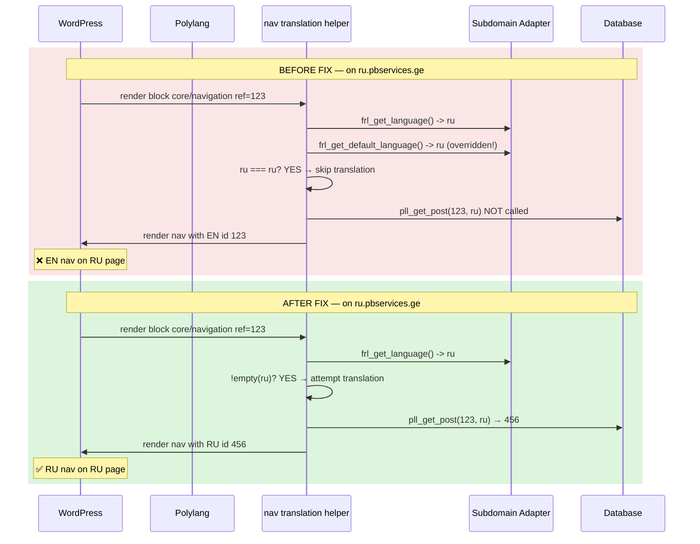

# Subdomain Adapter — Navigation Translation Fix (Corrected)

## Problem Statement

On subdomain `ru.pbservices.ge`, navigation menus still reference their English (EN) translations instead of automatically loading Russian (RU) as Polylang normally does on the main domain.

Templates and patterns appeared affected, but this is a **secondary symptom** of the navigation bug — when the `core/navigation` block renders with the EN `ref` ID, the entire page appears to be in English.

## Root Cause Analysis

### Root Cause (Only One): `pll_default_language` Collision in Nav Translation

**File:** [`includes/shared/navigation.php:59`](includes/shared/navigation.php:59) (before fix)

```php
if (!empty($current_lang) && $current_lang !== $default_lang) {
    // ... translate navigation ID via pll_get_post() ...
}
```

The Subdomain Adapter uses the [`pll_default_language`](modules/subdomain_adapter/class-subdomain-adapter.php:358) filter at priority 1 to override Polylang's default language to `ru` on the RU subdomain.

**Consequence:** Both `$current_lang` (via `frl_get_language()`) and `$default_lang` (via `frl_get_default_language()`) return `'ru'` on the RU subdomain. The condition `$current_lang !== $default_lang` evaluates to `false`, so the navigation ID translation is **skipped entirely** — the EN nav menu is served as-is.

**Why it works on the main domain:** On `pbservices.ge`, `$current_lang = 'ru'`, `$default_lang = 'en'`, so the condition is `true` and translation proceeds normally.

### Why P1/P2 (Template/Pattern Registration) Were Incorrect Diagnosis

The original plan proposed registering `wp_template`/`wp_template_part`/`wp_block` with Polylang via `pll_get_post_types`. This was **wrong** because:

1. **`ru.pbservices.ge` is a DB mirror copy** — templates don't have language-specific variants. The same `wp_template` posts exist in the mirror DB. `pll_get_post()` would return the same ID since no translation records exist.

2. **Block content translation is handled independently** by [`Frl_Translation_Service::get_translation_block()`](includes/core/translator/class-translation-service.php:215), which processes `{{text:...}}` and `{{link:...}}` placeholders at render time using the current language — this works identically on both domains regardless of post type registration.

3. **Templates work correctly on both domains** — the "template in English" symptom was a misattribution caused by the navigation rendering with EN links.

### Full Codebase Audit: `$current !== $default` Guard Pattern

Three locations in the codebase compare current vs default language:

| File | Line | Guard | Impact on RU subdomain |
|------|------|-------|----------------------|
| [`navigation.php`](includes/shared/navigation.php:59) (BEFORE FIX) | 59 | `$current_lang !== $default_lang` | **BREAKAGE** — nav translation skipped |
| [`class-translation-service.php`](includes/core/translator/class-translation-service.php:546) | 546 | `$current_language !== $default_language` | Harmless — falls through to redundant `register_string()` (no-op) |
| [`shortcodes.php`](public/shortcodes.php:687) | 687 | `$current_lang === $default_lang` | Benign — slugs already correct in DB mirror |

Only the navigation guard is broken.

---

## Fix Applied

### Fix: Remove `$default_lang` Guard in Nav Translation

**File:** [`includes/shared/navigation.php`](includes/shared/navigation.php:37)

**Change:** Remove the `$default_lang` variable and the `$current_lang !== $default_lang` guard. Always attempt translation with `pll_get_post()` — it returns the original ID when no translation exists, making the guard redundant.

```diff
- $current_lang = frl_get_language();
- $default_lang = frl_get_default_language();
+ $current_lang = frl_get_language();

  $settings['render_callback'] = function ($attributes, $content, $block)
-     use ($current_lang, $default_lang) {
+     use ($current_lang) {
      ...
-     if (!empty($current_lang) && $current_lang !== $default_lang) {
+     if (!empty($current_lang)) {
```

---

## Sequence Diagram: Nav Translation Flow (Before vs After)



---

## Verification Checklist

| # | Check | Expected |
|---|-------|----------|
| 1 | RU block navigation menu renders RU menu items on `ru.pbservices.ge` | Nav links point to RU content |
| 2 | EN navigation unaffected on main domain | Nav still works on `pbservices.ge` |
| 3 | RU page content (via block translator) still renders correctly | `{{text:...}}` placeholders resolve |
| 4 | No regression on existing RU subdomain URL transforms | Permalinks still correct |
| 5 | Templates render unchanged (same template, content translated at block level) | No 404s or layout breaks |

---

## Risk Assessment

| Risk | Likelihood | Impact | Mitigation |
|------|-----------|--------|------------|
| `pll_get_post()` called on every nav render | Always | Minimal | Already cached via `frl_cache_remember('permalinks', ...)` — one DB call per nav ID per request |
| EN nav still shows on RU when no RU translation exists | Low (DB mirror should have RU nav) | Medium | `pll_get_post()` returns original ID — nav renders untranslated, which is same as before on main domain |
| Cache key collision | None | N/A | Cache key is `wp_navigation_{$nav_id}` — namespaced and ID-specific |
