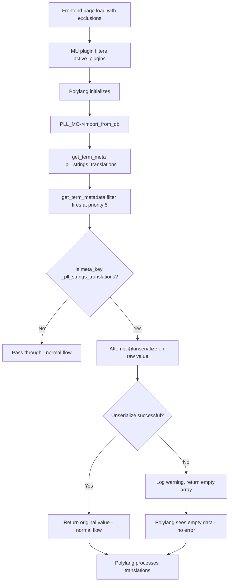

# Fix: `unserialize()` Error in Polylang Term Meta When Frontend Exclusions Are Enabled

## Problem

When enabling **Plugin Exclusions > Frontend Excluded Plugins** with `ai-engine/ai-engine.php` and `seo-engine/seo-engine.php`, an `unserialize()` error surfaces from Polylang's `PLL_MO->import_from_db()` reading corrupted `_pll_strings_translations` term meta.

## Root Cause

Pre-existing corrupted serialized data in `_pll_strings_translations` term meta (declared length 30,797 bytes, actual 25,926 bytes). When excluded plugins' error handlers are no longer active, the corruption surfaces as a visible warning.

## Solution (2 Steps)

### Step 1: Defensive Coding in `includes/main.php`

Add a filter on `get_term_metadata` for the `_pll_strings_translations` meta key that catches `unserialize()` failures and returns a fallback empty array. This prevents the warning from firing regardless of which plugins are active or which error handler is in play.

**File:** [`includes/main.php`](includes/main.php)

Add a filter hook:
```php
add_filter('get_term_metadata', 'frl_safe_get_pll_strings_translations', 5, 4);
```

The callback function:
- Only acts on `_pll_strings_translations` meta key
- Uses a static cache to avoid repeated checks per request
- Attempts `@unserialize()` on the raw meta value
- If it fails, logs the issue and returns an empty array (or `''` for non-single requests)
- Runs at priority 5 (before Polylang's own usage at later priorities)

### Step 2: Import/Export Validation in `functions-admin-import-export.php`

Add serialization integrity validation in the import function to prevent writing corrupted data to the database.

**File:** [`admin/helpers/functions-admin-import-export.php`](admin/helpers/functions-admin-import-export.php)

Add a validation check before `update_term_meta()`:
1. Serialize the data with `maybe_serialize()`
2. Attempt `@unserialize()` on the result
3. Verify the round-trip produces the same data
4. If validation fails, log a warning and skip the entry (don't save corrupted data)

## Files to Modify

| File | Change |
|------|--------|
| [`includes/main.php`](includes/main.php) | Add `get_term_metadata` filter for corrupted `_pll_strings_translations` |
| [`admin/helpers/functions-admin-import-export.php`](admin/helpers/functions-admin-import-export.php) | Add serialization integrity validation on import |

## Flow Diagram


