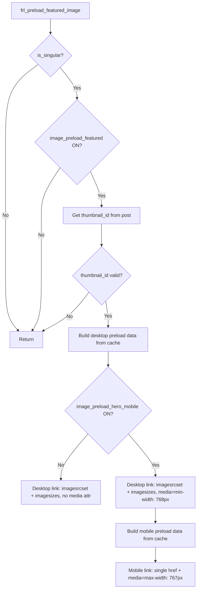

# Mobile Hero Image Preload — Implementation Plan

## Summary

Add a second `<link rel="preload">` tag targeting mobile viewports (`max-width: 767px`) with a configurable thumbnail size, alongside the existing responsive desktop preload link. All options are additive and independently toggleable.

## Options (already defined in `config/config-options.php`)

| Key | Type | Default | Purpose |
|---|---|---|---|
| `image_preload_featured` | checkbox | `1` | Master toggle for all featured image preloads |
| `image_preload_hero_mobile` | checkbox | `1` | Enable separate mobile preload link |
| `image_preload_hero_mobile_size` | text | `1536x1536` | WP thumbnail size name for mobile `href` |
| `image_preload_featured_ext` | text | `""` | Optional file extension (`.avif`, `.webp`) |

## Architecture



## Output Matrix

| `preload_featured` | `hero_mobile` | Ext | Desktop link | Mobile link |
|---|---|---|---|---|
| OFF | any | any | — | — |
| ON | OFF | `""` | `<link imagesrcset imagesizes>` (no media) | — |
| ON | OFF | `.avif` | `<link imagesrcset imagesizes>` (no media) | — |
| ON | ON | `""` | `<link imagesrcset imagesizes media="(min-width: 768px)">` | `<link href="mobile-url" media="(max-width: 767px)">` |
| ON | ON | `.avif` | `<link imagesrcset imagesizes media="(min-width: 768px)">` | `<link href="mobile-url.avif" media="(max-width: 767px)">` |

## Mobile Link Output Structure

```html
<link 
  id="frl-preload-img" 
  data-plugin="fralenuvole" 
  rel="preload" 
  fetchpriority="high" 
  as="image"
  media="(max-width: 767px)"
  href="https://example.com/wp-content/uploads/2025/01/hero-1536x768.jpg"
>
```

- Single `href` (not `imagesrcset`/`imagesizes`) — targeting one specific thumbnail size
- Same `id`, `data-plugin`, `rel`, `fetchpriority`, `as` as desktop

## Desktop Link When Mobile Is Active

Same as current but adds `media="(min-width: 768px)"`:
```html
<link id="frl-preload-img" data-plugin="fralenuvole" rel="preload" fetchPriority="high" imagesrcset="..." imagesizes="..." as="image" media="(min-width: 768px)" />
```

## File Changes

### [`public/public.php`](public/public.php) — `frl_preload_featured_image()` (lines 108-174)

**Refactor:** Extract current link output (line 167-173) into a helper function:

```php
function frl_output_preload_link(array $preload_data, string $media = ''): void
{
    $media_attr = $media ? sprintf(' media="%s"', esc_attr($media)) : '';
    
    if (!empty($preload_data['href'])) {
        // Mobile: single href
        printf(
            '<link id="%s-preload-img" data-plugin="%s" rel="preload" fetchPriority="high" as="image" href="%s"%s />',
            FRL_PREFIX,
            FRL_NAME,
            esc_url($preload_data['href']),
            $media_attr
        );
    } elseif (!empty($preload_data['srcset'])) {
        // Desktop: responsive imagesrcset
        printf(
            '<link id="%s-preload-img" data-plugin="%s" rel="preload" fetchPriority="high" imagesrcset="%s" imagesizes="%s" as="image"%s />',
            FRL_PREFIX,
            FRL_NAME,
            esc_attr($preload_data['srcset']),
            esc_attr($preload_data['sizes']),
            $media_attr
        );
    }
}
```

**Add mobile preload logic after desktop link output:**

```php
// Mobile hero preload (single href with specific thumbnail size)
if (frl_get_option('image_preload_hero_mobile')) {
    $mobile_size = (string) frl_get_option('image_preload_hero_mobile_size');
    if (empty($mobile_size)) {
        $mobile_size = 'full';
    }
    
    $mobile_cache_key = frl_generate_cache_key('featured_img_mobile', (string)$post->ID, $mobile_size, (string)$extension);
    
    $mobile_data = frl_cache_remember('postdata', $mobile_cache_key, function () use ($post, $mobile_size, $extension) {
        $thumbnail_id = get_post_thumbnail_id($post->ID);
        if (!$thumbnail_id) {
            return null;
        }
        
        $img_src = wp_get_attachment_image_src($thumbnail_id, $mobile_size);
        if (!$img_src || empty($img_src[0])) {
            return null;
        }
        
        $url = $img_src[0];
        
        // Apply extension if configured and variant exists
        if (!empty($extension)) {
            $original_path = get_attached_file($thumbnail_id);
            if ($original_path && file_exists($original_path . $extension)) {
                // Build the URL for the extension variant of the mobile size
                $upload_dir = wp_upload_dir();
                $metadata = wp_get_attachment_metadata($thumbnail_id);
                if ($metadata && !empty($metadata['file'])) {
                    $dirname = trailingslashit(dirname($metadata['file']));
                    // Check if this specific mobile size has the extension variant
                    $sizes = $metadata['sizes'] ?? [];
                    $mobile_file = null;
                    if (isset($sizes[$mobile_size])) {
                        $mobile_file = $sizes[$mobile_size]['file'];
                    }
                    if ($mobile_file) {
                        $variant_path = $upload_dir['basedir'] . '/' . $dirname . $mobile_file . $extension;
                        if (file_exists($variant_path)) {
                            $url = $upload_dir['baseurl'] . '/' . $dirname . $mobile_file . $extension;
                        }
                    } else {
                        // Mobile size == full or falls back to full; use original file
                        $variant_path = $original_path . $extension;
                        if (file_exists($variant_path)) {
                            $url = wp_get_attachment_url($thumbnail_id) . $extension;
                        }
                    }
                }
            }
        }
        
        return ['href' => $url];
    });
    
    if ($mobile_data) {
        frl_output_preload_link($mobile_data, '(max-width: 767px)');
    }
}
```

**Desktop output modified:**
- When `image_preload_hero_mobile` is ON: pass `$media = '(min-width: 768px)'` to `frl_output_preload_link()`
- When OFF: pass `$media = ''` (current behavior preserved)

## Cache Key Strategy

| Variant | Cache Key Pattern | Cache Group |
|---|---|---|
| Desktop | `featured_img_{post_id}_{image_size}_{extension}` | `postdata` |
| Mobile | `featured_img_mobile_{post_id}_{mobile_size}_{extension}` | `postdata` |

Both keys use `frl_generate_cache_key()` and `frl_cache_remember('postdata', ...)` — consistent with existing pattern.

## Extension Fallback: Approach B

When `image_preload_featured_ext` is set (e.g., `.avif`):
- `wp_get_attachment_image_src()` returns the `.jpg` URL
- Code checks if the extension variant exists on disk for the specific mobile size
- If it exists → use the extension variant URL
- If it DOESN'T exist → use the original format URL from `wp_get_attachment_image_src()` (no skip — always output)
- This mirrors the existing fallback at [`public/public.php:136-140`](public/public.php:136)

## Edge Cases

| Case | Behavior |
|---|---|
| `wp_get_attachment_image_src()` returns `false` | Should not happen with valid `thumbnail_id`, but guarded — returns `null` from cache callback |
| Mobile size name not registered | `wp_get_attachment_image_src()` falls back to full/original size automatically |
| Extension variant missing for mobile size | Fallback to original format URL (Approach B) |
| `image_preload_hero_mobile_size` empty/blank | Default to `'full'` |
| Desktop + mobile both ON, only one has `.avif` | Each link independently checks its own variant on disk |

## Zero Regression

- When `image_preload_hero_mobile` is OFF → behavior is byte-identical to current
- Desktop link output structure unchanged (only gains optional `media` attribute when mobile is ON)
- No changes to `frl_build_featured_image_srcset()`, `frl_get_featured_image_size()`, `frl_generate_cache_key()`
- No changes to cache cleanup in `core/cache/cache-cleanup.php` (same `postdata` group, TTL-based expiry)

## Files Modified

| File | Change |
|---|---|
| [`public/public.php`](public/public.php:108-174) | Refactor `frl_preload_featured_image()` — extract `frl_output_preload_link()` helper, add mobile preload logic |
| No other files | Options already defined in `config/config-options.php` |
