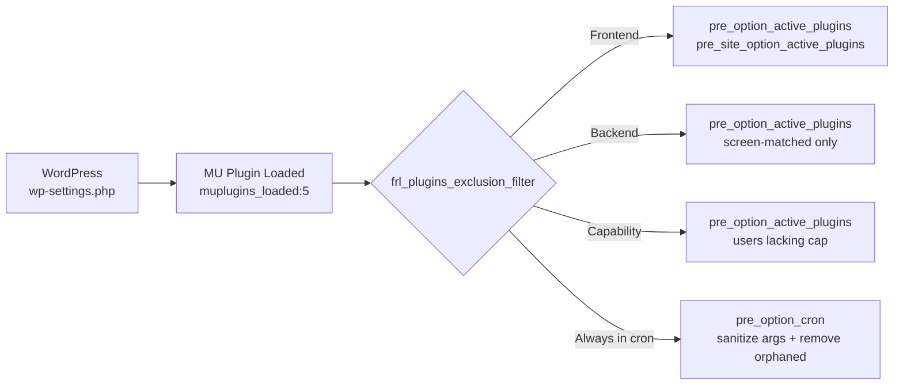

# MU Plugin Analysis: `assets/mu/frl-mu-plugin.php`

**Plugin:** Fralenuvole v5.4.0
**File:** [`assets/mu/frl-mu-plugin.php`](../assets/mu/frl-mu-plugin.php)
**Logic file:** [`includes/helpers/functions-mu-plugin.php`](../includes/helpers/functions-mu-plugin.php)

---

## 1. WHY Was It Done? (Problem Statement)

The MU plugin was created to solve a specific problem: **prevent specified WordPress plugins from loading without deactivating them**.

Use cases:
- A plugin causes conflicts on the frontend but is needed in the admin
- A plugin should only load for users with a specific capability (e.g., administrators)
- A plugin should not load on specific admin screens (e.g., only on `post.php`)
- Temporarily disable a plugin for debugging without triggering deactivation hooks or losing settings

The solution uses the MU (Must-Use) plugin mechanism because MU plugins load **before** regular plugins, allowing it to hook into `muplugins_loaded` (priority 5) and filter `pre_option_active_plugins` / `pre_site_option_active_plugins` before WordPress processes the active plugins list.

Additionally, the cron filter (`pre_option_cron`) was added to prevent `invalid_schedule` PHP notices/WP_Error logs when excluded plugins have registered cron events but their schedules are no longer registered.

---

## 2. Architecture

### File Structure

```
assets/mu/frl-mu-plugin.php        (34 lines - thin bootstrap)
includes/helpers/functions-mu-plugin.php  (357 lines - all logic)
```

### Init Sequence

```
WordPress loads MU plugins
  └─ assets/mu/frl-mu-plugin.php loaded
       ├─ Defines FRL_MU_NAME = 'fralenuvole'
       ├─ Requires includes/bootstrap.php (loads cache manager, error handler, config)
       ├─ Requires includes/helpers/functions-mu-plugin.php (all exclusion functions)
       └─ Hooks frl_plugins_exclusion_filter() at muplugins_loaded:5

muplugins_loaded hook fires
  └─ frl_plugins_exclusion_filter()
       ├─ Reads exclusion settings via frl_get_option()
       ├─ Determines frontend/backend context
       ├─ Builds $excluded array from applicable rules
       ├─ Registers pre_option_cron filter (always during cron, for args sanitization)
       └─ If $excluded not empty:
            ├─ Registers pre_option_active_plugins filter
            └─ Registers pre_site_option_active_plugins filter (multisite)
```

### Context Detection Flow (in [`frl_plugins_exclusion_filter()`](../includes/helpers/functions-mu-plugin.php:81))

```
$is_frontend_context = !frl_is_admin() && !frl_is_rest_api_request() && !frl_is_cron_job_request()

FRONTEND context (HTML pages + frontend AJAX):
  ├─ Frontend exclusion applies (all users)
  └─ Capability exclusion SKIPPED

NON-FRONTEND context (admin, REST API, cron):
  ├─ Backend exclusion applies (admin screens only)
  ├─ Capability exclusion applies (users without required cap)
  └─ Frontend exclusion SKIPPED
```

### Three-Tier Exclusion System

| Tier | Setting | When Applied | Scope |
|------|---------|-------------|-------|
| **Frontend** | `excluded_plugins_frontend` | Frontend HTML + frontend AJAX | All users (supersedes capability) |
| **Backend** | `excluded_plugins_backend` | Admin pages matching specific screens | All users, screen-filtered |
| **Capability** | `excluded_plugins_bycap` | Non-frontend contexts | Users lacking required capability |

### Filter Architecture



### Caching Hierarchy (4 levels)

```
L1: Closure static $cache          — dedup within each filter closure (per-request, memory)
L2: frl_get_exclusion_options()    — dedup across both filters (per-request, static variable)
L3: frl_cache_remember runtime     — dedup persistent cache lookup (per-request, runtime cache)
L4: frl_cache_remember persistent  — avoid DB query (cross-request, WEEK_IN_SECONDS TTL)
```

### Data Flow for `active_plugins`

```
pre_option_active_plugins filter fires
  └─ L1: static $cache hit? return
  └─ L2: frl_get_exclusion_options()
       ├─ L4: frl_cache_remember('options', 'mu_plugin_active_plugins', callback, WEEK_IN_SECONDS)
       │    ├─ L3 runtime cache hit? return
       │    ├─ Persistent cache (object cache/transient) hit? return
       │    └─ Miss: $wpdb->get_var() on wp_options table → normalize → cache → return
       └─ Cron data: fresh $wpdb->get_var() (NOT cached)
  └─ array_filter() removes excluded plugins
  └─ Cache in L1 static $cache → return
```

---

## 3. All Features

### Feature 1: Plugin Exclusion (Core)
- Filters `pre_option_active_plugins` to remove specified plugin paths from the active plugins array
- Filters `pre_site_option_active_plugins` for multisite network-activated plugins
- Three modes: frontend, backend (screen-scoped), capability-based

### Feature 2: Frontend-Only Exclusion
- Applied when `excluded_plugins_frontend_enabled` is on AND the request is a frontend context
- List format: simple plugin paths, one per line

### Feature 3: Backend Screen-Scoped Exclusion
- Applied when `excluded_plugins_backend_enabled` is on AND in admin context
- Multi-column format: `plugin-path|admin-screen` (e.g., `ai-engine/ai-engine.php|post.php`)
- The screen condition is **required** — exclusion only activates when `frl_is_admin_page($admin_screen)` matches

### Feature 4: Capability-Based Exclusion
- Applied when `excluded_plugins_bycap_enabled` is on AND NOT in frontend context
- Users who lack `excluded_plugins_bycap_cap` (default: `delete_plugins`) get the excluded list applied
- Self-guard: the plugin itself (`fralenuvole/fralenuvole.php`) is always excluded from its own exclusion list

### Feature 5: Cron Event Sanitization
- During WP Cron execution, `pre_option_cron` filter always runs (regardless of whether any exclusion is active)
- Removes cron events with unregistered schedules (prevents `invalid_schedule` errors when excluded plugins' schedules are not registered)
- Sanitizes `$event['args']` to always be an array (prevents `TypeError: count(): Argument #1 must be of type Countable|array, null given`)

### Feature 6: Persistent Caching
- `active_plugins` data cached with `WEEK_IN_SECONDS` TTL in `options` cache group
- Network active plugins cached separately with same TTL
- Cache invalidation via `activated_plugin` / `deactivated_plugin` hooks
- Static per-request caching at function and closure level

---

## 4. Modularity

### Strengths
- **Clear separation**: The MU plugin bootstrap (34 lines) is cleanly separated from the logic (357 lines in a separate file)
- **Single responsibility**: Each function has a clear, narrow purpose
- **Low coupling**: The MU plugin depends only on the plugin's core helper framework (`frl_get_option`, `frl_cache_remember`, `frl_is_admin`, `frl_textlist_to_array`, etc.)
- **No pollution**: The logic file is loaded **only** by the MU plugin, not by the main plugin bootstrap

### Weaknesses
- **Flattening logic**: [`frl_plugins_exclusion_filter()`](../includes/helpers/functions-mu-plugin.php:81) is a single function containing all three tiers of exclusion logic, making it 100+ lines. This could be decomposed into smaller, testable functions
- **Flattening logic in filters**: The closures in [`frl_add_exclusion_filter_active_plugins()`](../includes/helpers/functions-mu-plugin.php:191) and [`frl_add_exclusion_filter_cron()`](../includes/helpers/functions-mu-plugin.php:280) contain significant logic inline rather than dispatching to named functions
- **Shared data query**: [`frl_get_exclusion_options()`](../includes/helpers/functions-mu-plugin.php:30) fetches both `active_plugins` and `cron` in a single function, which is efficient but couples concerns (cron is only needed during cron runs)

---

## 5. Best Practices

### ✅ What's Done Well

1. **Recursion safety** — The `frl_cache_remember` calls use object cache/transients, never `get_option()`, so they're safe inside `pre_option_*` filters
2. **Static caching** — L1/L2 static caches prevent redundant processing within a single request
3. **Self-exclusion guard** — The plugin can never exclude itself (line 164)
4. **Array normalization** — Results are always `array_values()` after filtering to maintain 0-indexed arrays
5. **Explicit cache invalidation hooks** — `activated_plugin`/`deactivated_plugin` ensure cache freshness
6. **Documented rationale** — Extensive inline comments explain why caching choices were made
7. **Edge case handling** — Null `$pagenow` during early hooks, fallback to `$_SERVER['SCRIPT_NAME']`
8. **Type safety** — Cron args sanitization prevents PHP 8.x `TypeError`
9. **Config-driven** — All exclusion settings come from the plugin's options system via `frl_get_option()`
10. **Memory-bank documented** — Full architecture documented in `activeContext.md` and `progress.md`

### ❌ Areas Needing Attention

1. **`get_option('frl_disable_plugin')` in `should_bypass()`** ([`class-cache-manager.php:111`](../includes/core/cache/class-cache-manager.php:111)) — Called on every `frl_cache_remember` invocation. This is an extra DB/object-cache query on every cache check. While documented as safe, it still adds overhead

2. **`frl_cache_remember` fallback behavior** ([`class-cache-manager.php:629-631`](../includes/core/cache/class-cache-manager.php:629-631)) — When `should_bypass()` returns true, the callback is still executed (fallback mode). This means during bypass, the MU plugin's DB query runs on every request regardless

3. **No PHPUnit tests** — The exclusion logic has no automated test coverage. This is a risk for regressions given the complex flow

4. **Mixed concerns in `frl_get_exclusion_options()`** ([`functions-mu-plugin.php:30`](../includes/helpers/functions-mu-plugin.php:30)) — The function fetches both `active_plugins` (cached) and `cron` (fresh), coupling two different data sources

5. **Error handling** — No try/catch around `$wpdb->get_var()` calls. A DB connection failure would return `null`, which is cast to an empty array by `(array) maybe_unserialize(null)` → `['']` which could cause issues

---

## 6. Performance (Critical Analysis)

### Finding: Root Cause Identified

> **Live test confirmed:** The unnecessary cron DB query inside `frl_get_exclusion_options()` was causing ~5 seconds of slowdown on every page load when any exclusion tier was enabled.

### How `frl_get_option()` Actually Behaves

```
1st call (any frl_get_option in this request):
  → $loaded = false
  → frl_get_plugin_options('all')
    → frl_cache_remember('options', 'all_options', callback)
      → Returns ALL plugin options as array
  → Populates static $options → $loaded = true
  → Returns specific key from array

2nd, 3rd... Nth calls in same request:
  → $loaded = true, isset($options[$key]) = true
  → Direct static array return. O(1). Near-zero cost.
```

### The Bug: Unconditional Cron Query in `frl_get_exclusion_options()`

In [`frl_get_exclusion_options()`](includes/helpers/functions-mu-plugin.php:30), the `cron` option was fetched via **fresh `$wpdb->get_var()` + `maybe_unserialize()` on every single request** — including non-cron page loads where the cron data was never consumed.

```php
// This ran unconditionally on every request when exclusions were active:
$cron_value = $wpdb->get_var(
    $wpdb->prepare(
        "SELECT option_value FROM {$wpdb->options} WHERE option_name = %s LIMIT 1",
        'cron'
    )
);
$options['cron'] = $cron_value ? (array) maybe_unserialize($cron_value) : [];
```

The cron data is **only consumed** by `frl_add_exclusion_filter_cron()` (line 280), which is **only registered during cron requests** (line 170: `if (frl_is_cron_job_request())`). On non-cron requests, this fetch + deserialize was completely wasted work.

### Why Only When Exclusions Are Active

| Condition | `frl_get_exclusion_options()` called? | Cron query runs? |
|-----------|--------------------------------------|-----------------|
| Exclusions disabled | ❌ (never called) | ❌ |
| Exclusions enabled | ✅ (inside `pre_option_active_plugins` filter) | ✅ — **5s slowdown** |

The function is only called from within the `pre_option_active_plugins` filter closure, which is only registered when exclusions are active. With exclusions disabled, `frl_get_exclusion_options()` never runs, so the cron query never executes.

### Impact

| Metric | Before Fix | After Fix |
|--------|-----------|-----------|
| Extra DB queries per page load (exclusions active) | 1× `$wpdb->get_var()` for `cron` + 1× `maybe_unserialize()` | **Zero** |
| Page load time (exclusions active) | ~5s slower | Normal |
| Cron schedule cleanup during cron runs | Works | Works (unchanged) |
---

## 7. Issues, Bugs, Logical Flaws

### Bug/Issue #1: Potential `null` Return from `$wpdb->get_var()` in Cron
**File:** [`functions-mu-plugin.php:65-66`](../includes/helpers/functions-mu-plugin.php:65-66)
```php
$cron_value = $wpdb->get_var($wpdb->prepare(...));
$options['cron'] = $cron_value ? (array) maybe_unserialize($cron_value) : [];
```
If `$wpdb->get_var()` returns `null` (DB error), `$cron_value` evaluates to false, so `$options['cron']` becomes `[]`. This is handled gracefully. **Low risk.**

### Bug/Issue #2: `active_plugins` Cache Not Invalidated on Plugin Upgrade
**File:** [`functions-mu-plugin.php:44-58`](../includes/helpers/functions-mu-plugin.php:44-58)
The cache invalidation hooks are `activated_plugin` / `deactivated_plugin`. But **plugin upgrade** does not fire these hooks — it fires `upgrader_process_complete`. If a plugin is upgraded, its path doesn't change, so this is not a real bug for the exclusion use case (we filter by path, not version). **Low risk.**

### Bug/Issue #3: `frl_get_option()` in `frl_plugins_exclusion_filter()` Can Trigger DB Write
**File:** [`functions-mu-plugin.php:84-86`](../includes/helpers/functions-mu-plugin.php:84-86)
`frl_get_option()` has a side effect: if an option key is missing from the DB, it writes the default value via [`frl_set_missing_option_default()`](../includes/helpers/functions-options.php:744). This means:
- If any exclusion option key is not yet in the database, calling `frl_get_option()` on it at `muplugins_loaded:5` will trigger `update_option()` → DB write
- While this is part of the option system's design, it's worth noting that the MU plugin's early loading can cause option writes that wouldn't otherwise happen

### Bug/Issue #4: `frl_is_admin_page()` Fallback May Be Fragile
**File:** [`functions-access-control.php:236-239`](../includes/helpers/functions-access-control.php:236-239)
```php
$current_page = $pagenow;
if (empty($current_page)) {
    $current_page = basename($_SERVER['SCRIPT_NAME'] ?? '');
}
```
When `$pagenow` is null (before `wp-includes/vars.php` loads), the fallback uses `$_SERVER['SCRIPT_NAME']`. For admin AJAX requests routed through `admin-ajax.php`, `SCRIPT_NAME` is `/wp-admin/admin-ajax.php` — this is correct for filename-based matching. However, for REST API requests or custom entry points, this may not match. **Low risk** since the backend exclusion only fires in admin context.

### Bug/Issue #5: `frl_is_admin()` Can Have Race with `$_SERVER['REQUEST_URI']` Not Being Set
**File:** [`functions-access-control.php:174`](../includes/helpers/functions-access-control.php:174)
```php
$current_url = $_SERVER['REQUEST_URI'] ?? '';
```
In CLI/cron context, `$_SERVER['REQUEST_URI']` may not be set. The fallback to empty string means `str_contains('', '/wp-admin/')` is false, `str_contains('', 'admin-post.php')` is false, etc. This is correct behavior but relies on the null coalescing operator — worth noting for robustness.

### Bug/Issue #6: `frl_textlist_to_array()` Returns Nested Arrays Requiring Flattening
**File:** [`functions-mu-plugin.php:106-117`](../includes/helpers/functions-mu-plugin.php:106-117)
The flattening code appears in two places (frontend and capability sections). This is repeated logic that could be extracted into a helper. The `frl_textlist_to_array()` function always returns an array of arrays (each line becomes `[$item]` or `[$part1, $part2]`). The flattening step is required but easy to forget if new exclusion tiers are added.

### Bug/Issue #7: `pre_site_option_active_plugins` May Not Be Properly Invalidated
**File:** [`functions-mu-plugin.php:224-263`](../includes/helpers/functions-mu-plugin.php:224-263)
The cache key `mu_plugin_network_active_plugins` uses `WEEK_IN_SECONDS` TTL. On multisite, network plugin activation/deactivation fires `activated_plugin`/`deactivated_plugin` on the network admin. The invalidation would need to clear the persistent cache for this key. **Need to verify** that the invalidation hooks in the cache cleanup code handle the network key.

### Bug/Issue #8: Cron Filter Always Registered, But Exclusion Check May Miss
**File:** [`functions-mu-plugin.php:169-172`](../includes/helpers/functions-mu-plugin.php:169-172)
The cron filter is added **before** the empty-exclusion check, meaning it always runs during cron for args sanitization. However, the `$excluded` variable passed to the closure is empty if no exclusions are set. The cron filter doesn't use `$excluded` for filtering — it schedules-check orphaned events — so passing an empty array is fine but misleading. The `$excluded` parameter is documented as "unused directly, kept for consistency."

### Bug/Issue #9: `$wpdb->get_var()` Count Check for Network Active Plugins
**File:** [`functions-mu-plugin.php:245-254`](../includes/helpers/functions-mu-plugin.php:245-254)
```php
$plugins = $wpdb->get_var(
    $wpdb->prepare(
        'SELECT meta_value FROM ' . $wpdb->sitemeta . ' WHERE meta_key = %s LIMIT 1',
        'active_plugins'
    )
);
return $plugins ? maybe_unserialize($plugins) : [];
```
This query targets `$wpdb->sitemeta` directly — but what if the installation is not multisite? `$wpdb->sitemeta` may not exist. On a non-multisite install, this would trigger a DB error. However, the `pre_site_option_active_plugins` filter only fires on multisite, so this is only called in a multisite context. **Safe, but fragile** — if WordPress ever changes when `pre_site_option_*` fires, this could break.

---

## 8. Areas of Improvement

> **Correction (per author feedback):** The `frl_get_option()` system uses aggressive static caching — only the **first** call per request does real work; subsequent calls are O(1) array lookups. Updated priorities below reflect this.

### Critical (Performance)

| # | Improvement | Why | Impact |
|---|------------|-----|--------|
| **P1** | **Minimize `should_bypass()` overhead** — `get_option('frl_disable_plugin')` at [`class-cache-manager.php:111`](../includes/core/cache/class-cache-manager.php:111) fires on **every** `frl_cache_remember` call. In the MU plugin flow, this can fire 1-3× per request (for `all_options`, `mu_plugin_active_plugins`, `mu_plugin_network_active_plugins`). Each call is a WordPress `get_option()` — fast if autoloaded, but still a function call with filter overhead. | Reduces per-request overhead of every cache operation | **High** — Affects every request regardless of exclusion state |
| **P2** | **Early bail before option load** — Currently [`frl_plugins_exclusion_filter()`](../includes/helpers/functions-mu-plugin.php:81) always runs the first `frl_get_option()` which loads `all_options`. An early check (e.g., a dedicated constant `FRL_DISABLE_EXCLUSIONS` or checking `defined()` before `frl_get_option()`) could skip the entire function when the feature is not in use | Avoids unnecessary `all_options` persistent cache lookup and `should_bypass()` call on every request when the feature is unused | **High** — Most sites may not use exclusion at all |
| **P3** | **Reduce `mu_plugin_active_plugins` cache key overhead** — This is a separate `frl_cache_remember` key from `all_options`, so it incurs its own persistent cache lookup + `should_bypass()` call. Consider integrating it into the `all_options` batch or using a faster lookup path | One less persistent cache lookup + one less `get_option('frl_disable_plugin')` call when exclusions are active | **Medium** |
| **P4** | **Skip `frl_textlist_to_array()` when list is empty** — Add an early empty-string check before parsing | Avoids string operations on empty settings | **Low-Medium** |
| **P5** | **Merge `active_plugins` and network `active_plugins` cache keys** — Two separate `frl_cache_remember` calls for related data | One cache check instead of two | **Medium for multisite** |

### Architectural

| # | Improvement | Why | Impact |
|---|------------|-----|--------|
| **A1** | **Extract exclusion tiers into separate functions** — Break `frl_plugins_exclusion_filter()` into `frl_get_frontend_exclusions()`, `frl_get_backend_exclusions()`, `frl_get_cap_exclusions()` | Testability, readability, single responsibility | **Medium** |
| **A2** | **Extract filter closures into named functions or invocable classes** — The closures in `frl_add_exclusion_filter_*()` contain inline logic that's hard to test | Testability, debuggability | **Medium** |
| **A3** | **Add `$excluded` parameter to `frl_add_exclusion_filter_cron()` signature** — Remove the deliberately unused parameter | Code clarity | **Low** |
| **A4** | **Separate cron args sanitization from schedule cleanup** — Two independent concerns in one function | Single responsibility | **Low** |

### Best Practices

| # | Improvement | Why | Impact |
|---|------------|-----|--------|
| **B1** | **Add PHPUnit tests for exclusion logic** — Test each tier, combined scenarios, cron sanitization | Regression prevention | **High** |
| **B2** | **Add try/catch around `$wpdb->get_var()` calls** — Handle DB connection errors gracefully | Robustness | **Low** |
| **B3** | **Add `@throws` and return type declarations** — Improve static analysis support | Code quality | **Low** |
| **B4** | **Log when `$wpdb` is not a valid `wpdb` object** — Similar to the pattern in `frl_delete_plugin()` | Debuggability | **Low** |

### Confirmed Fix: Guard Cron Fetch Behind `frl_is_cron_job_request()`

The fix is simple and safe — only fetch cron data during actual cron runs:

```php
// In frl_get_exclusion_options():
if (frl_is_cron_job_request()) {
    $cron_value = $wpdb->get_var(
        $wpdb->prepare(
            "SELECT option_value FROM {$wpdb->options} WHERE option_name = %s LIMIT 1",
            'cron'
        )
    );
    $options['cron'] = $cron_value ? (array) maybe_unserialize($cron_value) : [];
} else {
    $options['cron'] = [];
}
```

See full plan at [`plans/fix-unnecessary-cron-query.md`](plans/fix-unnecessary-cron-query.md).

### Why Cron Data Is NOT Cached via `frl_cache_remember`

Unlike `active_plugins` (stable, cached with `WEEK_IN_SECONDS` TTL via `frl_cache_remember`), cron data is intentionally fetched fresh during WP-Cron runs. Here's why:

1. **Cron changes on every execution cycle**: WordPress modifies the `cron` option during `wp-cron.php` — it removes processed events and reschedules recurring ones. A persistent cache would return stale events that were already processed, causing **duplicate execution**.

2. **Stale data leads to correctness bugs**: If a cached cron array contains events that were already handled, those events would fire again. This is not a performance concern — it's a **correctness bug** with observable side effects (tasks running twice or not at all).

3. **Race conditions**: Concurrent cron processes would race with cache TTL, potentially masking DB changes.

4. **Request-level cache is sufficient**: The `static $options` cache in [`frl_get_exclusion_options():32`](../includes/helpers/functions-mu-plugin.php:32) already deduplicates the cron query within a single cron execution, where `get_option('cron')` might be called multiple times.

**Verdict**: The original decision to NOT cache cron via `frl_cache_remember` was correct. The only bug was that cron was fetched on **every** request (not just cron requests), which is what the fix addresses. Cron data is safe for request-level caching (static variable) but NOT safe for cross-request persistent caching because it changes too frequently and stale data causes observable side effects.

---

## Summary

The MU plugin is a well-architected solution to a real problem (plugin exclusion without deactivation). The caching strategy is sound, recursion safety is carefully handled, and edge cases are addressed.

**The confirmed root cause of the 5-second slowdown:** The `cron` option was fetched via fresh `$wpdb->get_var()` + `maybe_unserialize()` on **every** request inside `frl_get_exclusion_options()` — a function only called when exclusions were active. The cron data was never consumed on non-cron requests but was fetched and deserialized unconditionally.

**The fix:** Guard the cron fetch behind `frl_is_cron_job_request()` so it only runs during actual WP-Cron executions. This eliminates the wasted DB query and deserialization on every regular page load.

**Impact of the fix:** Zero behavior change during cron runs. No measurable overhead on regular page loads.
