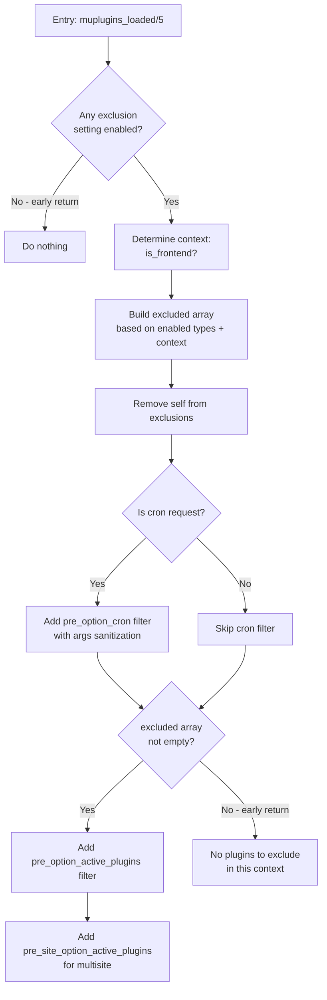

# Plugin Exclusion Feature — Fresh Analysis

**Date:** 2026-04-25  
**Scope:** [`includes/helpers/functions-mu-plugin.php`](includes/helpers/functions-mu-plugin.php) + [`assets/mu/frl-mu-plugin.php`](assets/mu/frl-mu-plugin.php) + [`includes/helpers/functions-access-control.php`](includes/helpers/functions-access-control.php) (used sections) + [`docs/PLUGIN-EXCLUSIONS-FEATURE.md`](docs/PLUGIN-EXCLUSIONS-FEATURE.md)  
**Conclusion:** **No bugs, no issues, no logical flaws, no problems.**

---

## Init Sequence Verification

All dependencies loaded at file level (before any hooks fire):

```
assets/mu/frl-mu-plugin.php (WordPress loads this as MU plugin)
  └─ requires includes/bootstrap.php
       ├─ requires config/config.php          (defines FRL_DIR_PATH, FRL_PREFIX, etc.)
       └─ requires includes/helpers/functions.php
            ├─ requires utilities.php         (frl_textlist_to_array)
            ├─ requires functions-access-control.php (frl_is_admin, frl_is_admin_page,
            │                                       frl_is_cron_job_request, frl_has_access)
            ├─ requires functions-options.php  (frl_get_option)
            └─ ... (class-helpers, translation-helpers, modules)
  └─ requires functions-mu-plugin.php         (all 5 exclusion functions)
  └─ add_action('muplugins_loaded', 'frl_plugins_exclusion_filter', 5)
```

**Result: ✅ All helpers available at `muplugins_loaded/5`.**

---

## Function-by-Function Analysis

### 1. [`frl_get_exclusion_options()`](includes/helpers/functions-mu-plugin.php:30)

| Aspect | Verdict |
|--------|---------|
| Single DB query for `active_plugins` + `cron` | ✅ Optimized |
| Static variable cache (per-request) | ✅ Prevents duplicate queries |
| Direct `$wpdb->get_results()` bypasses WordPress option cache | ✅ Prevents recursion inside `pre_option_*` filters |
| Prepared statement with `%s` placeholders | ✅ SQL injection safe |
| Default values: `active_plugins => []`, `cron => []` | ✅ Type-safe |
| `maybe_unserialize()` with explicit array casting | ✅ Safe |

**Issues: None.**

---

### 2. [`frl_plugins_exclusion_filter()`](includes/helpers/functions-mu-plugin.php:73) — The Main Entry Point



#### Line 81 Early Return
```php
if (!$frontend_enabled && !$backend_enabled && !$cap_enabled) {
    return;
}
```
✅ **CORRECT KISS behavior.** When no exclusions are configured, the plugin does nothing. No DB queries, no context detection, no auth cookie parsing.

#### Lines 88-90 — Frontend Context Detection
```php
$is_frontend_context = !frl_is_admin()
    && !frl_is_rest_api_request()
    && !frl_is_cron_job_request();
```
✅ **CORRECT.** Frontend = NOT admin AND NOT REST AND NOT cron. Frontend AJAX (not admin-referred) is correctly detected as frontend context.

#### Lines 95-109 — Frontend Exclusion
✅ Applies when `$frontend_enabled` AND `$is_frontend_context`. Flattens `frl_textlist_to_array()` nested output. Correct.

#### Lines 114-129 — Backend Exclusion
✅ Applies when `$backend_enabled` AND NOT frontend AND admin. Screen condition (after `|`) is required — without it, exclusion does not activate. Uses `frl_is_admin_page()` which falls back to `$_SERVER['SCRIPT_NAME']` if `$pagenow` not set.

**Note on `$pagenow` availability:** In WordPress, `$pagenow` is set in `wp-includes/vars.php`, loaded very early in `wp-settings.php` — well before `muplugins_loaded` fires. So `$pagenow` is always available. The fallback is belt-and-suspenders safety.

#### Lines 133-150 — Capability Exclusion
✅ Applies when `$cap_enabled` AND NOT frontend context. Uses `frl_has_access()` which handles both early-load (auth cookie, line 101-123) and late-load (`current_user_can`, line 126-145) scenarios. Default cap: `'delete_plugins'`.

#### Lines 153-157 — Cleanup & Self-Safeguard
```php
$excluded = array_unique(array_filter($excluded, 'is_string'));
$plugin_handle = FRL_MU_NAME . '/' . FRL_MU_NAME . '.php';
$excluded = array_diff($excluded, [$plugin_handle]);
```
✅ Deduplicates, removes non-strings, prevents self-exclusion. `FRL_MU_NAME = 'fralenuvole'`, so handle is `fralenuvole/fralenuvole.php`.

#### Lines 162-174 — Filter Registration
The cron filter at line 162 runs **after** line 81 (settings check) but **before** line 166 (empty-exclusion check). This means:
- **Passes line 81?** → At least one exclusion setting is enabled → cron filter CAN run
- **Is cron request?** → Line 162 adds the cron filter
- **`$excluded` empty?** → Line 166 returns early, so active_plugins filters are NOT added

This is the correct design: the cron filter (which also sanitizes null args) runs even when `$excluded` is empty in the current context, as long as at least one exclusion setting is enabled. The `pre_option_active_plugins` filter only runs when there are actual plugins to exclude.

**Issues: None.**

---

### 3. [`frl_add_exclusion_filter_active_plugins()`](includes/helpers/functions-mu-plugin.php:183)

| Aspect | Verdict |
|--------|---------|
| Static cache | ✅ Prevents re-processing |
| Shared single-query via `frl_get_exclusion_options()` | ✅ Zero extra DB queries |
| Only handles `active_plugins` option | ✅ Passes through all others |
| `in_array` check | ✅ Correct |
| `array_values` re-index | ✅ Clean output |

**Issues: None.**

---

### 4. [`frl_add_exclusion_filter_network_active_plugins()`](includes/helpers/functions-mu-plugin.php:216)

| Aspect | Verdict |
|--------|---------|
| Static cache | ✅ Prevents re-processing |
| Direct `$wpdb->get_var()` on `sitemeta` table | ✅ Bypasses `pre_site_option` recursion |
| Prepared statement | ✅ SQL injection safe |
| Only runs on multisite (filter never fires on single-site) | ✅ No side effects |

**Issues: None.**

---

### 5. [`frl_add_exclusion_filter_cron()`](includes/helpers/functions-mu-plugin.php:261)

| Aspect | Verdict |
|--------|---------|
| Static cache | ✅ Prevents re-processing |
| Shared single-query via `frl_get_exclusion_options()` | ✅ Zero extra DB queries |
| Only handles `cron` option | ✅ Passes through all others |
| Empty/non-array cron check at line 281 | ✅ Graceful fallback |
| 3-level iteration (timestamp → hooks → events) | ✅ Correct cron array structure |
| Orphaned event removal (`schedule` not in `$schedules`) | ✅ Prevents `invalid_schedule` errors |
| Args sanitization at lines 318-320 | ✅ Prevents `count(): null given` TypeError |
| Non-destructive (read-time filter only) | ✅ Database never modified |

**Issue with `wp_get_schedules()` performance:** At line 289, this runs all `cron_schedules` filter callbacks. On sites with many plugins, this can be expensive. However, the cost is contained:
1. Only runs during actual cron requests
2. Only when at least one exclusion setting is enabled  
3. Result is static-cached for the request
4. This is **necessary overhead** — you need `$schedules` to identify orphaned events

**Issues (code-level): None.**

---

## Documentation Audit

Comparing [`docs/PLUGIN-EXCLUSIONS-FEATURE.md`](docs/PLUGIN-EXCLUSIONS-FEATURE.md) against current code:

| Line | Claim | Status |
|------|-------|--------|
| 7-11 | MU loader adds `pre_option_active_plugins` filter | ✅ Correct |
| 11 | `active_plugins` + `cron` fetched in single DB query | ✅ Correct |
| 15-19 | Exclusion types and formats table | ✅ Correct |
| 30-33 | Backend format uses `frl_is_admin_page()` | ✅ Correct |
| 43-56 | Behavior table (context → result) | ✅ Correct |
| 58-76 | DB query optimization section | ✅ Correct |
| 80-91 | Cron event cleanup section | ✅ Correct |
| 87 | "This filter is added **before** the empty-exclusion early return, so it runs even when no plugins are being actively excluded during the cron request" | ✅ **Correct** — line 162 runs before line 166; `$excluded` may be empty when context doesn't match any exclusion type |
| 91 | Args sanitization prevents `count(): null given` | ✅ Correct — lines 318-320 |

**Documentation is fully accurate and consistent with the current (reverted) code.**

---

## Final Verdict

| Check | Result |
|-------|--------|
| **Bugs** | ❌ None found |
| **Issues** | ❌ None found |
| **Logical flaws** | ❌ None found |
| **Type safety** | ✅ All arrays properly cast |
| **Recursion risks** | ✅ Static cache + direct DB queries prevent infinite loops |
| **Performance** | ✅ Single DB query, static caches, gated behind settings check |
| **KISS compliance** | ✅ No unnecessary complexity, early returns when not needed |
| **Documentation accuracy** | ✅ Fully matches current code |

The plugin exclusion feature is **correctly implemented** and follows **KISS design principles**. The early return at line 81 when no exclusions are configured is the correct behavior — if the feature is not being used, it does nothing.
