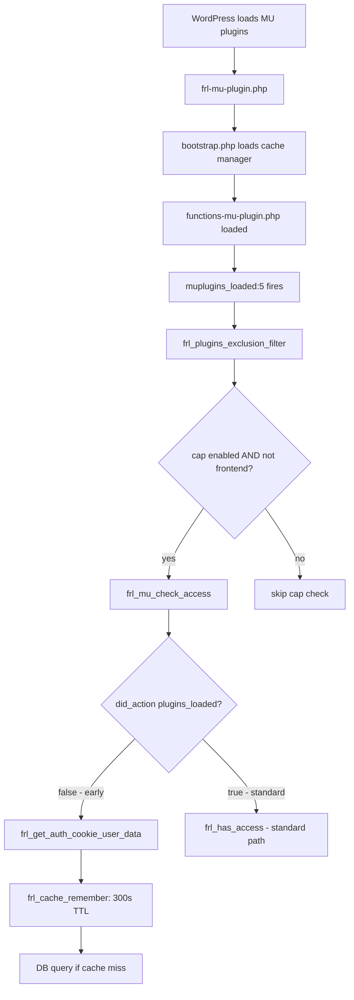

# Refactor: Move Early-Loading Access Check to MU Plugin

**Date:** 2026-04-28
**Status:** Ready for implementation

---

## Objective

Move the `!did_action('plugins_loaded')` early-loading code path out of [`frl_has_access()`](../includes/helpers/functions-access-control.php:93) and into the MU plugin's helper file, where it is the sole consumer. Also add `frl_cache_remember` cross-request caching to the DB query in `frl_get_auth_cookie_user_data()`.

---

## Changes Required

### File 1: [`includes/helpers/functions-access-control.php`](../includes/helpers/functions-access-control.php)

#### Change 1.1: Add `frl_cache_remember` to `frl_get_auth_cookie_user_data()`

Wrap the DB query (lines 62-72) in `frl_cache_remember` with a 300-second TTL, keyed by username:

```php
// Current (lines 62-72):
global $wpdb;
$meta_key = $wpdb->prefix . 'capabilities';
$row = $wpdb->get_row($wpdb->prepare(
    "SELECT u.ID, um.meta_value
     FROM {$wpdb->users} u
     JOIN {$wpdb->usermeta} um ON u.ID = um.user_id
     WHERE u.user_login = %s AND um.meta_key = %s
     LIMIT 1",
    $username,
    $meta_key
));

// New: wrap in frl_cache_remember
$row = frl_cache_remember('admin', 'auth_cookie_user_' . $username, function () use ($wpdb, $username, $meta_key) {
    return $wpdb->get_row($wpdb->prepare(
        "SELECT u.ID, um.meta_value
         FROM {$wpdb->users} u
         JOIN {$wpdb->usermeta} um ON u.ID = um.user_id
         WHERE u.user_login = %s AND um.meta_key = %s
         LIMIT 1",
        $username,
        $meta_key
    ));
}, 300);
```

**Rationale:** 300s TTL aligns with [`frl_has_access()`](../includes/helpers/functions-access-control.php:145) standard path, establishing a consistent "access control decisions cached for 5 minutes" rule. Username-scoped key prevents cross-user pollution. The username→ID mapping is immutable; capability changes are rare and session-stable.

#### Change 1.2: Remove early-loading block from `frl_has_access()`

Remove lines 100-124 (the entire `if (!did_action('plugins_loaded'))` block). The function becomes:

```php
function frl_has_access($capability = FRL_PLUGIN_ACCESS)
{
    // Bypass access check in migrate mode (break-glass)
    if (defined('FRL_MODE') && FRL_MODE === 'migrate') {
        return true;
    }

    // Standard loading: current_user_can is available
    if (!function_exists('current_user_can')) {
        return false;
    }

    $capability = $capability ?: FRL_PLUGIN_ACCESS;
    $user = frl_get_current_user();

    if ($capability === 'superadmin') {
        return $user->ID === FRL_PLUGIN_SUPERADMIN_ID;
    }

    if ($user->ID === FRL_PLUGIN_SUPERADMIN_ID) {
        return true;
    }

    $cache_key = "user_uid{$user->ID}_can_{$capability}";
    return frl_cache_remember('admin', $cache_key, function () use ($user, $capability) {
        return $user->has_cap($capability);
    }, 300);
}
```

---

### File 2: [`includes/helpers/functions-mu-plugin.php`](../includes/helpers/functions-mu-plugin.php)

#### Change 2.1: Add `frl_mu_check_access()` function

Add a new function before `frl_plugins_exclusion_filter()` that encapsulates the early-loading access check:

```php
/**
 * Checks user access during early WordPress loading (before plugins_loaded).
 *
 * Used by the MU plugin's capability-based exclusion to verify user permissions
 * before WordPress user functions are available. Falls back to frl_has_access()
 * once plugins_loaded has fired.
 *
 * @param string $capability The capability to check for.
 * @return bool True if the user has access, false otherwise.
 */
function frl_mu_check_access(string $capability): bool
{
    // Once plugins_loaded has fired, delegate to standard frl_has_access()
    if (did_action('plugins_loaded')) {
        return frl_has_access($capability);
    }

    // Early loading: use auth cookie directly
    $user_data = frl_get_auth_cookie_user_data();
    if (!$user_data) {
        return false;
    }

    if ($capability === 'superadmin') {
        return $user_data['id'] === FRL_PLUGIN_SUPERADMIN_ID;
    }

    if ($user_data['id'] === FRL_PLUGIN_SUPERADMIN_ID) {
        return true;
    }

    if (isset($user_data['caps'][$capability]) && $user_data['caps'][$capability]) {
        return true;
    }

    if (isset($user_data['caps']['administrator']) && $user_data['caps']['administrator']) {
        return true;
    }

    return false;
}
```

#### Change 2.2: Update call site

Change line 148 from:
```php
if (!frl_has_access($required_cap)) {
```
to:
```php
if (!frl_mu_check_access($required_cap)) {
```

---

## Execution Flow (After Patch)



---

## Verification Checklist

- [ ] `frl_get_auth_cookie_user_data()` DB query wrapped in `frl_cache_remember` with 300s TTL (aligned with frl_has_access)
- [ ] Early-loading block (lines 100-124) removed from `frl_has_access()`
- [ ] `frl_mu_check_access()` added to `functions-mu-plugin.php`
- [ ] Call site at `functions-mu-plugin.php:148` updated to use `frl_mu_check_access()`
- [ ] No other callers of `frl_has_access()` affected (all 39 run after `plugins_loaded`)
- [ ] `frl_has_access()` still handles `FRL_MODE === 'migrate'` bypass
- [ ] `frl_has_access()` still handles `superadmin` capability
- [ ] `frl_has_access()` still uses `frl_cache_remember` for standard capability checks
- [ ] grep for `frl_has_access` confirms no early-loading callers remain

---

## Rollback

If issues arise, revert both files to pre-patch state. The changes are additive in `functions-mu-plugin.php` (new function) and subtractive in `functions-access-control.php` (removed block + added cache wrapper). No database changes.
