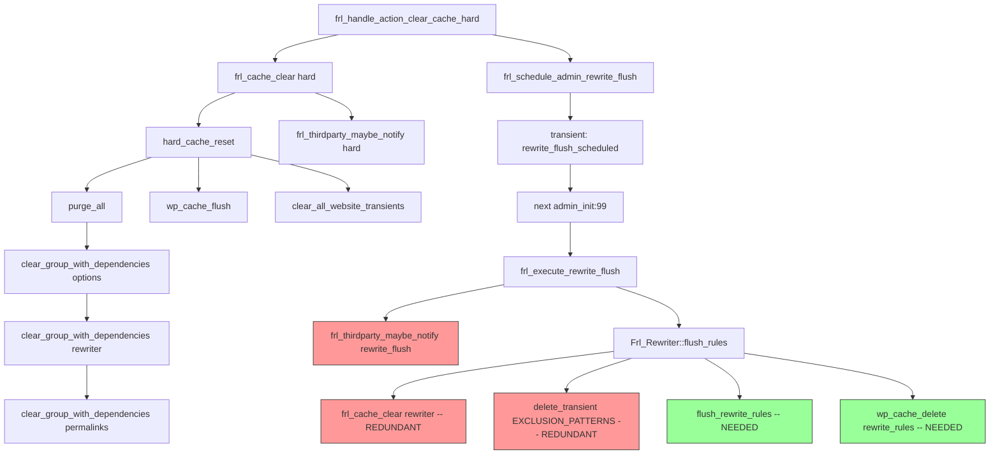

# Rewrite Rules Flush — Complete Analysis

## 1. Core Functions Map

### 1.1 `frl_schedule_admin_rewrite_flush()` — [`includes/plugin-lifecycle.php:220`](includes/plugin-lifecycle.php:220)

```php
function frl_schedule_admin_rewrite_flush(): void {
    frl_set_transient('rewrite_flush_scheduled', true, 60);
}
```

Sets a 60-second transient. Picked up on the **next admin page load** by [`frl_execute_scheduled_admin_flush()`](includes/plugin-lifecycle.php:230) (`admin_init`, priority 99).

### 1.2 `frl_execute_scheduled_admin_flush()` — [`includes/plugin-lifecycle.php:230`](includes/plugin-lifecycle.php:230)

```php
function frl_execute_scheduled_admin_flush(): void {
    if (frl_get_transient('rewrite_flush_scheduled')) {
        frl_delete_transient('rewrite_flush_scheduled');
        frl_flush_force_rewrite_rules();
    }
}
```

### 1.3 `frl_flush_force_rewrite_rules()` — [`includes/plugin-lifecycle.php:157`](includes/plugin-lifecycle.php:157)

Three paths:
- **Before `init`:** Schedules a cron event (`frl_schedule_rewrite_flush()` → `wp_schedule_single_event(time() + 15, 'frl_execute_rewrite_flush')`)
- **During `init`:** Defers to priority 200 via `add_action('init', 'frl_execute_rewrite_flush', 200)`
- **After `init`:** Executes immediately

### 1.4 `frl_execute_rewrite_flush()` — [`includes/plugin-lifecycle.php:198`](includes/plugin-lifecycle.php:198)

```php
function frl_execute_rewrite_flush(): void {
    frl_thirdparty_maybe_notify('rewrite_flush');
    if (class_exists('Frl_Rewriter')) {
        Frl_Rewriter::flush_rules(is_admin());
    } else {
        frl_cache_clear('rewriter');
        flush_rewrite_rules(is_admin());
    }
}
```

### 1.5 `Frl_Rewriter::flush_rules()` — [`includes/core/rewriter/class-rewriter.php:391`](includes/core/rewriter/class-rewriter.php:391)

```php
public static function flush_rules(bool $hard = false): void {
    frl_cache_clear('rewriter');                              // A: Clear rewriter cache group
    frl_delete_transient(EXCLUSION_PATTERNS_TRANSIENT);       // B: Clear exclusion patterns
    flush_rewrite_rules($hard);                                // C: Regenerate WP rewrite rules
    wp_cache_delete('rewrite_rules', 'options');               // D: Clear object cache entry
}
```

> **When to use:** Plugin settings have NOT changed (button press, cron, code update after upgrade).

### 1.6 `Frl_Rewriter::clear_rewriter_caches()` — [`includes/core/rewriter/class-rewriter.php:419`](includes/core/rewriter/class-rewriter.php:419)

```php
public static function clear_rewriter_caches(): void {
    frl_cache_clear('options');                                // Cascades to 'rewriter' via dependency
    frl_delete_transient(EXCLUSION_PATTERNS_TRANSIENT);
    flush_rewrite_rules(true);
    frl_thirdparty_maybe_notify('rewrite_flush');
}
```

> **When to use:** Plugin settings HAVE changed (hooked to `update_option_*` actions). The `options` clear is necessary because feature config hashes are derived from `frl_get_option()` values.

---

## 2. Dependency Cascade: `FRL_CACHE_DEPENDENCIES` — [`config/config-cache.php:83`](config/config-cache.php:83)

```php
'options' => ['theme', 'html', 'environment', 'admin', 'adminui', 'rewriter'],
'rewriter' => ['permalinks'],
```

When `clear_group_with_dependencies('options')` is called, it recursively clears:

```
options
  ├── theme
  ├── html
  ├── environment
  │     ├── adminui
  │     └── admin
  ├── admin
  ├── adminui
  └── rewriter
        └── permalinks
```

The [`clear_group_with_dependencies()`](includes/core/cache/class-cache-manager.php:1175) function uses a `$groups_cleared` static guard to prevent redundant work — once a group is cleared in a request, subsequent calls return immediately.

---

## 3. Three Call Sites of `frl_schedule_admin_rewrite_flush()`

### Site A: `frl_auto_backup_on_upgrade()` — [`includes/plugin-lifecycle.php:108`](includes/plugin-lifecycle.php:108)

**Context:** After a plugin version upgrade and settings auto-backup.

**Purpose:** The rewriter code may have changed between versions. Rules must be regenerated.

**Redundancy level:** None.

---

### Site B: `frl_handle_action_clear_cache_hard()` — [`includes/helpers/functions-action-handlers.php:270`](includes/helpers/functions-action-handlers.php:270)

**Full execution flow:**

```
frl_handle_action_clear_cache_hard()
  │
  ├─ 1. frl_cache_clear('hard')
  │      └─ Frl_Cache_Manager::hard_cache_reset()                   [cache-manager.php:1702]
  │            ├─ purge_all()                                        [cache-manager.php:833]
  │            │     └─ iterates ALL groups → clear_group_with_dependencies()
  │            │          ├─ 'options' → cascades to 'rewriter' (and 'permalinks')
  │            │          ├─ 'rewriter' → already cleared, guard skips
  │            │          └─ ... all other groups
  │            ├─ wp_cache_flush()            (global WP object cache flush)
  │            └─ clear_all_website_transients()
  │      └─ frl_thirdparty_maybe_notify('hard')    → notifies LS/Breeze/WPRocket
  │
  └─ 2. frl_schedule_admin_rewrite_flush()    ← transient for NEXT admin page load
         │
         └─ (NEXT REQUEST) frl_execute_scheduled_admin_flush()       [plugin-lifecycle.php:230]
                └─ frl_flush_force_rewrite_rules()                   [plugin-lifecycle.php:157]
                       └─ frl_execute_rewrite_flush()                [plugin-lifecycle.php:198]
                              ├─ frl_thirdparty_maybe_notify('rewrite_flush')
                              │       ← ⚠️ REDUNDANT — guard skips (already notified with 'hard')
                              └─ Frl_Rewriter::flush_rules()
                                     ├─ frl_cache_clear('rewriter')
                                     │       ← ⚠️ REDUNDANT — cleared via options→rewriter cascade
                                     ├─ delete_transient(EXCLUSION_PATTERNS)
                                     │       ← ⚠️ REDUNDANT — deleted by clear_all_website_transients()
                                     ├─ flush_rewrite_rules()
                                     │       ← ✅ NEEDED — hard_cache_reset() never calls this
                                     └─ wp_cache_delete('rewrite_rules', 'options')
                                             ← ✅ NEEDED — ensures object cache is in sync
```

---

### Site C: `frl_handle_action_flush_rewrite_rules()` — [`includes/helpers/functions-action-handlers.php:312`](includes/helpers/functions-action-handlers.php:312)

**Context:** Standalone "Flush Rewrite Rules" button.

**Redundancy level:** None.

---

## 4. Deep Dive: The Two Redundancies — Pros and Cons

### Redundancy A: `frl_cache_clear('rewriter')` in `flush_rules()`

**Why it's redundant here:** `hard_cache_reset()` → `purge_all()` already cleared `options` → cascaded to `rewriter` via `FRL_CACHE_DEPENDENCIES`. Both runtime and persistent storage for the `rewriter` group were wiped.

**But this runs on a SUBSEQUENT request** (the deferred admin page load). Between the hard reset and that admin load, other requests may have occurred.

| Pros (keep as-is) | Cons (remove it) |
|---|---|
| **Defensive safety net:** If a concurrent frontend request re-populated the `rewriter` cache between the `hard` reset and the admin page load, clearing again ensures fresh rules are generated | **Minor unnecessary operation** on every scheduled admin flush — but only when the transient was set after a `hard` clear (which is a relatively rare admin action) |
| **No context tracking needed:** `flush_rules()` doesn't need to know *why* it was called. It always does the right thing | |
| **`$groups_cleared` guard** prevents actual duplicate work within the same request — on the subsequent request the guard has reset, so it's not "wasted" in the traditional sense | |
| **Future-proof:** If someone adds a new call to `frl_schedule_admin_rewrite_flush()` that's NOT after a `hard` clear (like the existing standalone button), `flush_rules()` works correctly | |

**Verdict:** Keep. The defense against concurrent request race conditions outweighs the negligible performance cost.

### Redundancy B: `frl_thirdparty_maybe_notify('rewrite_flush')` in `frl_execute_rewrite_flush()`

**Why it's redundant here:** `frl_cache_clear('hard')` already called `frl_thirdparty_maybe_notify('hard')`, and both triggers (`'hard'` and `'rewrite_flush'`) map to the same third-party plugins via [`FRL_THIRDPARTY_OUTBOUND_HOOKS`](modules/thirdparty/config-constants-thirdparty.php:81):

```php
'hard'          → notifies LiteSpeed, Breeze, WP Rocket
'rewrite_flush' → notifies LiteSpeed, Breeze, WP Rocket
```

The [`frl_is_already_running()`](includes/helpers/functions-class-helpers.php) guard in `frl_thirdparty_maybe_notify()` silently skips the second call.

| Pros (keep as-is) | Cons (remove it) |
|---|---|
| **`frl_execute_rewrite_flush()` is a shared function** — it's also called from cron (`frl_schedule_rewrite_flush()`) when a third-party inbound purge triggers a rewrite flush. In THAT path, no `hard` was called, so the notification IS needed | None practical — the guard already makes it zero-cost |
| **The guard handles it** — `frl_is_already_running()` returns immediately on the redundant call, so there's zero performance impact | |
| **Principle of least surprise:** `frl_execute_rewrite_flush()` notifies third-party caches. If someone reads this function in isolation, they see the full picture without needing to know about the `frl_cache_clear('hard')` caller chain | |
| **Future-proof:** If `frl_cache_clear('hard')` ever stops triggering third-party notifications (e.g., if a config option is added), `frl_execute_rewrite_flush()` still does the right thing | |

**Verdict:** Keep. The guard makes it free, and the function is called from multiple paths where the notification IS needed.

---

## 5. Architectural Assessment: How to Centralize Dependency Visibility

### 5.1 Current State: Strengths and Weaknesses

**Strengths:**
- [`FRL_CACHE_DEPENDENCIES`](config/config-cache.php:83) is a single, declarative config array — easy to inspect
- [`FRL_THIRDPARTY_OUTBOUND_HOOKS`](modules/thirdparty/config-constants-thirdparty.php:81) similarly centralizes third-party mapping
- Re-entrancy guards (`frl_is_already_running()`) prevent cascading issues
- The two distinct methods in [`Frl_Rewriter`](includes/core/rewriter/class-rewriter.php) (`flush_rules` vs `clear_rewriter_caches`) are well-documented with clear intent

**Weaknesses:**
- **Orchestration is scattered across 5 files**: `include/plugin-lifecycle.php`, `includes/helpers/functions-action-handlers.php`, `includes/core/cache/class-cache-manager.php`, `includes/core/rewriter/class-rewriter.php`, `modules/thirdparty/thirdparty.php`
- **Cross-request flow (transient) is invisible** when reading any single file — you can't see that `frl_schedule_admin_rewrite_flush()` leads to `frl_execute_rewrite_flush()` without following the `admin_init` hook
- **No single document** lists every cache operation and its full cascade graph

### 5.2 My Recommendation: A Centralized Cache Operation Registry

I suggest adding a **single source-of-truth file** — a dedicated orchestrator class or config that explicitly defines every top-level cache operation and its complete cascade. Think of it as a **"Cache Operation Map"** :

```php
// config/cache-operations.php  (NEW FILE)
//
// Cache Operation Registry
// Every top-level cache operation is defined here with its full cascade
// and cross-references to the implementing functions.

const FRL_FRL_FRL_FRL_CACHE_OPERATIONS = [
    'hard' => [
        'label'       => 'Hard Cache Reset',
        'entry_point' => 'Frl_Cache_Manager::hard_cache_reset()',
        'steps'       => [
            '1. purge_all()           → all groups (options→rewriter cascade) ',
            '2. wp_cache_flush()      → global WP object cache',
            '3. clear_all_transients() → all _transient_* in DB',
        ],
        'thirdparty_trigger' => 'hard',
        'also_schedules'     => 'admin rewrite flush (via frl_schedule_admin_rewrite_flush)',
        'file'               => 'includes/core/cache/class-cache-manager.php:1702',
    ],
    'all' => [
        'label'       => 'Purge All',
        'entry_point' => 'Frl_Cache_Manager::purge_all()',
        'steps'       => [
            '1. Clear all groups (full dependency cascade)',
            '2. Reset runtime caches',
        ],
        'thirdparty_trigger' => 'all',
        'file'               => 'includes/core/cache/class-cache-manager.php:833',
    ],
    'light' => [
        'label'       => 'Light Purge',
        'entry_point' => 'Frl_Cache_Manager::purge_light()',
        'steps'       => [
            '1. Clear all groups EXCEPT heavy groups (no dependencies)',
            '2. Heavy groups preserved: staticdata, blocks, translations, permalinks, postdata',
        ],
        'thirdparty_trigger' => 'light',
        'file'               => 'includes/core/cache/class-cache-manager.php:1591',
    ],
    'rewrite_flush' => [
        'label'       => 'Rewrite Rules Flush',
        'entry_point' => 'frl_execute_rewrite_flush()',
        'steps'       => [
            '1. frl_thirdparty_maybe_notify("rewrite_flush")',
            '2. Frl_Rewriter::flush_rules()',
            '   a. frl_cache_clear("rewriter")',
            '   b. delete_transient(EXCLUSION_PATTERNS)',
            '   c. flush_rewrite_rules($hard)',
            '   d. wp_cache_delete("rewrite_rules", "options")',
        ],
        'triggered_by' => [
            'cron'     => 'frl_schedule_rewrite_flush() → 15s delay',
            'transient' => 'frl_schedule_admin_rewrite_flush() → next admin load',
            'direct'    => 'frl_flush_force_rewrite_rules() → immediate',
        ],
        'file'         => 'includes/plugin-lifecycle.php:198',
    ],
    // ... etc for each group
];
```

**Benefits:**
- One file to read for "what happens when I call X"
- Documented call chains between files
- Easy to spot redundant sequences
- New developers can understand the full system in minutes
- Can be extended with automated validation (CI test that checks actual behavior matches the registry)

**This is purely documentation** — it doesn't change any runtime behavior. But it makes the **invisible cross-file orchestration visible**.

### 5.3 A Secondary Suggestion: Operation Lifecycle Hooks

If you want more runtime visibility, add **before/after action hooks** to every top-level cache operation:

```php
do_action('frl_before_cache_clear_hard');
$stats = hard_cache_reset();
do_action('frl_after_cache_clear_hard', $stats);
```

This would allow:
- A debug mode that logs every operation with its caller
- Easy extension without modifying core functions
- Automated testing that verifies cascade ordering

### 5.4 Final Verdict on Current Architecture

The current logic **is well-designed** for its maturity level. The separation of concerns is good:
- Cache *storage* → [`class-cache-manager.php`](includes/core/cache/class-cache-manager.php)
- Cache *configuration* → [`config-cache.php`](config/config-cache.php)
- Rewriter-specific flush logic → [`class-rewriter.php`](includes/core/rewriter/class-rewriter.php)
- Plugin lifecycle (activation, upgrade, uninstall) → [`plugin-lifecycle.php`](includes/plugin-lifecycle.php)
- User-facing action handlers → [`functions-action-handlers.php`](includes/helpers/functions-action-handlers.php)
- Third-party bridge → [`thirdparty.php`](modules/thirdparty/thirdparty.php)

What's missing is a **map** that ties them all together. The recommended `FRL_CACHE_OPERATIONS` registry fills that gap without refactoring working code.

---

## 6. Streamlining Summary

| Redundancy | Keep/Remove | Rationale |
|---|---|---|
| `frl_cache_clear('rewriter')` after `hard` | **Keep** | Defensive against concurrent request race conditions between requests |
| `delete_transient(EXCLUSION_PATTERNS)` after `hard` | **Keep** | Harmless double-delete; transient is empty already |
| `frl_thirdparty_maybe_notify('rewrite_flush')` after `hard` | **Keep** | Needed when called from cron path; guard makes it free when redundant |
| **Documentation gap** | **Fill** | Add a `FRL_CACHE_OPERATIONS` registry so the full cascade is visible in one place |

## 7. Dependency Graph (Mermaid)


