# Subdomain Transformer — Implementation Plan

## Overview

New module `subdomain-transformer` that maps subdomains to Polylang languages and transforms URLs bidirectionally:

- **On `pbservices.ge`**: Russian content URLs → `ru.pbservices.ge/...`
- **On `ru.pbservices.ge`**: RU content has clean URLs (no `/ru/` prefix) via automatic default-language switching, non-RU content redirects to main domain
- **Extensible**: add `ar.pbservices.ge` or cross-environment subdomains (e.g., `ru.pbproperty.ge`) via config only

### Key Mechanism: `pll_default_language` Filter

Instead of stripping the `/ru/` prefix via `str_replace` on every URL, the module hooks into `pll_default_language` at priority 1 to tell Polylang that RU is the default language on `ru.pbservices.ge`. Polylang then naturally:
- Hides the language prefix for RU (default language)
- Generates clean URLs: `ru.pbservices.ge/post-slug/` instead of `ru.pbservices.ge/ru/post-slug/`

This makes RU content URLs **zero-cost** on the subdomain — no `str_replace` needed. Only cross-language links require transformation.

### Default Language Handling

On `pbservices.ge`, EN is the default language with "hide default language prefix" enabled in Polylang:
- EN home: `https://pbservices.ge/` (no prefix)
- RU home: `https://pbservices.ge/ru/` (has prefix)

On `ru.pbservices.ge`, the `pll_default_language` filter switches default to RU:
- RU home: `https://ru.pbservices.ge/` (no prefix — via filter)
- EN home: `https://ru.pbservices.ge/en/` (has prefix)

## Rewriter Interaction

The rewriter's `post_type_link` (priority 10) and `term_link` (priority 10) hooks translate CPT slug bases and remove taxonomy bases. The subdomain transformer registers at priority **20** — after the rewriter — to receive already-path-transformed URLs and apply domain-level transformation:

```
WordPress → Rewriter (p10, path) → Subdomain Transformer (p20, domain) → Final URL
```

The subdomain transformer does NOT register as a rewriter feature because:
- The rewriter's path utils (`parse_url_segments()` / `rebuild_url()`) hardcode `home_url()` as the domain base — they have no concept of domain swapping
- The subdomain transformer does cross-domain transformation (swap domain + strip language prefix), which is a different layer

## Translation Helpers Used

The module leverages the plugin's own optimized helpers from [`functions-translation-helpers.php`](includes/helpers/functions-translation-helpers.php) instead of raw Polylang functions:

| Helper | Replaces | Benefit |
|---|---|---|
| `frl_get_language($post->ID)` | `pll_get_post_language($post->ID)` | Translation Service cache layer |
| `frl_get_language($term->term_id, 'term')` | `pll_get_term_language($term->term_id)` | Same optimized path for terms |
| `frl_translator_is_enabled()` | `function_exists('pll_*')` | Gates on both Polylang active AND translator not disabled |

## Files to Create

### 1. `modules/subdomain-transformer/config-constants-subdomain-transformer.php`

Configuration constants. Maps subdomains to Polylang language codes with their associated main domains.

```php
<?php
if (!defined('ABSPATH')) exit;

/**
 * Subdomain → { lang, main_domain } mapping.
 * Key = full subdomain host.
 * 'lang' = Polylang language slug for this subdomain.
 * 'main_domain' = the primary domain this subdomain is a mirror of.
 *
 * Add entries here for new language subdomains, including cross-environment ones.
 */
define('FRL_SUBDOMAIN_TRANSFORMER_MAP', [
    'ru.pbservices.ge' => [
        'lang'        => 'ru',
        'main_domain' => 'pbservices.ge',
    ],
    // Future same-env: 'ar.pbservices.ge' => ['lang' => 'ar', 'main_domain' => 'pbservices.ge'],
    // Future cross-env: 'ru.pbproperty.ge' => ['lang' => 'ru', 'main_domain' => 'pbproperty.ge'],
]);

/**
 * Main domain → default language (the one with NO URL prefix in Polylang).
 * Used for cross-language URL transformations on the subdomain.
 */
define('FRL_SUBDOMAIN_TRANSFORMER_MAIN_DEFAULTS', [
    'pbservices.ge'  => 'en',
    'pbproperty.ge'  => 'en',
]);
```

**Design decisions:**
- Each subdomain entry carries its own `main_domain` — enables cross-environment subdomains (e.g., `ru.pbproperty.ge`)
- `FRL_SUBDOMAIN_TRANSFORMER_MAIN_DEFAULTS` defines which language has no URL prefix per main domain
- Map keyed by subdomain host for O(1) host lookup
- Reverse map (`lang → subdomain`) and other indexes computed at runtime in the handler class

### 2. `modules/subdomain-transformer/class-subdomain-transformer.php`

Singleton handler class with all transformation logic.

#### Properties

```php
class Frl_Subdomain_Transformer {
    private static ?self $instance = null;
    private bool $hooks_registered = false;

    // Configuration (from constants)
    private array $subdomain_map;       // subdomain => ['lang' => X, 'main_domain' => Y]
    private array $lang_to_subdomain;   // lang => subdomain host (reverse index)
    private array $main_defaults;       // main_domain => default_lang (no prefix)

    // Runtime state (set once per request in detect())
    private ?string $current_host = null;
    private ?string $current_subdomain_lang = null;  // null = not on a mapped subdomain
    private ?string $current_subdomain_host = null;
}
```

#### Methods

| Method | Type | Purpose |
|---|---|---|
| `init()` | Static factory | Singleton access, triggers hook registration |
| `detect()` | Private | Reads `$_SERVER['HTTP_HOST']`, checks against map, builds indexes, sets runtime state |
| `is_configured()` | Public | Returns true if the map is non-empty |
| `is_on_subdomain()` | Public | Returns true if current request is on a mapped subdomain |
| `register_hooks()` | Private | Adds all WordPress/Polylang filters |
| `filter_pll_default_language()` | Filter | **Switches Polylang default language to subdomain's language** on subdomain (priority 1) |
| `filter_pll_current_language()` | Filter | Forces language on subdomain — safety net (priority 2) |
| `filter_pll_get_home_url()` | Filter | Returns subdomain URL for mapped languages; handles cross-language home URLs (priority 20) |
| `filter_post_link()` | Filter | Transforms post permalinks (priority 20) |
| `filter_post_type_link()` | Filter | Transforms CPT permalinks (priority 20) |
| `filter_page_link()` | Filter | Transforms page permalinks (priority 20) |
| `filter_term_link()` | Filter | Transforms term links (priority 20) |
| `filter_canonical_url()` | Filter | Transforms canonical URL (priority 20) |
| `transform_url()` | Private | Core transformation: swaps domain + strips/adds lang prefix based on default language rules |
| `redirect_non_target_content()` | Action | On subdomain, 301 redirects non-target-language content to main domain (priority 5) |

#### Guard Pattern (every filter)

Uses the plugin's own optimized helpers from [`functions-translation-helpers.php`](includes/helpers/functions-translation-helpers.php) instead of raw Polylang functions.

```php
public function filter_post_link(string $link, $post): string {
    // Guard 1: Admin/REST/Preview — no transformation
    if (is_admin() || frl_is_rest_api_request() || is_preview()) {
        return $link;
    }

    // Guard 2: Module not configured
    if (!$this->is_configured()) {
        return $link;
    }

    // Guard 3: Invalid post object
    if (!$post instanceof WP_Post) {
        return $link;
    }

    // Guard 4: Translation system not available
    // frl_translator_is_enabled() checks both Polylang active AND translator not disabled
    if (!frl_translator_is_enabled()) {
        return $link;
    }

    // frl_get_language() uses Translation Service's cache layer
    $content_lang = frl_get_language($post->ID);
    if (empty($content_lang)) {
        return $link;
    }

    return $this->transform_url($link, $content_lang);
}
```

For term links, use `frl_get_language($term->term_id, 'term')`.
For canonical URLs, use `frl_get_language()` (current request language).

#### `pll_default_language` Filter (NEW — Key Mechanism)

This is the key mechanism that makes the subdomain's primary language have clean URLs naturally:

```php
public function filter_pll_default_language($lang) {
    if ($this->is_on_subdomain()) {
        return $this->current_subdomain_lang;
    }
    return $lang;
}
```

Registered at priority 1. When on `ru.pbservices.ge`, Polylang treats RU as the default language:
- RU home: `https://ru.pbservices.ge/` (no prefix — Polylang hides it for default)
- RU posts: `https://ru.pbservices.ge/post-slug/` (no prefix)
- EN posts: `https://ru.pbservices.ge/en/post-slug/` (EN is non-default, has prefix)

No `frl_cache_remember` needed — the `is_on_subdomain()` check is a simple instance property lookup (set once by `detect()`), O(1).

#### Core `transform_url()` Logic

Handles default-language prefix stripping and cross-domain URL transformation. On the subdomain, target-language URLs need **zero transformation** because `pll_default_language` filter makes Polylang generate clean URLs (no prefix) for the subdomain's language.

```php
private function transform_url(string $url, string $content_lang): string {
    $target_subdomain = $this->lang_to_subdomain[$content_lang] ?? null;
    if ($target_subdomain === null) {
        return $url; // No subdomain mapped for this language
    }

    $main_domain  = $this->subdomain_map[$target_subdomain]['main_domain'];
    $main_default = $this->main_defaults[$main_domain] ?? null;

    // --- ON MAIN DOMAIN ---
    if (!$this->is_on_subdomain()) {
        // Only transform if this language HAS a prefix on main (not the default)
        if ($content_lang !== $main_default) {
            // pbservices.ge/ru/post/ → ru.pbservices.ge/post/
            return str_replace(
                "https://{$main_domain}/{$content_lang}/",
                "https://{$target_subdomain}/",
                $url
            );
        }
        // Default language on main has no prefix → stays on main domain
        return $url;
    }

    // --- ON SUBDOMAIN ---
    if ($content_lang === $this->current_subdomain_lang) {
        // Content matches subdomain's language.
        // pll_default_language filter makes Polylang generate clean URLs
        // (no prefix) for this language → NO transformation needed.
        return $url;
    }

    // Cross-language content on subdomain → swap to main domain
    // Step 1: Strip language prefix from subdomain URL
    $url = str_replace(
        "https://{$this->current_subdomain_host}/{$content_lang}/",
        "https://{$this->current_subdomain_host}/",
        $url
    );

    // Step 2: Swap domain to main
    $url = str_replace(
        "https://{$this->current_subdomain_host}/",
        "https://{$main_domain}/",
        $url
    );

    // Step 3: Add prefix back if this language is NOT default on main
    if ($content_lang !== $main_default) {
        $url = str_replace(
            "https://{$main_domain}/",
            "https://{$main_domain}/{$content_lang}/",
            $url
        );
    }

    return $url;
}
```

All `str_replace` calls are idempotent — each fires only when the domain context matches. No regex.

**Performance note:** On the subdomain, the target-language path is a single `$target_subdomain === null` check + `$this->is_on_subdomain()` + `$content_lang === $this->current_subdomain_lang` → `return $url`. **Zero `str_replace` calls** for the most common case.

#### `pll_get_home_url` Filter

```php
public function filter_pll_get_home_url($url, $lang) {
    // If this language has a mapped subdomain → return subdomain URL
    if (isset($this->lang_to_subdomain[$lang])) {
        return 'https://' . $this->lang_to_subdomain[$lang] . '/';
    }

    // If on a subdomain AND requesting a non-target language home URL
    if ($this->is_on_subdomain() && $lang !== $this->current_subdomain_lang) {
        $main_domain  = $this->subdomain_map[$this->current_subdomain_host]['main_domain'];
        $main_default = $this->main_defaults[$main_domain] ?? null;

        if ($lang === $main_default) {
            return 'https://' . $main_domain . '/';          // default → no prefix
        }
        return 'https://' . $main_domain . '/' . $lang . '/'; // non-default → has prefix
    }

    return $url;
}
```

This handles the language switcher and hreflang tags correctly in both directions:
- On main domain: `pll_home_url('ru')` → `https://ru.pbservices.ge/`
- On subdomain: `pll_home_url('ru')` → `https://ru.pbservices.ge/` (already correct via `pll_default_language` + `lang_to_subdomain` confirmation)
- On subdomain: `pll_home_url('en')` → `https://pbservices.ge/` (EN is default on main, no prefix)

#### `template_redirect` Guard

Uses `frl_get_language()` for optimized language lookup.

```php
public function redirect_non_target_content(): void {
    if (!$this->is_on_subdomain()) {
        return;
    }

    if (!frl_translator_is_enabled()) {
        return;
    }

    $main_domain = $this->subdomain_map[$this->current_subdomain_host]['main_domain'];

    $obj = get_queried_object();
    if ($obj instanceof WP_Post) {
        $post_lang = frl_get_language($obj->ID);
        if ($post_lang && $post_lang !== $this->current_subdomain_lang) {
            // Non-target-language content on subdomain → 301 to main domain
            $redirect_url = $this->transform_url(
                home_url($_SERVER['REQUEST_URI']),
                $post_lang
            );
            wp_redirect($redirect_url, 301);
            exit;
        }
    }

    // 404 on subdomain → redirect to main domain home
    if (is_404()) {
        wp_redirect('https://' . $main_domain . '/', 301);
        exit;
    }
}
```

### 3. `modules/subdomain-transformer/subdomain-transformer.php`

Module entry point. Follows the existing module pattern (like [`modules/pbs/pbs.php`](modules/pbs/pbs.php)).

```php
<?php
/**
 * Module Name: Subdomain Transformer
 * Description: Maps subdomains to Polylang languages and transforms URLs.
 *              When on pbservices.ge: Russian URLs point to ru.pbservices.ge.
 *              When on ru.pbservices.ge: default language switched to RU, URLs clean.
 */

if (!defined('ABSPATH')) {
    exit;
}

require_once __DIR__ . '/config-constants-subdomain-transformer.php';

// Bail if constants not defined (defensive)
if (!defined('FRL_SUBDOMAIN_TRANSFORMER_MAP') || !defined('FRL_SUBDOMAIN_TRANSFORMER_MAIN_DEFAULTS')) {
    return;
}

require_once __DIR__ . '/class-subdomain-transformer.php';

// Initialize — class handles its own hook registration
Frl_Subdomain_Transformer::init();
```

## Files to Modify

### 4. `config/environment/config-defaults.php` (line ~48)

Add `subdomain_transformer` to the `FRL_ENV_DEFAULT` modules array (disabled by default):

```php
'modules' => [
    'acf'           => false,
    'wsform'        => true,
    'thirdparty'    => true,
    'pbnova'        => false,
    'pbs'           => false,
    'pbproperty'    => false,
    'frl'           => false,
    'subdomain_transformer' => false,  // NEW
],
```

### 5. `config/environment/config-environment.php` (line ~23-32)

Enable the module in `FRL_ENV_PBS_TEMPLATE` so both `FRL_ENV_PBS_PRODUCTION` and `FRL_ENV_PBS_RU_SUBDOMAIN` inherit it:

```php
const FRL_ENV_PBS_TEMPLATE = [
    'prefix' => 'pbs',
    'webhook_config' => 'pbs',
    'modules' => [
        'pbs' => true,
        'subdomain_transformer' => true,  // NEW
    ],
    'plugin_options' => [
        'wsform_webhook' => true,
    ],
];
```

## Hook Flow Diagram

```mermaid
flowchart TB
    subgraph "Request Startup - plugins_loaded/5"
        MODULE["frl_modules_init()<br/>Loads subdomain-transformer.php"]
        INIT["Frl_Subdomain_Transformer::init()"]
        DETECT["detect(): Check HTTP_HOST<br/>against SUBDOMAIN_TRANSFORMER_MAP"]
    end

    subgraph "Polylang Default Language Switch"
        PLL_DEF["pll_default_language filter - p1"]
        DEF_CHECK{"is_on_subdomain?"}
        DEF_RU["Return 'ru' - Polylang generates clean URLs"]
        DEF_PASS["Return original default"]
    end

    subgraph "Language Detection - Safety Net"
        PLL_LANG["pll_current_language filter - p2"]
        FORCE{"is_on_subdomain?"}
        RETURN_RU["Return 'ru'"]
        PASSTHRU["Return original lang"]
    end

    subgraph "URL Generation"
        WP_URL["WordPress generates URL"]
        RW_P10["Rewriter - p10<br/>translate CPT bases, remove tax bases"]
        ST_P20["Subdomain Transformer - p20<br/>transform_url()"]
        SWAP{"Language has mapped subdomain?"}
        SWAP_YES["On main: swap domain + strip prefix<br/>On sub (target): NO-OP<br/>On sub (cross): swap to main + add prefix"]
        SWAP_NO["Return unchanged"]
    end

    subgraph "Home URL and Hreflang"
        PLL_HOME["pll_get_home_url filter - p20"]
        HOME_SWAP{"Language mapped?"}
        HOME_YES["Return subdomain URL"]
        HOME_CROSS{"On subdomain<br/>and non-target?"}
        HOME_MAIN["Return main domain URL<br/>with correct prefix"]
        HOME_NO["Return original URL"]
    end

    subgraph "Content Guard - subdomain only"
        TR["template_redirect - p5"]
        TR_CHECK{"is_on_subdomain AND<br/>content lang != target_lang?"}
        TR_REDIRECT["301 redirect to main domain<br/>with correct prefix via transform_url()"]
        TR_PASS["Do nothing"]
    end

    MODULE --> INIT --> DETECT
    PLL_DEF --> DEF_CHECK
    DEF_CHECK -->|Yes| DEF_RU
    DEF_CHECK -->|No| DEF_PASS
    PLL_LANG --> FORCE
    FORCE -->|Yes| RETURN_RU
    FORCE -->|No| PASSTHRU
    WP_URL --> RW_P10 --> ST_P20 --> SWAP
    SWAP -->|Yes| SWAP_YES
    SWAP -->|No| SWAP_NO
    PLL_HOME --> HOME_SWAP
    HOME_SWAP -->|Yes| HOME_YES
    HOME_SWAP -->|No| HOME_CROSS
    HOME_CROSS -->|Yes| HOME_MAIN
    HOME_CROSS -->|No| HOME_NO
    TR --> TR_CHECK
    TR_CHECK -->|Yes| TR_REDIRECT
    TR_CHECK -->|No| TR_PASS
```



## Testing Checklist

| # | Scenario | Expected Result |
|---|---|---|
| 1 | On `pbservices.ge`, view RU post | Permalink = `ru.pbservices.ge/post-slug/` |
| 2 | On `pbservices.ge`, view EN post (default, no prefix) | Permalink = `pbservices.ge/post-slug/` (unchanged) |
| 3 | On `pbservices.ge`, language switcher RU link | Points to `ru.pbservices.ge/` |
| 4 | On `pbservices.ge`, hreflang ru tag | `href="https://ru.pbservices.ge/post-slug/"` |
| 5 | On `pbservices.ge`, view IT post | Permalink = `pbservices.ge/it/post-slug/` (unchanged, no subdomain mapped) |
| 6 | On `ru.pbservices.ge`, view RU post | Permalink = `ru.pbservices.ge/post-slug/` (no prefix — pll_default_language filter) |
| 7 | On `ru.pbservices.ge`, view RU page | Permalink = `ru.pbservices.ge/page-slug/` (no prefix) |
| 8 | On `ru.pbservices.ge`, language switcher EN link | Points to `pbservices.ge/` (EN is default on main, no prefix) |
| 9 | On `ru.pbservices.ge`, language switcher IT link | Points to `pbservices.ge/it/` (IT has prefix on main) |
| 10 | On `ru.pbservices.ge`, hreflang ru tag | `href="https://ru.pbservices.ge/post-slug/"` |
| 11 | On `ru.pbservices.ge`, hreflang en tag | `href="https://pbservices.ge/post-slug/"` (EN default on main, no prefix) |
| 12 | On `ru.pbservices.ge`, view RU CPT | Permalink = `ru.pbservices.ge/services/service-slug/` (rewriter-composed, no prefix) |
| 13 | On `ru.pbservices.ge`, canonical URL for RU post | `ru.pbservices.ge/post-slug/` (no /ru/ prefix) |
| 14 | On `ru.pbservices.ge`, access EN post | 301 redirect to `pbservices.ge/post-slug/` (EN default on main, no prefix) |
| 15 | On `ru.pbservices.ge`, access IT post | 301 redirect to `pbservices.ge/it/post-slug/` (IT has prefix on main) |
| 16 | On `ru.pbservices.ge`, access 404 | 301 redirect to `pbservices.ge/` |
| 17 | Admin area (either domain) | No URL transformation (is_admin() guard) |
| 18 | REST API | No URL transformation (frl_is_rest_api_request() guard) |
| 19 | Preview URLs | No URL transformation (is_preview() guard) |
| 20 | `pll_default_language()` on subdomain | Returns 'ru' (via filter) |
| 21 | `pll_current_language()` on subdomain | Returns 'ru' (safety net filter) |
| 22 | `pll_current_language()` on main domain | Returns whatever Polylang determines (unchanged) |

## Performance Impact

| Operation | Cost | Notes |
|---|---|---|
| `detect()` | 1 `$_SERVER` access + 1 array key lookup | Once per request, stored in instance property |
| Guard checks (`is_admin()`, `frl_is_rest_api_request()`, `is_preview()`) | 2-3 function calls | O(1), bail before any transformation |
| `frl_get_language($id)` | Translation Service cached lookup | O(1), existing cache layer |
| `transform_url()` — subdomain, target language | 3 property reads + 2 comparisons | **Zero str_replace** — the most common case |
| `transform_url()` — main domain, mapped language | 1 `str_replace()` on URL string | O(n), n = URL length (~50-100 chars) |
| `transform_url()` — subdomain, cross-language | 1-3 `str_replace()` on URL string | Rare case (non-RU content on RU subdomain) |
| Total per filtered URL (typical) | ~2-5 microseconds | Negligible vs Polylang's DB query overhead |

No database queries. No regex. All transformations are pure string operations guarded by early-exit conditions. The most common path (subdomain target-language content) has zero `str_replace` overhead.

## Extensibility

### Adding a new language subdomain on the same environment (e.g., `ar.pbservices.ge`)

1. Add to `FRL_SUBDOMAIN_TRANSFORMER_MAP`:
   ```php
   'ar.pbservices.ge' => ['lang' => 'ar', 'main_domain' => 'pbservices.ge'],
   ```
2. Add `FRL_ENV_PBS_AR_SUBDOMAIN` to `config/environment/config-environment.php` (extends PBS template)
3. Add `'ar.pbservices.ge' => 'FRL_ENV_PBS_AR_SUBDOMAIN'` to `FRL_ENV_MAP`

### Adding a subdomain for a different environment (e.g., `ru.pbproperty.ge`)

1. Add to `FRL_SUBDOMAIN_TRANSFORMER_MAP`:
   ```php
   'ru.pbproperty.ge' => ['lang' => 'ru', 'main_domain' => 'pbproperty.ge'],
   ```
2. Ensure `pbproperty.ge` has its default language in `FRL_SUBDOMAIN_TRANSFORMER_MAIN_DEFAULTS`:
   ```php
   'pbproperty.ge' => 'en',
   ```
3. Add `FRL_ENV_PBP_RU_SUBDOMAIN` constant (extends PBP template, enables `subdomain_transformer` module)
4. Add `'ru.pbproperty.ge' => 'FRL_ENV_PBP_RU_SUBDOMAIN'` to `FRL_ENV_MAP`

**Zero module code changes needed in all cases.** The handler class is fully data-driven from these constants.
