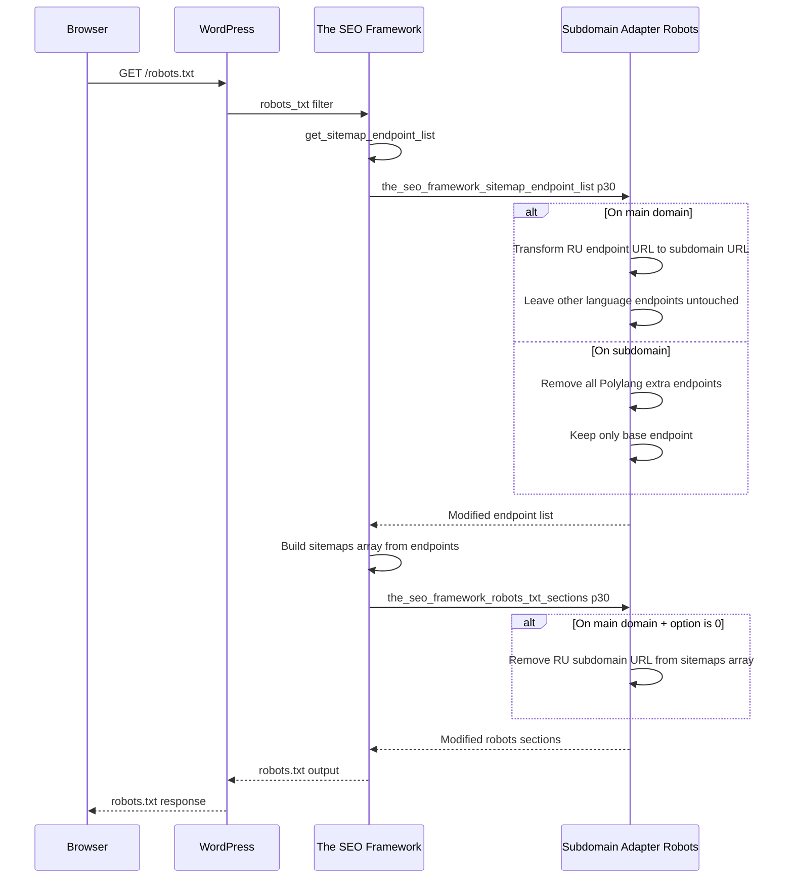

# TSF Subdomain Sitemap Compatibility — Implementation Plan

## Problem Statement

TSF + Polylang already generates correct sitemap URLs for most languages. Only the RU sitemap needs special handling because it has a subdomain mapping.

### Current behavior on `pbservices.ge/robots.txt`:
```
Sitemap: https://pbservices.ge/sitemap.xml          ← correct
Sitemap: https://pbservices.ge/ar/sitemap.xml       ← correct (directory-style, no subdomain)
Sitemap: https://pbservices.ge/zh/sitemap.xml       ← correct (directory-style, no subdomain)
Sitemap: https://pbservices.ge/ru/sitemap.xml       ← WRONG: should be https://ru.pbservices.ge/sitemap.xml
```

### Current behavior on `ru.pbservices.ge/robots.txt`:
```
Sitemap: https://ru.pbservices.ge/sitemap.xml       ← correct
Sitemap: https://ru.pbservices.ge/ru/sitemap.xml    ← WRONG: duplicate, should not exist
Sitemap: https://ru.pbservices.ge/ar/sitemap.xml    ← WRONG: should not appear on subdomain
Sitemap: https://ru.pbservices.ge/zh/sitemap.xml    ← WRONG: should not appear on subdomain
```

### Desired behavior on `pbservices.ge/robots.txt`:
```
Sitemap: https://pbservices.ge/sitemap.xml
Sitemap: https://ru.pbservices.ge/sitemap.xml       ← transformed to subdomain URL (optional: can be hidden)
Sitemap: https://pbservices.ge/ar/sitemap.xml       ← unchanged (already correct)
Sitemap: https://pbservices.ge/zh/sitemap.xml       ← unchanged (already correct)
```

### Desired behavior on `ru.pbservices.ge/robots.txt`:
```
Sitemap: https://ru.pbservices.ge/sitemap.xml       ← only the subdomain's own sitemap
```

---

## Architecture

### Location: Inside existing `subdomain_adapter` module

```
modules/subdomain_adapter/
├── class-subdomain-adapter.php           # Existing main class
├── class-subdomain-adapter-legacy.php    # Existing legacy class
├── class-subdomain-adapter-robots.php    # NEW: TSF robots/sitemap filters
├── config-constants-subdomain-adapter.php
├── config-options-subdomain_adapter.php  # MODIFIED: add new option
└── subdomain_adapter.php                 # MODIFIED: conditionally load robots class
```

### New Option

In [`config-options-subdomain_adapter.php`](modules/subdomain_adapter/config-options-subdomain_adapter.php):

```php
'subdomain_adapter_robots_sitemap' => array(
    'label'             => 'List Subdomain Sitemap in robots.txt',
    'description'       => 'When disabled, the slave subdomain sitemap URL (ie. https://ru.pbservices.ge/sitemap.xml) is removed from the main domain\'s robots.txt.',
    'type'              => 'checkbox',
    'default'           => 0,
    'sanitize_callback' => 'absint',
    'restricted'        => true,
),
```

---

## Implementation Details

### Class: `Frl_Subdomain_Adapter_Robots`

Located in `modules/subdomain_adapter/class-subdomain-adapter-robots.php`.

#### Hook Registration

| Hook | Priority | Purpose |
|------|----------|---------|
| `the_seo_framework_sitemap_endpoint_list` | 30 | Transform RU endpoint URL on main domain; strip extra endpoints on subdomain |
| `the_seo_framework_robots_txt_sections` | 30 | Optionally remove RU subdomain URL from robots.txt on main domain |

Priority 30 ensures this runs **after** Polylang's compatibility at p20.

#### Guards
- TSF must be active: `class_exists('The_SEO_Framework\Load')`
- Subdomain Adapter must be configured: `Frl_Subdomain_Adapter::init()->is_configured()`

---

### Filter: `the_seo_framework_sitemap_endpoint_list` (p30)

**On main domain (`pbservices.ge`):**
1. Receive the endpoint list (Polylang already added `_base_polylang_ru` at p20 with endpoint `ru/sitemap.xml`)
2. Find the RU endpoint (`_base_polylang_ru`) and replace its `endpoint` and `regex`:
   ```php
   $list['_base_polylang_ru']['endpoint'] = 'https://ru.pbservices.ge/sitemap.xml';
   $list['_base_polylang_ru']['regex']    = '/^https:\/\/ru\.pbservices\.ge\/sitemap\.xml/i';
   ```
3. All other language endpoints (`ar`, `zh`, etc.) are left untouched

**On subdomain (`ru.pbservices.ge`):**
1. Receive the endpoint list
2. Remove all `_base_polylang_*` endpoints (Polylang's directory-style extras)
3. Keep only the `base` endpoint

---

### Filter: `the_seo_framework_robots_txt_sections` (p30)

**On main domain (`pbservices.ge`):**
1. Check `frl_get_option('subdomain_adapter_robots_sitemap')`
2. If `0` (default): remove the RU subdomain URL from the sitemaps array:
   ```php
   $sections['sitemaps']['sitemaps'] = array_filter(
       $sections['sitemaps']['sitemaps'],
       fn($url) => !str_contains($url, 'ru.pbservices.ge')
   );
   ```
3. If `1`: leave as-is (the endpoint list filter already set the correct subdomain URL)

**On subdomain (`ru.pbservices.ge`):**
1. No action needed — the endpoint list filter already removed extra endpoints, so TSF only includes the base sitemap

---

### Bootstrap Changes (`subdomain_adapter.php`)

After the existing legacy links loading:

```php
// Load and initialize the TSF robots/sitemap compatibility handler.
if (class_exists('The_SEO_Framework\Load')) {
    require_once __DIR__ . '/class-subdomain-adapter-robots.php';
    Frl_Subdomain_Adapter_Robots::init();
}
```

---

## Data Flow



---

## Files to Create

1. `modules/subdomain_adapter/class-subdomain-adapter-robots.php` — New class with 2 TSF filters

## Files to Modify

1. `modules/subdomain_adapter/config-options-subdomain_adapter.php` — Add `subdomain_adapter_robots_sitemap` option
2. `modules/subdomain_adapter/subdomain_adapter.php` — Conditionally load the robots class when TSF is active

---

## Testing Checklist

### On `pbservices.ge`:
- [ ] `GET /robots.txt` contains `Sitemap: https://pbservices.ge/sitemap.xml`
- [ ] `GET /robots.txt` does NOT contain `https://ru.pbservices.ge/sitemap.xml` (option default = 0)
- [ ] `GET /robots.txt` still contains `Sitemap: https://pbservices.ge/ar/sitemap.xml` (unchanged)
- [ ] `GET /robots.txt` still contains `Sitemap: https://pbservices.ge/zh/sitemap.xml` (unchanged)
- [ ] Enable option → `GET /robots.txt` now contains `Sitemap: https://ru.pbservices.ge/sitemap.xml`

### On `ru.pbservices.ge`:
- [ ] `GET /robots.txt` contains only `Sitemap: https://ru.pbservices.ge/sitemap.xml`
- [ ] `GET /robots.txt` does NOT contain other language sitemap URLs
- [ ] `GET /sitemap.xml` returns valid XML with RU content

---

## Risk Assessment

| Risk | Likelihood | Mitigation |
|------|-----------|------------|
| TSF changes filter signatures | Low | TSF filters are stable; we use standard `apply_filters` patterns |
| Polylang changes endpoint key prefix | Low | We strip by `_base_polylang_` prefix; if Polylang changes it, we just update the prefix |
| TSF not active | N/A | Guarded by `class_exists('The_SEO_Framework\Load')` — class simply won't load |

---

## Conclusion

**Feasibility: HIGH**

Minimal changes — one new class file inside the existing `subdomain_adapter` module, one new option, one bootstrap line. No new module, no environment config changes, no database migrations.
